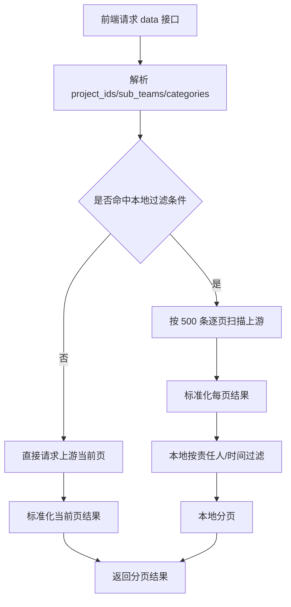
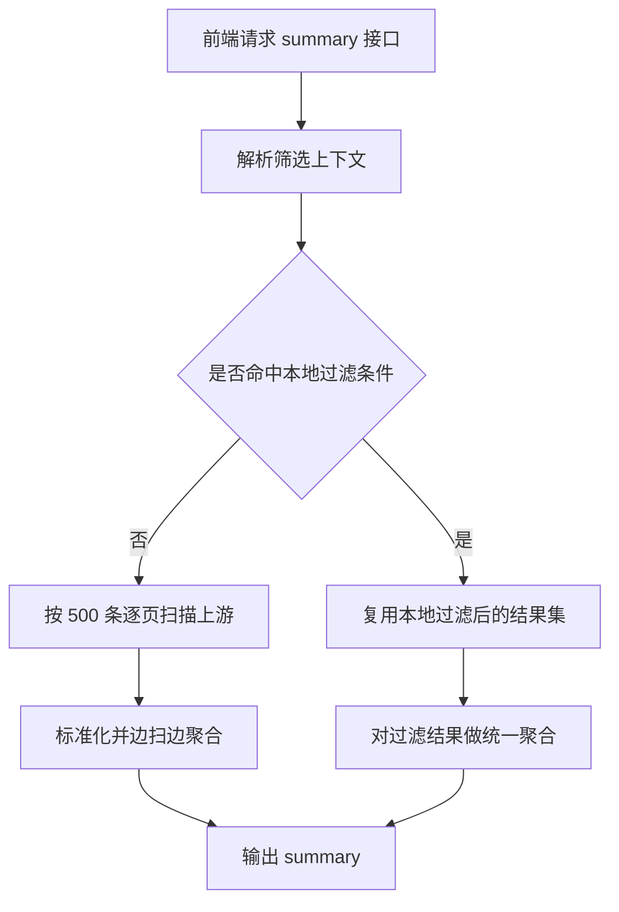

# 需求看板模块说明

## 1. 模块定位

`requirement_board` 是项目管理模块中的“需求看板”后端实现，负责把项目配置映射到数据湖需求接口，并向前端提供两类能力：

- 需求数据看板：分页明细查询
- 需求总结看板：基于同一筛选条件的全量聚合统计
- 需求数据导出：基于同一筛选条件的全量明细导出

该模块的设计目标是：

1. 不在 MySQL 落需求明细表
2. 统一代理数据湖接口，屏蔽上游字段差异
3. 使用 Redis 做短 TTL 缓存，兼顾性能与数据实时性
4. 对上游不支持的筛选条件，在本地完成标准化过滤与聚合

当前模块目录如下：

- `requirement_board_api.py`：Ninja 路由
- `requirement_board_model.py`：状态、时间维度等常量定义
- `requirement_board_schemas.py`：接口输入输出契约
- `requirement_board_services.py`：主业务逻辑、上游请求、缓存、聚合
- `README.md`：模块说明文档

---

## 2. 核心业务背景

需求看板的数据源来自数据湖接口。一个项目是否能查询需求，取决于项目管理模块中的两项配置：

- `design_id`
- `sub_teams`

其中：

- `design_id` 会映射为上游查询参数中的 `domainid` 列表
- `sub_teams` 是项目可选责任团队列表
- 多项目查询时，会把所选项目的 `design_id` 聚合成数组发给数据湖
- 团队选项由前端基于所选项目动态去重生成

本模块已经与“健康迭代开关”解耦：

- `design_id / sub_teams` 现在可作为通用需求数据源配置使用
- 是否开启健康迭代，不影响需求看板自身查询
- 只有健康迭代同步功能仍受 `enable_iteration` 控制

---

## 3. 状态口径

### 3.1 上游状态映射

数据湖当前状态字段为 `schedule_state`，可能返回：

- `Initial`
- `Defined`
- `In-Progress`
- `Completed`
- `Accepted`

统一映射为系统内状态码：

| 上游状态 | 系统状态码 | 中文文案 |
| --- | --- | --- |
| Initial | I | 初始化 |
| Defined | D | 已定义完成 |
| In-Progress | P | 开发中 |
| Completed | C | 已开发完成（转测） |
| Accepted | A | 测试完成（已置A） |

### 3.2 状态语义说明

- `I`：需求刚创建或进入初始化阶段，尚未完成定义
- `D`：需求已完成定义，等待进入开发或排期推进
- `P`：需求正在开发处理中，尚未达到转测状态
- `C`：需求已开发完成并转测，等待测试验收
- `A`：需求已测试完成并置 A，可视为验收完成

---

## 4. 时间字段与延期口径

### 4.1 标准时间字段

当前模块统一输出四个时间字段：

- `planned_test_time`：计划转测时间
- `due_date`：计划完成时间
- `completed_time`：开发完成时间（置 C 时间）
- `accepted_time`：测试完成时间（置 A 时间）

### 4.2 时间筛选口径

前端通过以下字段传递时间筛选：

- `time_field`
- `time_start`
- `time_end`

可选时间维度固定为：

- `planned_test_time`
- `due_date`
- `completed_time`
- `accepted_time`

说明：

- 如果只选择时间维度，不选择区间，则不生效
- 如果用户仍传旧字段 `accepted_time_start / accepted_time_end`，后端会兼容
- 数据湖当前**不支持**按时间区间下推筛选，因此时间筛选在本地完成

### 4.3 延期判定口径

#### 开发延期
满足任一条件即判定为开发延期：

1. `completed_time > planned_test_time`
2. 当前状态还未达到 `C/A`，但当前时间已经晚于 `planned_test_time`

如果 `planned_test_time` 缺失，则不计为开发延期。

#### 测试延期
满足任一条件即判定为测试延期：

1. `accepted_time > due_date`
2. 当前状态还未达到 `A`，但当前时间已经晚于 `due_date`

如果 `due_date` 缺失，则不计为测试延期。

---

## 5. 责任人口径

上游新增字段：

- `develop_owner`
- `test_owner`

字段格式为字符串，可能包含多个 username，用英文逗号分隔，例如：

```text
z60094428,z60094429
```

标准化后输出为：

- `develop_users: string[]`
- `test_users: string[]`
- `develop_user_display: string`
- `test_user_display: string`

规则如下：

1. 按英文逗号拆分
2. 去除空白
3. 去重
4. 保留原有顺序

### 5.1 筛选口径

- 责任人筛选命中任一 username 即视为命中
- 开发责任人筛选和测试责任人筛选彼此独立
- 数据湖当前**不支持** username 下推，因此责任人筛选在本地完成

### 5.2 汇总口径

责任人排行统计采用“每位责任人全量计入”的口径：

- 一条需求关联 2 个开发责任人，则这条需求会在 2 个人的排行中都累计一次
- 工作量和 KLOC 也会对每位责任人分别全量累计

因此：

- 责任人维度的汇总总量**不会**与全局总量守恒
- 这是预期行为，不是统计错误

---

## 6. 上游接口对接设计

### 6.1 请求方式

统一使用 `POST` 请求，并通过 JSON 请求体传参。

当前请求体核心结构如下：

```json
{
  "domainid": ["2356", "5689"],
  "sub_teams": ["底软", "测试"],
  "categories": ["AR", "DR"],
  "page": {
    "page_no": 1,
    "page_size": 20
  }
}
```

说明：

- `domainid` 默认取项目 `design_id` 列表
- 若真实上游字段名不是 `domainid`，可通过配置替换
- `page_no` / `page_size` 在 JSON 的 `page` 对象中发送
- 即使传入的 `page_size > 500`，上游最多返回 `500` 条；本模块也会在后端侧主动限制上游单次请求页大小为 `500`
- 上游响应 `page` 字段口径：`page_sum=总条数`、`page_size=每页条数`、`page_no=当前页`
- 本模块对外返回时，会把 `page_sum` 转换为“本地总页数”，供前端分页组件使用

### 6.2 基础筛选与本地筛选分工

#### 会下推到数据湖的筛选

- 项目（转换为 `design_id -> domainid[]`）
- 责任团队（`sub_teams[]`）
- 需求类型（`categories[]`）

#### 不会下推、在本地完成的筛选

- 开发责任人（`develop_users[]`）
- 测试责任人（`test_users[]`）
- 时间维度 + 时间区间（`time_field + time_start + time_end`）

这样设计的原因是：

- 数据湖已确认不支持 username 筛选
- 数据湖已确认不支持通用时间区间筛选
- 本地过滤可以保证功能完整性，同时避免对上游契约作错误假设

---

## 7. 对外接口说明

### 7.1 获取筛选项

`GET /api/project-manager/requirement-board/filter-options`

返回项目列表，字段包括：

- `id`
- `name`
- `code`
- `domain`
- `type`
- `design_id`
- `sub_teams`
- `config_complete`

`config_complete=true` 表示当前项目具备需求看板查询条件。

### 7.2 获取数据明细

`POST /api/project-manager/requirement-board/data`

请求体：

```json
{
  "project_ids": ["..."],
  "sub_teams": ["底软"],
  "categories": ["AR", "DR", "SR"],
  "develop_users": ["z60094428"],
  "test_users": ["z60094429"],
  "time_field": "accepted_time",
  "time_start": "2026-01-01",
  "time_end": "2026-01-31",
  "page_no": 1,
  "page_size": 20
}
```

返回分页结果：

- `items`
- `total`
- `page_no`
- `page_size`
- `page_sum`

### 7.3 获取总结看板

`POST /api/project-manager/requirement-board/summary`

请求体与数据明细接口一致，但不接受分页参数。

返回内容包括：

- 摘要总量
- 状态分布
- 类型分布
- 项目分布
- 团队统计
- 责任人排行
- 开发延期/测试延期摘要与预览
- 开发交付趋势
- 测试交付趋势

### 7.4 导出需求明细

`POST /api/project-manager/requirement-board/export`

请求体与总结接口一致，不接受分页参数。

导出规则：

- 始终导出当前筛选条件命中的全量明细
- 仍然复用项目 / 团队 / 类型 / 验证策略下推
- 责任人 / 时间区间仍在本地过滤
- 返回 `.xlsx` 文件流，不在 Redis 中缓存二进制文件

---

## 8. 标准化输出字段

单条需求明细标准化后至少包括：

- `requirement_id`
- `title`
- `category`
- `status_code`
- `status_label`
- `raw_status`
- `project_id`
- `project_name`
- `design_id`
- `team_name`
- `planned_test_time`
- `due_date`
- `completed_time`
- `accepted_time`
- `is_dev_delayed`
- `is_test_delayed`
- `workload_man_day`
- `workload_kloc`
- `develop_users`
- `test_users`
- `develop_user_display`
- `test_user_display`

其中团队字段会兼容：

- `service_name`
- `servioce_name`

统一输出为 `team_name`。

---

## 9. 缓存与分页策略

### 9.1 缓存原则

模块使用 Django cache（项目当前通常接 Redis）做短 TTL 缓存，不做 MySQL 明细落库。

缓存分为三类：

1. 上游单页缓存
2. 本地过滤后的结果集缓存
3. 总结结果缓存

### 9.2 为什么不落 MySQL 明细

原因如下：

- 需求状态会持续变化
- 明细量较大
- 数据湖已具备权威明细能力
- 本系统主要做“展示、过滤、聚合”，不需要长期保存每日快照

### 9.3 上游分页限制

当前约束：

- 单次上游页大小最大 500
- 如果用户在前端请求 `page_size > 500`，后端会限制到 500
- 总结接口扫描时也固定按照 500 逐页拉取

### 9.4 本地过滤模式

当命中以下条件之一时，会进入本地过滤模式：

- `develop_users` 非空
- `test_users` 非空
- `time_start` / `time_end` 生效

处理流程：

1. 按基础筛选从上游循环拉取，单页 500
2. 标准化每页结果
3. 在本地按责任人 / 时间区间过滤
4. 生成精确 `items/total/page_sum`
5. 将已过滤结果短时缓存，避免重复全量扫描

---

## 10. 详细设计

这一节补充模块内部的关键设计思路，重点说明：

- 请求链路如何分流
- 为什么要做本地过滤
- 锁和缓存如何配合使用
- 总结聚合为什么能和图表/表格保持口径一致

### 10.1 分层设计

模块内部职责分层如下：

1. **API 层**
   - 接收前端请求
   - 做 Schema 解析
   - 调用 service 层

2. **上下文解析层**
   - 把 `project_ids` 转换为项目对象
   - 校验项目是否具备 `design_id / sub_teams`
   - 生成 `design_project_map`
   - 判断本次查询是否需要走“本地过滤模式”

3. **上游访问层**
   - 统一构造数据湖 `POST + JSON` 请求
   - 屏蔽 `domainid` 字段名差异
   - 处理响应结构兼容
   - 提供调试日志

4. **标准化层**
   - 状态标准化
   - 时间字段标准化
   - 责任人拆分标准化
   - 团队字段兼容标准化
   - 延期标记计算

5. **本地过滤与分页层**
   - 对责任人和时间区间做本地过滤
   - 在本地计算 `total/page_sum`
   - 保证前端分页和筛选结果精确一致

6. **聚合层**
   - 计算摘要卡
   - 计算状态分布
   - 计算团队统计
   - 计算责任人排行
   - 计算延期摘要
   - 计算月度趋势

### 10.2 数据查询主链路

#### 明细查询链路



#### 总结查询链路



### 10.3 为什么要区分“远端分页模式”和“本地过滤模式”

这是整个模块最核心的分流设计。

#### 远端分页模式

适用条件：

- 只按项目 / 团队 / 类型筛选
- 不带责任人筛选
- 不带时间区间筛选

优点：

- 上游只查当前页，开销最小
- 响应速度快
- Redis 仅缓存分页结果，内存占用可控

#### 本地过滤模式

适用条件：

- 带开发责任人
- 或带测试责任人
- 或带时间区间筛选

原因：

- 上游不支持 username 筛选
- 上游不支持通用时间区间筛选
- 如果仍然沿用远端分页，会出现“当前页看起来正确，但 total/page_sum 不准确”的问题

因此本地过滤模式必须：

1. 先按基础条件把上游全量范围扫出来
2. 再本地过滤
3. 最后本地重新分页

这样才能保证：

- `items` 正确
- `total` 正确
- `page_sum` 正确
- 总结结果和图表结果能和数据表完全对齐

### 10.4 查询上下文解析算法

上下文解析的核心目标，是把前端筛选转换成可执行的后端查询上下文。

主要步骤如下：

1. 规范化 `project_ids/sub_teams/categories/develop_users/test_users`
2. 查询项目表，校验项目是否存在
3. 校验项目是否已配置 `design_id + sub_teams`
4. 建立 `design_id -> project` 映射
5. 校验 `design_id` 不重复归属多个项目
6. 计算本次可选责任团队全集
7. 校验用户实际选择的团队是否合法
8. 解析时间维度、开始时间、结束时间
9. 判断本次请求是否命中本地过滤模式
10. 生成两份 payload：
    - `remote_cache_payload`：只包含可下推条件
    - `cache_payload`：包含完整筛选条件，用于本地缓存键

这样设计的好处是：

- 上游请求体不会混入不支持的字段
- 本地缓存键仍能准确区分不同筛选条件

### 10.5 标准化算法

上游返回的每条需求明细进入系统后，都会经过统一标准化处理。

标准化步骤如下：

1. 识别项目归属
   - 优先取 `requirement2domain`
   - 回映射到 `design_id -> project`

2. 标准化状态
   - 将 `Initial/Defined/In-Progress/Completed/Accepted` 映射为 `I/D/P/C/A`

3. 标准化团队
   - 兼容 `service_name / servioce_name`
   - 统一输出 `team_name`

4. 标准化责任人
   - 拆分 `develop_owner / test_owner`
   - 去空格
   - 去重
   - 同时输出数组和展示字符串

5. 标准化时间
   - 统一格式化为字符串
   - 同时支持后续重新解析为 datetime 做比较

6. 标准化工作量
   - `workload_man_day / workload_kloc` 缺失按 0
   - 统一做数值化处理

7. 计算延期标签
   - `is_dev_delayed`
   - `is_test_delayed`

### 10.6 本地过滤算法

本地过滤的判断顺序如下：

1. 先判断开发责任人是否命中
2. 再判断测试责任人是否命中
3. 最后判断时间字段值是否落在区间内

只有全部条件都命中，当前需求才会被保留。

时间区间过滤规则：

- 若筛选字段值为空，则该条直接视为不命中
- 日期型输入会自动补齐边界：
  - 开始时间补到 `00:00:00`
  - 结束时间补到 `23:59:59`

### 10.7 总结聚合算法

总结接口的关键原则是：**所有卡片、图表、表格都必须共用同一份聚合结果**。

聚合器内部统一维护：

- 全局总量
- 状态分布
- 类型分布
- 项目分布
- 团队分布
- 责任人分布
- 开发延期 / 测试延期
- 开发交付趋势
- 测试交付趋势

聚合过程是单次扫描、边扫边累计，不会先把全部明细存入 Redis 再做二次汇总。

#### 团队聚合

每扫到一条需求时：

1. 团队总需求数 +1
2. 团队总人天/KLOC 累加
3. 对应状态桶 `I/D/P/C/A` +1
4. 若状态为 `C/A`，计入开发完成口径
5. 若状态为 `A`，计入验收完成口径

#### 责任人聚合

每扫到一条需求时：

1. 遍历 `develop_users`
2. 每个用户任务数、人天、KLOC 全量累计一次
3. 遍历 `test_users`
4. 每个用户任务数、人天、KLOC 全量累计一次

#### 趋势聚合

每扫到一条需求时：

- 用 `planned_test_time` 记开发计划月桶
- 用 `completed_time` 记开发实际月桶
- 用 `due_date` 记测试计划月桶
- 用 `accepted_time` 记测试实际月桶

#### 延期预览聚合

每扫到一条延期需求时：

1. 增加延期数量
2. 把该条塞入预览列表
3. 按目标时间字段排序
4. 只保留前 N 条（当前默认 8 条）

这样可以避免延期预览表无限膨胀。

### 10.8 锁设计

模块内部使用的是**短时互斥锁**，依赖缓存系统的 `cache.add(lock_key, value, ttl)` 语义。

#### 锁的目标

避免“缓存失效瞬间，多请求同时触发全量扫描”造成的缓存击穿。

#### 当前加锁的两个场景

1. **本地过滤结果集缓存**
   - 场景：责任人/时间区间查询
   - 成本高，因为需要全量扫页

2. **总结结果缓存**
   - 场景：总结看板查询
   - 成本高，因为需要扫完整个筛选范围并聚合

#### 为什么不对普通单页缓存加锁

普通单页请求成本相对低：

- 只查上游一页
- 只标准化当前页
- 即使并发回源一次，成本也可接受

因此：

- 页缓存不加锁，减少锁竞争
- 过滤结果缓存和总结缓存加锁，防止重扫全量

#### 锁算法流程

1. 计算缓存键
2. 尝试 `cache.add(lock_key, "1", ttl)`
3. 若拿到锁：
   - 当前请求负责真正计算
4. 若没拿到锁：
   - 进入短暂等待轮询
   - 尝试读取对方已经算好的缓存结果
5. 若等待后仍无结果：
   - 当前请求继续自己计算或走异常分支

#### 当前等待策略

- 轮询次数：10 次
- 每次等待：0.3 秒
- 总等待上限：约 3 秒

这是一种轻量级的“先等缓存、再决定是否重复计算”的策略。

### 10.9 缓存键设计

模块内部缓存键按职责拆分为三类：

1. **单页缓存**
   - 前缀：`pm:requirement-board:page:v4`
   - 包含：项目、design_ids、团队、类型、页码、页大小

2. **过滤结果缓存**
   - 前缀：`pm:requirement-board:filtered:v4`
   - 包含：项目、design_ids、团队、类型、责任人、时间维度、时间区间

3. **总结缓存**
   - 前缀：`pm:requirement-board:summary:v4`
   - 包含：与过滤结果相同的完整筛选条件

导出接口的设计补充：

- 导出不会缓存 `.xlsx` 二进制文件
- 导出会复用单页缓存、过滤结果缓存和对应锁，避免同一筛选重复扫全分页

使用版本号 `v4` 的意义：

- 当缓存结构或聚合口径发生变化时，可以直接升版本
- 避免新旧结构共用缓存导致脏读

### 10.10 时间比较与时区设计

延期判断和时间区间判断本质上都依赖 datetime 比较。

这里有一个容易踩坑的点：

- 有些时间来自字符串解析，可能是 naive datetime
- 当前时间 `timezone.now()` 往往是 aware datetime

如果直接比较，会触发：

```text
TypeError: can't compare offset-naive and offset-aware datetimes
```

因此模块内部在比较前会先统一时间对象的“时区形态”，确保：

- aware 和 aware 比较
- 或 naive 和 naive 比较

这是延期判定算法稳定运行的关键细节。

### 10.11 复杂度分析

#### 远端分页模式

- 单次明细查询复杂度：`O(page_size)`
- 主要成本在一次上游 HTTP + 当前页标准化

#### 本地过滤模式

- 设上游总量为 `N`
- 本地过滤复杂度约为：`O(N)`
- 主要成本在逐页扫描 + 标准化 + 本地过滤

#### 总结聚合模式

- 复杂度约为：`O(N)`
- 但采用边扫边聚合，不需要保留全量中间明细副本

#### 全量导出模式

- 远端分页导出复杂度约为：`O(N)`
- 本地过滤导出复杂度约为：`O(N)`
- 导出采用 `openpyxl` 的 write-only 工作簿逐行写入，避免额外保留一份导出副本

#### 空间复杂度

- 远端分页模式：`O(page_size)`
- 本地过滤模式：`O(M)`，其中 `M` 为过滤命中后的结果条数
- 总结模式：`O(K)`，其中 `K` 是聚合桶数量（团队数、项目数、类型数、用户数、月份数），通常远小于全量明细

### 10.12 失败与降级策略

当前设计下的失败处理策略如下：

1. **上游不可达**
   - 抛出 `502`
   - 调试日志会记录请求异常

2. **上游返回非 200 HTTP**
   - 抛出 `502`
   - 日志记录状态码和响应片段

3. **上游 JSON 非法**
   - 抛出 `502`

4. **筛选参数非法**
   - 抛出 `422`
   - 如非法类型、非法团队、非法时间字段、时间区间错误

5. **扫描页数过多**
   - 抛出 `502`
   - 提示用户缩小筛选范围

6. **未配置真实上游 URL**
   - 自动走 mock 路径
   - 便于前后端联调和页面开发

---

## 11. 总结看板聚合口径

### 10.1 团队统计

团队维度按 `team_name` 聚合，每行包含：

- `total_count`
- `total_workload_man_day`
- `total_workload_kloc`
- `i_count / d_count / p_count / c_count / a_count`
- `dev_done`
- `acceptance_done`

### 10.2 完成率定义

#### 开发完成（C+A）

- 数量 = `C + A`
- 人天 = `状态为 C/A 的 workload_man_day 之和`
- KLOC = `状态为 C/A 的 workload_kloc 之和`

#### 验收完成（A）

- 数量 = `A`
- 人天 = `状态为 A 的 workload_man_day 之和`
- KLOC = `状态为 A 的 workload_kloc 之和`

#### 比例公式

- 数量完成率 = 完成数量 / 团队总需求数
- 人天完成率 = 完成人天 / 团队总人天
- KLOC 完成率 = 完成 KLOC / 团队总 KLOC
- 分母为 0 时统一按 0 处理

### 10.3 趋势图口径

#### 开发交付趋势

- 计划值：按 `planned_test_time` 统计月度数量
- 实际值：按 `completed_time` 统计月度数量

#### 测试交付趋势

- 计划值：按 `due_date` 统计月度数量
- 实际值：按 `accepted_time` 统计月度数量

### 10.4 延期摘要口径

`delay_summary` 分为两块：

- `development`
- `acceptance`

每块包含：

- `count`
- `rate`
- `preview_items`

其中 `preview_items` 仅保留有限条数，用于前端快速预览风险需求，完整明细仍应回到数据看板查看。

---

## 12. 联调调试日志开关

为了方便对接真实数据湖，模块内置了调试日志开关：

- 环境变量：`REQUIREMENT_BOARD_DEBUG_LOG`
- 可选值：`true / 1 / yes / on`

开启后会打印以下日志：

1. 上游请求日志
2. 上游响应分页关键信息
3. 数据页缓存命中 / 回源加载
4. 本地过滤扫描过程
5. 总结计算扫描过程
6. 总结缓存命中 / 写入

### 12.1 典型日志事件

- `RequirementBoard[upstream_request]`
- `RequirementBoard[upstream_response]`
- `RequirementBoard[data_page_cache_hit]`
- `RequirementBoard[data_page_loaded]`
- `RequirementBoard[local_filter_scan_start]`
- `RequirementBoard[local_filter_scan_page]`
- `RequirementBoard[local_filter_scan_done]`
- `RequirementBoard[summary_compute_start]`
- `RequirementBoard[summary_scan_page]`
- `RequirementBoard[summary_compute_done]`
- `RequirementBoard[summary_cache_hit]`
- `RequirementBoard[summary_cached]`

### 12.2 日志内容说明

#### 上游请求日志

会记录：

- 请求模式（`mock` / `http`）
- 请求方法（固定 `POST`）
- 请求 URL
- 请求 JSON 体

#### 上游响应日志

会记录：

- HTTP 状态码
- 上游 `code/message`
- 分页信息 `page`
- 当前页返回的 `item_count`

### 12.3 使用建议

联调真实数据湖时建议：

1. 临时开启 `REQUIREMENT_BOARD_DEBUG_LOG=true`
2. 通过前端页面或直接调用后端接口发起查询
3. 在后端日志里核对：
   - `domainid[]` 是否正确
   - `sub_teams[]` / `categories[]` 是否正确
   - `page.page_no / page.page_size` 是否正确
   - 上游返回的 `page_sum(总条数) / page_size(每页条数)` 是否符合预期
4. 联调完成后关闭该开关，避免日志过多

---

## 13. 关键配置项

| 配置项 | 说明 |
| --- | --- |
| `REQUIREMENT_BOARD_API_URL` | 数据湖接口地址；未配置时走 mock |
| `REQUIREMENT_BOARD_API_TOKEN` | 可选，Bearer Token |
| `REQUIREMENT_BOARD_DOMAIN_FIELD` | 上游项目字段名，默认 `domainid` |
| `REQUIREMENT_BOARD_DESIGN_ALIAS_FIELD` | 可选，额外补充的 design id 别名字段 |
| `REQUIREMENT_BOARD_API_HEADERS_JSON` | 额外请求头 JSON |
| `REQUIREMENT_BOARD_API_TIMEOUT` | 请求超时时间，默认 15 秒 |
| `REQUIREMENT_BOARD_API_VERIFY_SSL` | 是否校验证书 |
| `REQUIREMENT_BOARD_DEBUG_LOG` | 是否开启联调调试日志 |
| `REQUIREMENT_BOARD_SCAN_PAGE_SIZE` | 本地过滤扫描时单页大小，默认 500 |
| `REQUIREMENT_BOARD_SUMMARY_PAGE_SIZE` | 总结扫描单页大小，默认 500 |
| `REQUIREMENT_BOARD_SUMMARY_MAX_PAGES` | 最多扫描页数保护，默认 200 |
| `REQUIREMENT_BOARD_EXPORT_PAGE_SIZE` | 导出扫描单页大小，默认 500 |
| `REQUIREMENT_BOARD_EXPORT_MAX_PAGES` | 导出最多扫描页数保护，默认 200 |

---

## 14. 当前已知限制

1. 若本地未配置 `REQUIREMENT_BOARD_API_URL`，模块会自动走 mock 数据，不会真正访问数据湖
2. 责任人和时间区间筛选目前只能本地过滤，无法下推到上游
3. 责任人排行采用全量计入口径，因此责任人总量不与全局守恒
4. 总结接口需要扫描全量匹配结果，在筛选范围很大时可能较慢，因此依赖缓存与扫描页保护
5. 当前不做长期明细持久化，也不提供历史快照能力

---

## 15. 联调建议流程

真实数据湖联调时建议按以下顺序执行：

1. 确认项目 `design_id / sub_teams` 已配置完整
2. 配置 `REQUIREMENT_BOARD_API_URL`
3. 如有鉴权，再配置 `REQUIREMENT_BOARD_API_TOKEN`
4. 打开 `REQUIREMENT_BOARD_DEBUG_LOG=true`
5. 先用单项目、单团队、全类型跑基础查询
6. 再验证：
   - `page_size=20`
   - `page_size=500`
   - 多项目查询
   - 多团队查询
7. 再验证本地过滤：
   - 开发责任人
   - 测试责任人
   - 时间维度 + 时间区间
8. 最后验证总结结果是否与全量明细口径一致

---

## 16. 本次二期增强点回顾

本轮增强主要补齐了以下能力：

- 新状态语义映射（Initial / Defined / In-Progress / Completed / Accepted）
- 四类时间字段统一输出
- 开发/测试延期判定
- 责任人拆分、展示与筛选
- 数据接口混合筛选模式
- 总结接口的团队统计、责任人排行、交付趋势、延期预览
- 500 条分页上限适配
- 联调调试日志开关

如需继续扩展，可优先考虑：

1. 增加单独的联调诊断脚本
2. 为总结接口增加耗时指标日志
3. 增加更细粒度的缓存命中统计
4. 在运维文档中补充真实数据湖对接示例
