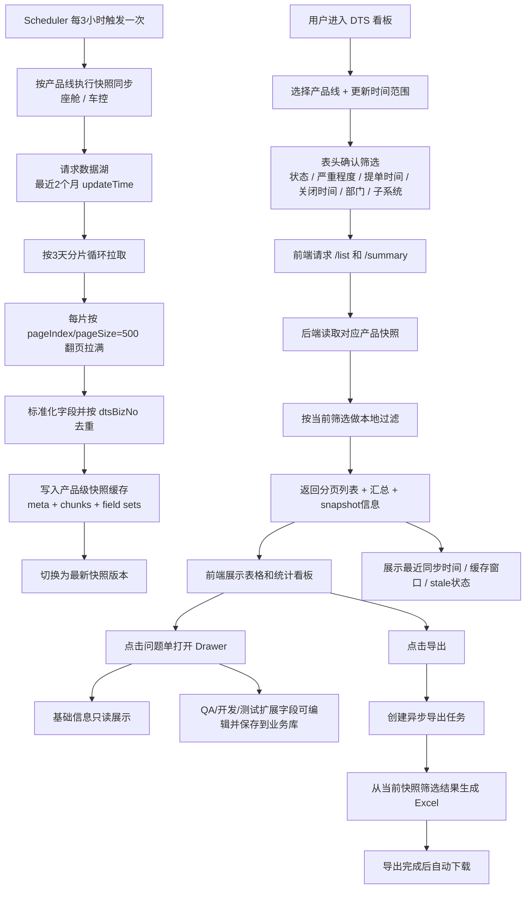

# DTS Statistics 详设文档（多项目分组查询 + Redis 缓存降频 + 导出 + 扩展字段治理）

本文档描述 DTS 统计模块的后端详设实现，包括：多项目查询的分组策略、Redis 缓存降频、缺陷去重合并规则、扩展字段的保存/读取与导出，以及相关配置项与保护策略。

> 前端路由（用于定位页面）：`/project-manager/dts-statistics`  
> 后端 API 前缀：`/api/project-manager/dts-statistics`

> 当前 DTS 看板的实际运行口径已经升级为“最近 2 个月快照缓存版”。
> 下方先给出当前生效流程图，后续章节中的旧版实时查询设计可作为历史实现参考。

---

## 0. 当前工作流程（快照缓存版）



### 0.1 补充说明

- 快照窗口固定为最近 2 个月 `updateTime` 数据。
- 标题栏时间筛选仍然表示 `updateTime`，不是提单时间。
- 数据湖快照行中的隐藏更新时间字段使用 `updateAt`，对应查询入参 `updateTimeBegin/updateTimeEnd`。
- 数据湖中的“子系统”真实字段为 `sSubsystemNoName`；当前接口层同时兼容旧键 `sSubmitsystemNoName`。
- `createAt`、`dCloseTime`、`sDeptOneNoName`、`sSubsystemNoName` 均为快照结果上的本地过滤。
- 快照不存在时，不再回退实时慢查数据湖，而是直接提示“数据准备中/请先执行同步任务”。
- 导出与页面明细使用同一套缓存筛选结果口径。
- 周期字段在表格、Drawer、导出中统一按“四舍五入”显示整数。

---

## 1. 背景与目标

### 1.1 背景

- 用户可在前端一次选择多个项目进行 DTS 问题单统计。
- 上游数据湖接口存在“按项目/版本拆分请求”的现实约束：项目的 `version_c` 不同，无法在单次请求中覆盖所有项目。
- 频繁切换 Tab/翻页/重复查询会导致大量重复的上游请求，造成数据湖压力和页面响应抖动。
- 治理字段（QA/开发/测试扩展信息）存储在本地 DB，需要做到：
  - 明细/看板能及时展示（保存后立刻生效）
  - 切换 Tab/翻页不反复打数据湖
  - 多人并发同条件查询时避免缓存击穿

### 1.2 目标

- 多项目查询不强依赖“一次请求查全量项目”，改为按 `version_c` 分组，向上游发起多次请求（符合上游接口能力）。
- 引入 Redis 缓存（通过 `CacheManager`/Django cache），缓存上游分页结果与全量扫描结果，降低上游请求频次。
- 明细(list) 和 看板(summary) 复用缓存；切 Tab/翻页/重复点查询不重复打数据湖。
- 缓存只缓存“上游基础字段”，扩展字段仍实时从 DB merge，避免复杂的 cache invalidate。

---

## 2. 模块概览

### 2.1 数据来源

1) 上游数据湖（HTTP POST）
- 返回 DTS 缺陷的基础字段，如：`defectNo/submitTime/submitTeam/currentStatus/...`

2) 本地数据库（MySQL）
- `project_manager.Project`：项目 DTS 查询配置（`enable_dts/version_c/di_teams`）
- `pm_dts_extension`：治理扩展字段（QA/开发/测试）
- `pm_dts_defect_project_link`：缺陷与项目/团队的命中关系映射（用于“项目/团队”列与统计口径）

### 2.2 后端路由与接口

代码位置：`backend-django/apps/project_manager/dts_statistics/dts_statistics_api.py`

- `POST /api/project-manager/dts-statistics/list`
- `POST /api/project-manager/dts-statistics/summary`
- `POST /api/project-manager/dts-statistics/save-extension/{defect_no}`
- `POST /api/project-manager/dts-statistics/export`

路由注册：`backend-django/apps/project_manager/router.py`

---

## 3. 数据模型设计

### 3.1 Project（项目配置）

查询配置字段（来自 `apps.project_manager.project.project_model.Project`）：

- `enable_dts: bool`  
  是否开启 DTS 统计（未开启则不可查询）
- `version_c: str | null`  
  上游查询的版本维度（分组关键字段）
- `di_teams: list[str]`  
  该项目关联的责任团队列表（用于构造上游 `teamNameList`，并用于缺陷-项目命中映射）

> 配置完整口径：`enable_dts == true` 且 `version_c` 非空 且 `di_teams` 非空。

### 3.2 DtsExtension（治理扩展字段）

代码位置：`backend-django/apps/project_manager/dts_statistics/dts_statistics_model.py`

表：`pm_dts_extension`

- 主键：`defect_no`（DTS 单号）
- QA 区：`qa_category/pl_group/is_downstream/.../qa_remark`
- 开发区：`dev_sub_category(JSON)/dev_reason/dev_improvements(JSON)/...`
- 测试区：`test_miss_reason(JSON)/test_improvements(JSON)/...`

设计要点：

- 数组字段使用 `JSONField(list)`，便于在导出/统计时按条目拆分计数。
- 保存采用**partial update**，避免“保存 QA Tab 时把开发/测试字段覆盖为空”的风险（详见第 7.3 节）。

### 3.3 DtsDefectProjectLink（缺陷命中映射）

代码位置：`backend-django/apps/project_manager/dts_statistics/dts_statistics_model.py`

表：`pm_dts_defect_project_link`

- 字段：
  - `defect_no`
  - `project_id`
  - `team_name`：从上游 defect 中提取（优先 `submitTeam`，其次 `currentTeam`）
  - `version_c`：命中时所在分组版本
  - `last_seen_at`：最近命中时间（用于后续可能的清理/追踪）
- 约束：
  - 唯一约束：`(defect_no, project)`
- 索引：
  - `defect_no`
  - `(project, last_seen_at)`

设计要点：

- “项目/团队”显示不直接依赖上游返回的项目字段，而是通过 `team_name -> 项目集合` 的映射建立关联，前端展示口径为“一个问题单只属于一个项目/团队”（展示单值字段 `project_name/team_name`，同时保留数组字段用于 tooltip）。

---

## 4. 上游数据湖接口约定

### 4.1 请求 payload

后端构造方式：`_build_upstream_payload(...)`  
代码位置：`backend-django/apps/project_manager/dts_statistics/dts_statistics_services.py`

```json
{
  "version": "V1.2.3",
  "teamNameList": "TeamA,TeamB,TeamC",
  "dataType": "today",
  "columnType": "openDefects",
  "excludeInvalid": false,
  "startTime": "2026-03-16 00:00:00",
  "endTime": "2026-03-16 23:59:59",
  "pageInfo": { "pageNo": 1, "pageSize": 20 }
}
```

关键字段：

- `version`：来自项目 `version_c`（按分组传入）
- `teamNameList`：同组所有项目 `di_teams` 去重并排序后逗号拼接
- `columnType`：`openDefects/closeDefects/totalDefects`
- `startTime/endTime`：由前端起止时间范围生成

### 4.2 响应格式

后端使用字段（容错读取）：

```json
{
  "pageResult": { "total": 123, "pageNo": 1, "pageSize": 20, "pageSum": 7 },
  "dataList": [
    {
      "defectNo": "DTS2026xxxx",
      "brief": "...",
      "severity": "关键",
      "submitTime": "2026-03-16 11:22:33",
      "submitTeam": "TeamA",
      "currentTeam": "TeamA",
      "currentStatus": "开发修复",
      "currentHandler": "user1",
      "currentStage": "开发",
      "closeType": "",
      "process_days": "3"
    }
  ]
}
```

### 4.3 鉴权与请求参数

请求头构造：`_build_request_headers()`

- `DTS_STATISTICS_API_TOKEN`：支持 `Bearer <token>` 或直接 token（后端会自动补 Bearer）
- `DTS_STATISTICS_API_HEADERS_JSON`：额外 header（JSON 字符串，key/value）
- `DTS_STATISTICS_API_TIMEOUT`：默认 15 秒
- `DTS_STATISTICS_API_VERIFY_SSL`：默认 true

---

## 5. 多项目查询分组策略

代码位置：`_group_projects(project_ids)`

### 5.1 纳入项目过滤规则

默认（严格模式）：

- 仅纳入 `enable_dts=true` 的项目
- 且 `version_c` 非空
- 且 `di_teams` 非空

Mock 辅助模式：

- 若启用 `DTS_STATISTICS_MOCK_RELAX_PROJECT_FILTER=true`：
  - 对缺失 `version_c/di_teams` 的项目允许注入 mock 值，方便前端 UI 联调（不依赖项目配置完整）

### 5.2 分组与 teamNameList 生成

- 按 `version_c` 分组
- 每组生成：
  - `team_name_list = ",".join(sorted(unique(di_teams)))`
  - `team_to_project_ids: { team_name -> [project_id, ...] }`（去重并按项目名/ID排序保证稳定）

目的：

- 用 `version + teamNameList` 作为一次上游请求的最小粒度
- 同组内的多个项目通过 `teamNameList` 一次请求覆盖（上游按 OR 命中）

---

## 6. Redis 缓存设计（降频核心）

缓存实现：

- `CacheManager`：`backend-django/common/fu_cache.py`（底层 Redis）
- 锁实现：使用 Django cache 的 `cache.add`（同样通常落在 Redis）

### 6.1 缓存 Key 指纹

统一使用：

- `md5(json.dumps(payload, sort_keys=True, ensure_ascii=False, default=str))`
- key = `<prefix><digest>`

### 6.2 上游单页缓存（list 优先，单组最快）

- Key 前缀：`cache:dts_statistics:page:`
- Payload 指纹字段：
  - `version/teamNameList/columnType/startTime/endTime/pageNo/pageSize/dataType/excludeInvalid`
- TTL：
  - `DTS_STATISTICS_PAGE_CACHE_TTL_SECONDS`（默认 120s）
- 缓存值：
  - `{ "pageResult": {...}, "dataList": [...] }`

适用场景：

- 选中的项目命中 **1 个 version 分组** 时，list 直接走上游分页 + 缓存复用。

### 6.3 上游全量扫描缓存（summary 必用，多组 list 复用）

- Key 前缀：`cache:dts_statistics:scan:`
- Payload 指纹字段：
  - `version/teamNameList/columnType/startTime/endTime/dataType/excludeInvalid/scanPageSize`
- 扫描分页参数：
  - `scanPageSize = DTS_STATISTICS_SCAN_PAGE_SIZE`（默认 500，最大 1000）
  - `maxScanPages = DTS_STATISTICS_SCAN_MAX_PAGES`（默认 200）
- TTL：
  - `DTS_STATISTICS_SCAN_CACHE_TTL_SECONDS`（默认 180s）
- 缓存值：
  - `list[defect_dict]`（仅上游基础字段集合）

适用场景：

- `summary`：始终基于 scan 缓存聚合（避免依赖 list 当前页）
- `list`：多个 version 分组时，先扫描各分组并合并后做本地分页（保证正确分页与稳定排序）

### 6.4 防击穿锁（避免并发扫描打爆数据湖）

- Lock key：`cache:dts_statistics:lock:<scan_digest>`
- 获取锁：
  - `cache.add(lock_key, "1", lock_ttl)`
  - TTL：`DTS_STATISTICS_SCAN_LOCK_TTL_SECONDS`（默认 30s）
- 未获取锁时：
  1) 先短暂等待缓存出现（最多 3s，轮询 `CacheManager.get`）
  2) 若仍未命中缓存：允许降级扫描一次（避免“锁一直拿不到导致一直空结果”）

### 6.5 为什么只缓存上游基础字段

- 扩展字段（`DtsExtension`）来自本地 DB，必须在保存后即时生效。
- 缓存只保存上游基础字段，不缓存“扩展合并后的最终结果”：
  - 明细/看板读取时再实时 merge 扩展字段
  - 无需做复杂的缓存失效/更新逻辑

---

## 7. 接口行为详述

### 7.1 `POST /list`（明细表）

Schema：`DtsStatisticsQuerySchema`

请求示例：

```json
{
  "project_ids": ["p1", "p2"],
  "column_type": "openDefects",
  "start_time": "2026-03-16 00:00:00",
  "end_time": "2026-03-16 23:59:59",
  "page_no": 1,
  "page_size": 20
}
```

取数策略：

1) 若分组数 == 1：
- 走 `_load_page_cached()`（上游分页 + 单页缓存）
- 同时批量 upsert `DtsDefectProjectLink`

2) 若分组数 > 1：
- 走 `_scan_all_cached()` 拉取每组全量（scan 缓存 + 锁）
- 合并并去重 `_merge_duplicate_defects()`（按 `defectNo`）
- 排序 `_sort_defects()`（按 `submitTime` 倒序，解析失败则用 `defectNo` 兜底）
- 本地分页 `_paginate()`
- 对当前页 items 进行 `_bulk_upsert_links_for_sources()`（保障 scan 缓存命中时也会刷新 link 的 last_seen_at）

返回字段：

- 上游基础字段（见 `DataLakeDefectSchema`，已补充 `dts004ReasonAnalysis` / `dts009ReasonAnalyses` / `sAchieveDescibe` 三个数据湖字段）
- 命中映射：
  - `project_ids/project_names/team_names`（数组）
  - `project_name/team_name`（单值展示字段，满足“一个问题单只属于一个团队/项目”的产品口径）
- 扩展字段：
  - 来自 `DtsExtension` 的 QA/开发/测试字段（未填写则返回默认空值/空数组）

### 7.2 `POST /summary`（统计看板）

Schema：`DtsStatisticsQuerySchema`（不依赖分页字段）

取数策略：

- 始终走 scan 缓存：各分组 `_scan_all_cached()` -> 合并去重 -> 统计聚合

统计口径：

- `total_count`：去重后的缺陷条数
- `open_count/closed_count`：
  - 当 `column_type=openDefects`：全部记为 open
  - 当 `column_type=closeDefects`：全部记为 closed
  - 当 `column_type=totalDefects`：用状态/关闭类型启发式判断 closed
- `avg_process_days`：对可解析为 float 的 `process_days` 求平均（保留 2 位小数）
- `low_level_count/low_level_rate`：在 `dts004ReasonAnalysis`、`dts009ReasonAnalyses`、`sAchieveDescibe` 三个字段中搜索低级问题关键词，命中任一关键词的缺陷只计 1 次；`low_level_rate = low_level_count / total_count`

扩展字段统计：

- 从 `pm_dts_extension` 批量加载：计算 QA/开发/测试完成率与各类分布（QA类目/PL领域/措施状态/开发小类/漏测原因）
- 统计看板返回值已补充趋势与治理视角：
  - `flow_type_dist`：流程类型分布，口径改为 `sConfigFlowType`
  - `update_trend`：按 `updateAt` 聚合的更新时间趋势，短跨度按天、长跨度按周，并返回总量 / 已关闭 / 严重问题 / 关键问题序列
  - `process_days_bucket_dist`：处理时长固定分桶
  - `issue_intro_stage_dist`：问题引入阶段分布
  - `dev_action_status_dist` / `test_action_status_dist`：开发/测试措施状态拆分统计
  - `pl_group_severity_matrix`：PL领域 × 严重度热力矩阵，用于热点领域识别
  - `pl_group_dev_completion_dist`：各 PL 组开发填报完成率，按 `auto_pl_group_name` 分组，`dev_owner_name` 非空视为已填报
- 旧的 `stage_dist` 已移除，避免与流程类型口径重复

项目分布（`project_dist`）：

- 遵循“一个 defect 只计入一个 project”的口径：
  - 依据 `defectNo -> version -> team_name -> project_ids` 的映射，取排序后第一个命中的项目作为归属
  - 避免一个 defect 同时计入多个项目导致总数大于 `total_count`

### 7.3 `POST /save-extension/{defect_no}`（保存扩展字段）

Schema：`DtsExtensionSaveSchema`

关键设计：**partial update**

- 使用 `data.dict(exclude_unset=True)` 只更新前端提交的字段
- 避免只保存 QA Tab 时把 Dev/Test 字段覆盖为默认空值
- `project_ids` 仅用于前端上下文，不落库（服务端会 `pop`）

返回：

```json
{ "success": true }
```

### 7.4 `POST /export`（全量导出 XLSX）

Schema：`DtsStatisticsExportSchema`（不包含分页字段）

导出流程：

- 各分组 scan 缓存拉全量 -> 去重排序
- 批量加载扩展字段 + link 映射
- `openpyxl.Workbook(write_only=True)` 逐行写入，避免内存膨胀
- 数组字段使用换行拼接（例如 `dev_sub_category/test_miss_reason`）

保护策略：

- 扫描页数超过上限（默认 200 页）时，抛 `422`，提示缩小筛选范围。

### 7.5 `POST /responsibility-quality-report`（责任田领域质量报表）

Schema：`DtsResponsibilityQualityQuerySchema`

用途：

- 为前端「责任田领域质量」tab 提供独立报表，不复用 `list/summary` 的查询结果
- 按 `dCloseTime` 分月预计算最近 24 个月的切片，前端只在已加载切片内切换月份
- 表格按模板结构返回 `当月值 / 累计值 / 累计扣分`
- 目前只实现「产品过程质量」第一段，其他两段继续保留结构但值恒为 0
- 质量 tab 的座舱 / 车控切换是 tab 内局部状态，默认跟随初次打开时的页面产品，之后独立生效

返回结构：

- `month_options`：月份下拉框选项，按最近月份优先排序
- `pl_groups`：动态 PL 组列头，包含 `label/owner_name/sort`
- `month_reports`：当前请求月份对应的报表切片；若未传 `month`，后端默认返回最新月份
  - `score_items`：顶部摘要条数据，包含 `score` 与 `deduction`
  - `rows`：表格行数据，`cells[]` 对应每个 PL 组

口径说明：

- 请求参数支持 `month`，前端切换月份时会重新请求对应月份的数据
- `process_quality_type` 仅做精确匹配；带噪声文本、HTML 包裹文本都不会额外命中
- `累计值` 使用最近 12 个月滚动窗口；`累计扣分` 以负数返回
- 缺失或未命中的 PL 归入 `未识别PL领域`
- 若真实数据为空，后端会返回确定性的 mock 报表，保证前端可联调

### 7.6 `POST /low-level-issues`（低级问题明细）

Schema：`DtsStatisticsQuerySchema`

用途：

- 为统计看板「低级问题」卡片提供独立分页明细接口
- 仅返回命中低级问题关键词的缺陷，不影响 `summary` 的计数口径

返回结构：

- `total`：命中的低级问题总数
- `pageIndex/pageSize`：分页元数据
- `items[]`：当前页明细，仅包含弹窗需要的主要字段

返回字段：

- `dtsBizNo`：DTS 单号
- `briefDesc`：简要描述，返回前会做轻量文本化处理
- `uQbiCloseTypeName`：关闭类型
- `auto_source_type`：提单来源
- `sSubmitUserName`：提单人姓名
- `auto_pl_group_name`：PL 组

---

## 8. 配置项（Settings / Env）

后端读取策略：`_get_setting(name, default)`，优先 `settings.<NAME>`，否则读取同名环境变量。

| 配置项 | 默认值 | 说明 |
|---|---:|---|
| `DTS_STATISTICS_API_URL` | 空 | 上游数据湖 URL；为空时自动走 mock |
| `DTS_STATISTICS_API_TOKEN` | 空 | Bearer token（可带/不带 Bearer 前缀） |
| `DTS_STATISTICS_API_HEADERS_JSON` | 空 | 额外请求头 JSON 字符串 |
| `DTS_STATISTICS_API_TIMEOUT` | 15 | requests 超时时间（秒） |
| `DTS_STATISTICS_API_VERIFY_SSL` | true | 是否校验证书 |
| `DTS_STATISTICS_FORCE_MOCK` | false | 强制 mock（不请求上游） |
| `DTS_STATISTICS_MOCK_TOTAL` | 1234 | mock 总数（用于前端联调） |
| `DTS_STATISTICS_MOCK_RELAX_PROJECT_FILTER` | false | mock 场景放宽项目配置过滤 |
| `DTS_STATISTICS_MOCK_VERSION` | `MOCK` | mock 场景注入的 version_c |
| `DTS_STATISTICS_PAGE_CACHE_TTL_SECONDS` | 120 | 单页缓存 TTL |
| `DTS_STATISTICS_SCAN_CACHE_TTL_SECONDS` | 180 | 扫描缓存 TTL |
| `DTS_STATISTICS_SCAN_LOCK_TTL_SECONDS` | 30 | 扫描锁 TTL |
| `DTS_STATISTICS_SCAN_PAGE_SIZE` | 500 | 扫描每页大小（<=1000） |
| `DTS_STATISTICS_SCAN_MAX_PAGES` | 200 | 最大扫描页数（保护上游 & 导出） |

---

## 9. 数据字典绑定（填报字段）

为保证治理字段的统计口径一致，前端在「问题单填报」Drawer 中将部分字段绑定到系统数据字典（`core_dict/core_dict_item`）。

为减少前端多次请求，后端提供聚合接口：

- `GET /api/project-manager/dts-statistics/dict-options`
  - 一次性返回 DTS 模块所需字典选项（`yes_no/dts_qa_category/...` 的下拉选项）
  - 前端会在页面初始化时预加载，并在 Drawer 表单中复用

字典编码约定（前端默认按这些 code 拉取）：

| 字典编码(code) | 绑定字段 | 说明 |
|---|---|---|
| `yes_no` | `is_downstream/need_dev_analyze/need_test_analyze/is_dev_analyzed/is_test_analyzed` | 是/否通用选项；若字典不存在，前端会回退到固定的「是/否」 |
| `dts_qa_category` | `qa_category` | QA 问题大类 |
| `dts_process_quality_type` | `process_quality_type` | 过程质量分类 |
| `dts_dev_sub_category` | `dev_sub_category` | 开发问题小类（多选） |
| `dts_dev_non_base_desc` | `dev_non_base_desc` | 非底软问题说明（多选） |
| `dts_dev_asset_type` | `dev_asset_type` | 落地资产类型（多选） |
| `dts_test_miss_reason` | `test_miss_reason` | 漏测原因（多选） |
| `dts_action_status` | `dev_status/test_status` | 改进状态（开发/测试共用） |

> 注意：当前 DTS 统计模块的扩展字段落库采用“可读口径”：前端在保存时会将字典项的 **label** 作为 value 一并提交（即 DB 中存储的是中文可读值），以保证列表/导出/统计看板天然可读，避免二次映射。

### 9.1 字典初始化建议（可直接作为首次初始化）

本仓库已提供 migration 用于初始化 DTS 相关字典（可按实际情况调整选项）：

- `backend-django/apps/project_manager/migrations/0024_seed_dts_dicts.py`
- `backend-django/apps/project_manager/migrations/0025_dts_extension_dev_non_base_desc_dicts.py`
- `backend-django/apps/project_manager/migrations/0045_dts_extension_dev_asset_type.py`

初始化选项清单（建议）：

- `yes_no`（是否）
  - 是
  - 否
- `dts_qa_category`（DTS-QA问题大类）
  - 需求理解偏差
  - 技术方案问题
  - 设计实现问题
  - 代码质量问题
  - 联调集成问题
  - 测试遗漏
  - 配置环境问题
  - 数据问题
  - 三方依赖问题
  - 其他
- `dts_process_quality_type`（DTS-过程质量分类）
  - 需求评审不足
  - 技术方案缺失
  - 设计评审不足
  - 开发自测不足
  - 测试用例覆盖不足
  - 回归验证不足
  - 变更影响分析不足
  - 发布流程问题
  - 配置管理问题
  - 其他
- `dts_dev_sub_category`（DTS-开发问题小类）
  - 空指针/异常处理
  - 边界条件遗漏
  - 状态机/时序问题
  - 并发/竞态问题
  - 配置错误
  - 接口兼容性问题
  - 数据处理错误
  - 资源释放/泄漏
  - 容错性不足
  - 日志/监控缺失
  - 其他
- `dts_test_miss_reason`（DTS-漏测原因）
  - 用例未覆盖
  - 场景遗漏
  - 边界值遗漏
  - 组合场景遗漏
  - 回归范围不足
  - 环境限制未覆盖
  - 数据构造不足
  - 自动化缺失
  - 执行遗漏
  - 其他
- `dts_dev_non_base_desc`（DTS-非底软问题说明）
  - 硬件/平台原因
  - 三方依赖原因
  - 配置/环境原因
  - 需求/产品原因
  - 数据原因
  - 其他
- `dts_dev_asset_type`（DTS-落地资产类型）
  - 文档
  - 脚本
  - 工具
  - 组件
  - 平台能力
  - 规范
  - 知识库
  - 其他
- `dts_action_status`（DTS-改进状态）
  - open
  - close

---

## 10. 错误处理与状态码

典型错误：

- `422`（输入/范围问题）
  - `column_type` 不合法
  - 无可查询项目：未开启 DTS 或缺少 `version_c/di_teams`
  - 扫描页数过多：提示缩小筛选范围
  - `defect_no` 为空
- `502`（上游失败）
  - requests 异常、上游 HTTP>=400、上游响应非 JSON、格式异常

---

## 11. 性能与保护策略

- 扫描默认 `500 * 200 = 100,000` 条上限保护（scanPageSize * maxScanPages）
- list 的 `page_size` 被限制到最大 500（schema validator）
- 关联表 upsert 使用 `bulk_create(..., update_conflicts=True)`，batch_size=500，减少写放大
- 扩展字段加载对 defect_no 分块（chunk_size=2000），避免 SQL IN 过长
- 缓存等待窗口 3 秒（锁未获取时短等待缓存），降低并发扫描重复率

---

## 12. 自测与验收清单（后端）

1) 缓存命中
- 同一筛选重复查询/翻页：上游请求次数显著下降（日志可见 page/scan cache 命中）

2) 并发防击穿
- 多人同筛选并发查询：scan 锁生效，不出现 N 倍扫描；未拿锁时能等待缓存或降级扫描一次

3) 保存扩展字段
- 只保存 QA/开发/测试任一部分，不应清空其他 Tab 之前保存过的字段

4) 导出
- 有数据可下载；无数据时提示；筛选范围过大时返回 422

---

## 13. 代码位置索引

后端核心：

- API Router：`backend-django/apps/project_manager/dts_statistics/dts_statistics_api.py`
- Schemas：`backend-django/apps/project_manager/dts_statistics/dts_statistics_schemas.py`
- Services（分组/缓存/扫描/导出/保存）：`backend-django/apps/project_manager/dts_statistics/dts_statistics_services.py`
- Models：`backend-django/apps/project_manager/dts_statistics/dts_statistics_model.py`
- 路由注册：`backend-django/apps/project_manager/router.py`
- 缓存封装：`backend-django/common/fu_cache.py`
