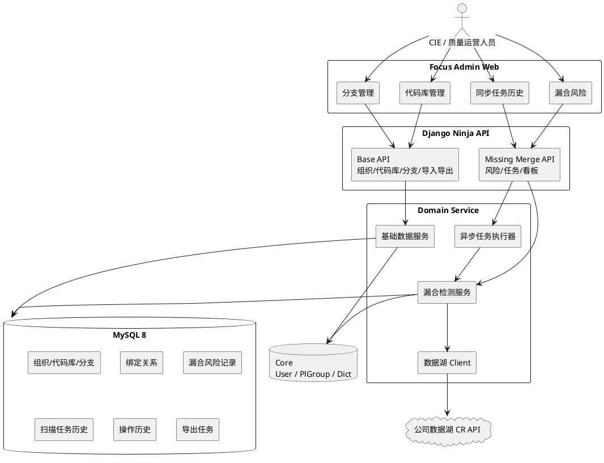
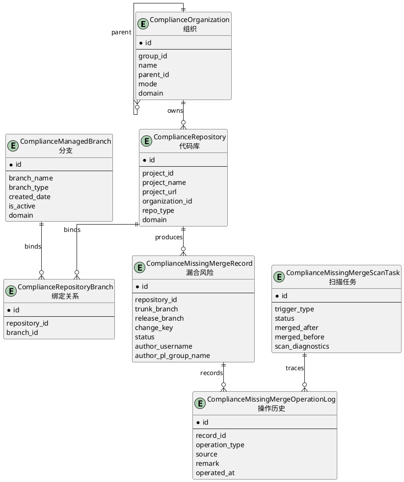
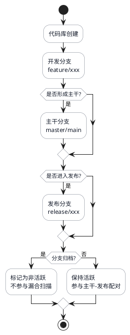
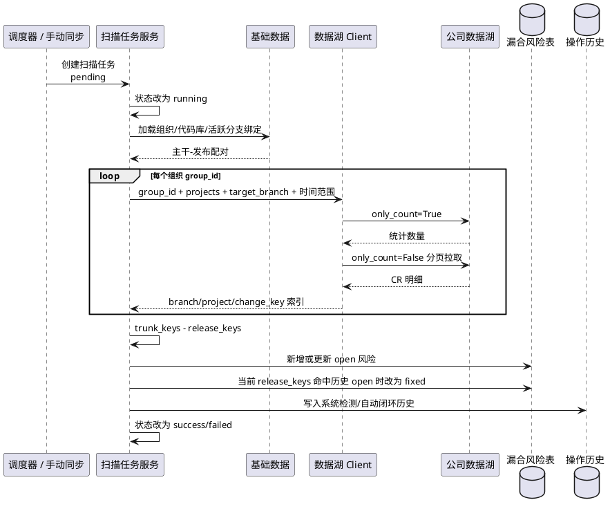
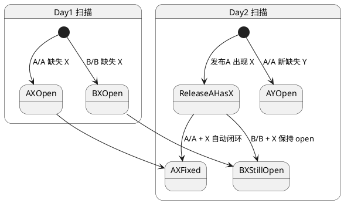
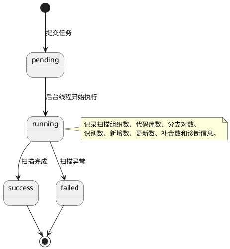

# 从 Excel 台账到自动化漏合治理：merge_compliance 模块建设实践

## 摘要

`merge_compliance` 模块原本承担代码合规 Excel 风险台账导入和人工跟踪能力。随着公司代码库系统升级，单纯依赖外部 Excel 台账已经无法支撑组织、代码库、分支持续变化后的漏合治理诉求。我们在保留旧能力的前提下，围绕“基础数据治理 + 数据湖 CR 拉取 + 漏合差异识别 + 任务化闭环 + 可视化分析”完成了一轮生产化升级。

本文从背景、目标、设计方案和使用方法四个角度，梳理本模块如何把组织、代码库、分支、CR 明细、PL 组归属和漏合风险串成一条可持续运营的治理链路。

## 一、背景

在早期合规治理阶段，漏合风险主要依赖用户上传其他系统导出的 Excel 台账。这个方式可以快速启动，但在生产运行中逐渐暴露出几个问题：

- 数据来源依赖人工导出，存在延迟、漏传和格式漂移。
- 组织和代码库关系随公司代码库系统变化而变化，Excel 难以长期维护准确配置。
- 分支状态缺少统一管理，已归档分支仍可能被纳入统计，导致误报。
- 漏合风险无法自动闭环，需要人工判断某个 CR 是否已经补合。
- PL 组、创建人、仓库类型等治理维度缺少结构化沉淀，无法形成趋势看板。

因此，模块升级的核心思路不是直接替换旧 Excel 能力，而是先搭建一套稳定的基础数据底座，再逐步把漏合检测从“外部台账导入”演进为“系统自动发现、自动闭环、人工兜底处理”。

## 二、建设目标

本次建设围绕生产环境落地，目标可以概括为五个方面。

| 目标 | 说明 |
| --- | --- |
| 主数据统一 | 维护组织、代码库、分支、代码库-分支绑定关系，作为漏合检测配置来源 |
| 自动检测 | 对接公司数据湖 CR API，按组织、项目、目标分支拉取已合入 CR |
| 精准识别 | 按同一代码库、同一主干-发布配对、同一 `change_key` 识别漏合风险 |
| 自动闭环 | 当前扫描窗口内发布分支出现历史漏合 `change_key` 时，自动标记已补合 |
| 可运营 | 支持导入导出、任务历史、PL 组看板、分支可视化和操作历史追溯 |

模块设计中特别强调两个边界：

1. 旧 Excel 风险台账能力继续保留，避免影响存量流程。
2. 新漏合检测链路只依赖系统内维护的组织、代码库、分支配置，不再要求用户上传外部 Excel 风险数据。

## 三、整体架构

模块在工程实现中位于 `apps.code_compliance`，业务命名沿用 `merge_compliance`。生产架构分为前端交互层、Django API 层、领域服务层、外部数据湖和 MySQL 存储层。



### 3.1 核心数据模型

基础数据和漏合风险数据采用解耦建模。组织、代码库、分支是检测配置；漏合记录是扫描结果；任务历史和操作日志负责可追溯。



生产语义上，`group_id` 和 `project_id` 均来自公司代码库系统，不是本系统数据表主键。这样做可以保证后续与公司代码库系统、数据湖 API、导入导出文件之间的 ID 口径一致。

### 3.2 代码库管理：组织树与仓库清单一体化

代码库管理页采用类似代码托管平台文件浏览器的布局：左侧组织树，右侧代码库列表。组织与代码库放在同一个页面，是为了让用户在维护仓库时自然地看到其组织上下文。

主要能力包括：

- 左侧组织树支持搜索、展开、收起、节点新增、编辑、删除。
- 右侧展示当前组织直接关联的代码库列表。
- 代码库表单支持组织、模式、领域、仓库类型、责任 PL 组、URL、备注等字段。
- 仓库类型来自 core 字典 `code_compliance_repo_type`。
- 责任领域绑定启用的 `core.PlGroup`，避免自由文本。
- 表格中的分支数可点击查看该代码库绑定的全部分支。
- 支持组织+代码库清单异步导出。

组织和代码库合一后，CIE 在生产维护时不需要在多个菜单之间来回切换。新增组织使用 Dialog，新增或编辑代码库使用 Drawer，保持页面主上下文稳定。

### 3.3 分支管理：活跃状态与归档控制

分支管理页负责维护分支主数据。分支不是某个代码库的私有字段，而是可复用的主数据，再通过绑定关系挂到不同代码库上。

分支关键字段包括：

- 分支名称
- 创建日期
- 分支类型：开发、主干、发布、其他
- 分支别名
- 分支用途
- 领域
- 是否活跃

`是否活跃` 是生产漏合检测中的重要开关。活跃分支参与扫描配对；已归档分支仍保留历史可见性，但在生成主干-发布分支组合前会被过滤掉，避免归档分支继续制造误报。

分支管理页还支持点击“关联仓库数”查看该分支绑定的组织树和代码库列表。右侧代码库名称可作为超链接跳转到代码库地址，方便运营人员从合规系统直接进入代码仓确认上下文。

### 3.4 代码库-分支绑定工作台

绑定关系是漏合检测的配置基础。模块提供两个方向的批量绑定：

- 分支侧：选中多个分支，批量绑定代码库。
- 代码库侧：选中多个代码库，批量绑定分支。

绑定 Dialog 采用工作台式交互，而不是简单的多选下拉：

- 候选区支持组织树、关键词、分页和当前页批量选择。
- 已选区固定在右侧，跨页、跨组织选择不丢失。
- 支持追加绑定和替换绑定两种模式。
- 绑定接口只接收 ID 列表和绑定模式，避免前端携带冗余业务字段。

这种设计解决了生产环境代码库数量较多时，多选下拉难以搜索、难以确认、跨页选择容易丢失的问题。

### 3.5 分支演进可视化

代码库管理页点击分支数后，会打开代码库绑定分支 Dialog。Dialog 中包含两部分：

- 上半部分：分支演进鱼骨图，展示当前代码库绑定的全量分支。
- 下半部分：绑定分支列表，支持分页查看。

鱼骨图按分支创建时间排序，未知创建日期的分支放在末尾。节点通过颜色区分分支类型，通过灰态区分已归档分支。分支较多时，鱼骨图支持横向滚动和全屏查看，保证信息完整展示。



鱼骨图不是为了替代分支列表，而是帮助用户快速理解一个代码库下分支的时间演进和当前活跃状态。列表负责精确字段查看，鱼骨图负责上下文认知。

### 3.6 漏合检测流程

漏合检测以代码库绑定关系为配置来源。系统会加载所有未删除组织、代码库、绑定分支，并过滤非活跃分支。对于同一代码库下的活跃主干分支和活跃发布分支，系统自动生成主干-发布配对。



检测中的关键集合运算如下：

```text
missing_keys = trunk_change_keys - release_change_keys
```

如果某个 `change_key` 在主干分支已经合入，但在对应发布分支没有出现，则认为该主干-发布配对存在漏合风险。

### 3.7 跨天自动闭环语义

生产环境通常会配置“只查最近一天”的定时任务。这里最容易产生疑问：当天窗口是否还能闭环历史数据？

模块的语义是：当前时间范围的新拉取结果，会和历史未处理漏合数据在同一配对维度下比对。配对维度固定为：

```text
repository + trunk_branch + release_branch + change_key
```

举例：

- 第 1 天，`change_key=X` 在 `主干A -> 发布A` 缺失，生成一条 open 风险。
- 第 1 天，同一个 `change_key=X` 在 `主干B -> 发布B` 也缺失，生成另一条 open 风险。
- 第 2 天，`change_key=X` 出现在 `发布A` 的当前扫描窗口内，则只闭环 `主干A -> 发布A + X`。
- `主干B -> 发布B + X` 不会被闭环，除非 `X` 也出现在 `发布B` 的当前扫描结果中。
- 第 2 天如果又发现 `change_key=Y` 在 `主干A -> 发布A` 缺失，则新增一条新的 open 风险。



这套语义保证了同一个 `change_key` 不会跨代码库、跨主干-发布配对误闭环。

### 3.8 PL 组归属与看板

数据湖返回的 CR 明细中包含 `author.username`。系统在落库时会用该字段匹配 Focus 用户，再根据启用的 PL 组成员关系解析作者所属 PL 组。

归属规则如下：

- 命中 Focus 用户且用户属于启用 PL 组：记录该 PL 组。
- 用户不存在、用户未加入启用 PL 组、PL 组被禁用：归为 `非底软领域`。
- 同一用户命中多个启用 PL 组：按系统排序取第一个，保证单条 CR 只归属一个 PL 组。
- 前端创建人展示为 `姓名（工号）`；未匹配用户时展示原始工号。

漏合风险页顶部提供 `风险列表 / PL组看板` 视图切换。PL 组看板按 `merged_at` 所属自然周统计漏合趋势，并展示状态分布和 PL 组排行。这样管理者可以看到某个 PL 组在不同周的漏合变化，而不是只看单条风险明细。

### 3.9 操作历史与人工处理

漏合风险支持人工处理状态：

- 未处理
- 已补合
- 已忽略

所有人工处理必须填写处理备注。备注要求去除首尾空格后不少于 5 个字符，并禁止控制字符和高风险脚本字符。每次处理都会写入操作历史。

系统也会写入历史记录：

- 首次自动检测到漏合风险。
- 后续自动刷新中检测到漏合风险已完成补合。
- 已补合记录后续同一配对再次缺失时，重新检测为待处理。

详情 Drawer 使用时间轴展示操作历史，区分系统操作和人工操作，保证风险从发现到闭环的链路可追溯。

### 3.10 异步任务与可观测性

漏合检测和组织+代码库导出都采用异步任务模式。生产环境中，扫描范围可能包含大量组织、代码库和分支，如果接口同步等待完整执行，很容易出现网关或浏览器超时。

异步扫描任务状态流转如下：



同步任务历史页用于生产排障。尤其当某天检测结果为 0 时，可以从任务详情中的 `scan_diagnostics` 判断原因：

- 是否生成了扫描配对。
- 每个组织 `group_id` 下有多少 `project_id`。
- 每个目标分支 `only_count` 是否为 0。
- 明细分页拉取数量是否和统计数量一致。
- 每个主干-发布配对的主干 key、发布 key、漏合 key、闭环数量是多少。

如果 `only_count` 为 0，说明数据湖在该组织、分支、项目集合和时间范围下没有返回已合入 CR。如果没有配对，则应检查代码库是否同时绑定了活跃主干分支和活跃发布分支。

### 3.11 数据导入与异步导出

为了降低系统切换成本，组织、代码库、分支都支持 Excel 模板下载和批量导入。

导入定位为“基础字段导入”，不导入代码库-分支绑定关系。绑定关系需要通过前端工作台人工确认后批量维护，避免 Excel 中隐藏关系错误直接进入扫描配置。

代码库管理页提供组织+代码库异步导出：

- 全量导出：导出全部未删除组织下的全部未删除代码库。
- 按当前筛选导出：复用页面筛选条件，但不受当前分页限制。
- Excel 一行代表一个代码库，字段顺序为组织信息、代码库信息、统计和备注信息。
- 导出任务成功后生成文件，前端轮询任务状态并下载。
- 相同用户、相同导出指纹的运行中任务会复用，避免重复导出。

导出的典型字段包括：

| 分类 | 字段 |
| --- | --- |
| 组织信息 | 组织ID、组织名、父组织ID、父组织名、组织路径、组织模式、组织领域、组织备注 |
| 代码库信息 | 代码库ID、代码库名、代码库URL、代码库模式、代码库领域、代码仓类型、责任PL组 |
| 统计信息 | 绑定分支数、创建时间、更新时间 |

## 四、生产使用方法

### 4.1 初始化菜单和权限

生产环境部署完成后，执行模块初始化命令补齐菜单、权限、字典和定时任务配置。初始化会保留旧风险入口，并新增：

- 代码库管理
- 分支管理
- 漏合风险
- 同步任务历史

接口权限会挂载到对应菜单下，便于按角色授权。

### 4.2 维护基础数据

推荐生产维护顺序如下：

1. 在代码库管理页维护组织树，确保 `group_id` 与公司代码库系统一致。
2. 在组织下维护代码库，确保 `project_id`、代码库 URL、仓库类型、责任 PL 组准确。
3. 在分支管理页维护分支，标记分支类型和是否活跃。
4. 在代码库或分支侧批量维护绑定关系。
5. 通过代码库分支数和分支关联仓库数检查绑定关系是否符合预期。

分支是否参与漏合检测，取决于是否活跃以及分支类型。已归档分支不会参与扫描配对，但仍可在关系弹窗中查看。

### 4.3 执行手动同步

在漏合风险页点击手动同步：

1. 选择合入时间范围。
2. 选择扫描范围：
   - 不选组织和代码库：全量扫描。
   - 只选组织：扫描该组织下全部代码库。
   - 选择代码库：扫描指定代码库集合。
3. 提交后接口立即返回任务创建结果。
4. 页面刷新最近任务摘要，任务详情可在同步任务历史页查看。

如果已有 `pending/running` 任务，系统不会创建新任务，会返回当前运行中任务，避免生产环境并发扫描互相争抢资源。

### 4.4 查看和处理漏合风险

风险列表支持按以下维度筛选：

- 关键词
- 状态
- 组织/代码库级联多选
- 创建人姓名或工号
- PL 组
- 主干分支
- 发布分支
- 合入时间
- 识别时间

打开详情 Drawer 后，可以查看 CR 标题、描述、链接、代码行变化、创建人、PL 组归属、分支配对和操作历史。人工处理时必须填写备注，便于后续复盘。

### 4.5 查看 PL 组看板

漏合风险页顶部切换到 `PL组看板` 后，可以从运营视角查看：

- 各 PL 组漏合总量。
- 未处理、已补合、已忽略分布。
- 按周维度的漏合趋势。
- `非底软领域` 数据量。
- 空合入时间记录数量。

看板沿用风险列表筛选条件，因此可以先筛选某个组织、代码库、时间范围，再切换看板分析趋势。

### 4.6 排查零结果任务

当定时任务最近几天结果为 0 时，建议按以下顺序排查：

1. 打开同步任务历史，确认任务状态是否为 success。
2. 查看扫描计数：组织数、代码库数、分支对数是否为 0。
3. 查看扫描诊断：
   - `project_count` 是否为 0。
   - 每个 `target_branch` 的 `only_count` 是否为 0。
   - 每个配对的 `trunk_key_count`、`release_key_count`、`missing_key_count` 是否符合预期。
4. 如果没有扫描配对，检查代码库是否同时绑定活跃主干和活跃发布分支。
5. 如果 `only_count` 为 0，检查时间范围、分支名、组织 `group_id` 和代码库 `project_id` 是否与数据湖口径一致。
6. 如果主干和发布都有数据但没有漏合，说明当前窗口内集合差异为空，属于正常无风险。

## 五、落地收益

升级后的 `merge_compliance` 模块不再只是一个 Excel 台账工具，而是形成了面向生产的代码合规治理闭环：

- 基础数据从自由文本变为结构化主数据。
- 分支活跃状态显式化，减少归档分支误报。
- 漏合风险从人工上传变为自动扫描识别。
- 历史 open 风险可以跨天自动闭环。
- 每条 CR 可归属到 Focus 用户和 PL 组。
- 手动同步、定时扫描、导出任务均任务化、可追踪。
- 代码库-分支关系和分支演进可视化，提升配置可理解性。
- 任务诊断信息让生产排障从“看日志猜原因”变成“在页面看数据链路”。

这套建设思路也为后续扩展留下了空间：例如显式主干-发布监测关系、任务队列化、扫描失败重试、按任务反查新增风险、与代码库系统实时同步组织和项目等能力，都可以在现有主数据和任务模型上继续演进。
