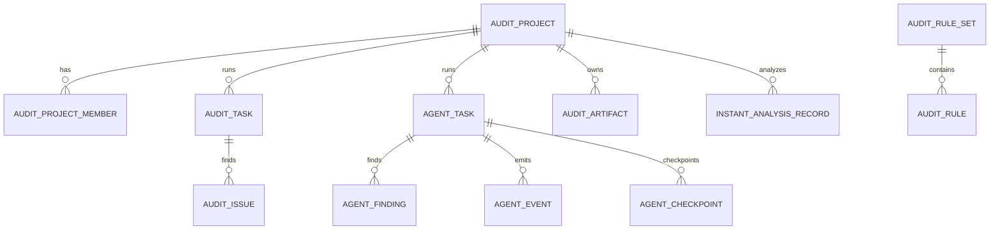

# DeepAudit 后端实现附录

DeepAudit 后端并不是单一 `api.py + service.py` 结构，而是一套按子域拆分的智能审计后端系统。聚合入口位于 `backend-django/apps/deepaudit/router.py`，再向下拆成项目、扫描任务、Agent 任务、规则、Prompt、RAG、用户配置、看板、报告导出等多个子域。

## 后端边界与目录结构

```text
apps/deepaudit/
├── router.py                    # 聚合路由
├── project/                     # 项目接入域
├── scan_task/                   # 传统扫描与即时分析
├── agent_task/                  # Agent 任务与事件流
├── audit_rule/                  # 审计规则集
├── prompt_template/             # 提示词模板
├── rag/                         # 检索增强与索引
├── user_config/                 # 用户配置与 SSH 凭据
├── dashboard/                   # 看板摘要
├── realtime.py                  # WebSocket group 推送
├── consumers.py                 # DeepAudit WebSocket consumer
├── runtime.py                   # 工作区准备与运行时封装
├── storage.py                   # DeepAudit 存储目录封装
├── tasks.py                     # Celery 调度入口
└── reporting.py                 # 报告输出
```

## 路由总览

聚合路由位于 `backend-django/apps/deepaudit/router.py`，核心前缀包括：

- `/api/deepaudit/projects`
- `/api/deepaudit/members`
- `/api/deepaudit/tasks`
- `/api/deepaudit/scan`
- `/api/deepaudit/agent-tasks`
- `/api/deepaudit/rules`
- `/api/deepaudit/prompts`
- `/api/deepaudit/settings`
- `/api/deepaudit/embedding`
- `/api/deepaudit/rag`
- `/api/deepaudit/ssh-keys`
- `/api/deepaudit/reports`
- `/api/deepaudit/dashboard`
- `/api/deepaudit/data-tools`

这意味着 DeepAudit 不是“一个大接口管所有页面”，而是按业务域拆成多个可维护接口组。

## 核心模型拓扑



最重要的模型文件如下：

- `project/project_model.py`
  `AuditProject`、`AuditProjectMember`
- `scan_task/scan_task_model.py`
  `AuditTask`、`AuditIssue`、`AuditArtifact`、`InstantAnalysisRecord`
- `agent_task/agent_task_model.py`
  `AgentTask`、`AgentFinding`、`AgentEvent`、`AgentCheckpoint`
- `audit_rule/audit_rule_model.py`
  `AuditRuleSet`、`AuditRule`
- `prompt_template/prompt_template_model.py`
  `PromptTemplate`
- `user_config/user_config_model.py`
  `AuditUserConfig`、`AuditSshCredential`

## 子域实现说明

### 1. 项目接入域

文件：

- `project/project_api.py`
- `project/project_services.py`

负责：

- 项目 CRUD
- 成员与 owner 关系同步
- 回收站与恢复
- ZIP 上传与删除
- 分支列表获取
- 文件列表获取

关键方法：

- `create_project`
  创建项目并同步 owner membership
- `list_branches`
  结合 Git 服务列出远端分支
- `upload_project_zip`
  把 ZIP 存入 DeepAudit 存储并回写 artifact 元信息
- `prepare_workspace`
  在运行前准备项目工作区

### 2. 传统扫描域

文件：

- `scan_task/scan_task_api.py`
- `scan_task/scan_task_services.py`

负责：

- 仓库扫描任务
- ZIP 扫描任务
- 即时分析
- 任务详情、问题列表、状态更新
- JSON/PDF 导出

关键方法：

- `create_task`
  创建扫描任务
- `run_instant_analysis`
  即时分析，不走完整任务链
- `list_issues`
  返回任务问题分页
- `export_task_pdf_response`
  输出可交付报告

### 3. Agent 任务域

文件：

- `agent_task/agent_task_api.py`
- `agent_task/agent_task_services.py`
- `agent_task/agent_runner.py`

负责：

- Agent 审计任务创建
- 事件流输出
- Finding 管理
- 检查点查看与恢复
- 任务取消与摘要输出

关键方法：

- `create_task`
  创建 `AgentTask`
- `stream_events_response`
  以 `StreamingHttpResponse` 输出 SSE
- `list_events`
  返回历史事件列表
- `resume_from_checkpoint`
  从阶段快照恢复任务

### 4. 规则 / Prompt / 用户配置域

文件：

- `audit_rule/audit_rule_services.py`
- `prompt_template/prompt_template_services.py`
- `user_config/user_config_services.py`

负责：

- 默认规则集初始化
- 规则集导入导出
- 默认模板初始化
- LLM 配置、Embedding 配置
- SSH 凭据保存与读取

这些域决定了 DeepAudit 的“策略层”，不是纯粹后台管理页。

### 5. RAG 域

文件：

- `rag/rag_api.py`
- `rag/rag_services.py`
- `rag/indexer.py`
- `rag/retriever.py`
- `rag/project_retriever.py`

负责：

- 项目索引构建
- 文件分片
- Embedding
- 项目级检索
- 知识问答支持

这部分是 Agent 质量的重要基础能力。

## 实时链路

DeepAudit 同时支持 SSE 与 WebSocket：

### SSE

接口：

- `/api/deepaudit/agent-tasks/{task_id}/stream`

实现：

- `agent_task_services.stream_events_response`
- 返回 `StreamingHttpResponse`
- `content_type = text/event-stream`
- 显式设置 `X-Accel-Buffering: no`

### WebSocket

路径：

- `/ws/deepaudit/tasks/{task_id}/`

实现：

- `apps/deepaudit/consumers.py`
- `apps/deepaudit/realtime.py`
- `core/websocket/routing.py`

机制：

- 先通过 JWT query token 认证
- 再做项目 viewer 级权限校验
- 加入任务级 group
- 通过 `push_task_event` 广播任务事件

## 运行时与存储

DeepAudit 有自己的一套运行时目录管理：

- `storage.py`
  管理 workspace、reports、knowledge、ssh 等目录
- `runtime.py`
  负责工作区准备、SSH 私钥装载、用户配置读取
- `cleanup_runtime_storage`
  提供清理工作区与报告文件的能力

这也是为什么 DeepAudit 部署比普通 CRUD 模块更复杂：它不只是数据库应用，还强依赖文件系统与运行工作区。

## 异步执行与部署要求

DeepAudit 强依赖异步执行：

- 扫描任务由 `dispatch_deepaudit_task(run_scan_task, ...)` 调度
- Agent 任务由 `dispatch_deepaudit_task(run_agent_task, ...)` 调度

因此生产环境至少要保证：

- Django 后端以 `application.asgi:application` 运行
- Celery worker 正常
- Redis cache / celery / channels DB 隔离
- `/basic-api/`、`/ws/` 与 DeepAudit `/stream` 被正确代理

如果这些条件缺失，最常见的表现就是：

- 普通列表接口正常
- 创建任务正常
- 但实时日志不刷新、WebSocket 连接失败、SSE 长时间无输出

## 对应主线文档

- [DeepAudit 智能审计主线页](/modules/deepaudit)
- [Nginx 部署文档](/dev-guide/deploy/nginx)
