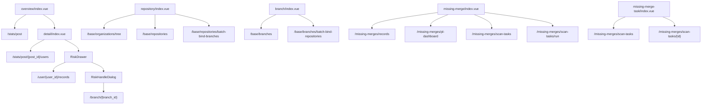

# 代码合规前端附录

代码合规前端位于 `web/apps/web-ele/src/views/compliance/`。旧风险台账采用“岗位概览 -> 用户详情 -> 风险抽屉 -> 分支处理对话框”四层展开；一期基础数据新增“代码库管理”和“分支管理”两个维护入口；自动漏合检测新增“漏合风险”和“同步任务历史”入口。

## 页面结构

- `overview/index.vue` 岗位维度概览页
- `detail/index.vue` 岗位下钻到用户维度
- `components/RiskDrawer.vue` 用户风险明细抽屉
- `components/RiskHandleDialog.vue` 分支整改对话框
- `repository/index.vue` 代码库管理，左侧组织树，右侧代码库列表
- `branch/index.vue` 分支管理，表格 CRUD 与批量绑定代码库
- `missing-merge/index.vue` 漏合风险，查询自动检测出的漏合 CR、查看详情、更新状态并手动触发同步
- `missing-merge-task/index.vue` 同步任务历史，统一查看手动同步和定时扫描任务

## API 入口

- `src/api/compliance/index.ts`
- `src/api/compliance/base.ts`
- `src/api/compliance/missing-merge.ts`

主要消费：

- `getPostStats`
- `getPostUsersStats`
- `getUserRecords`
- `updateBranchStatus`
- `uploadComplianceData`
- `listOrganizationsApi`
- `listRepositoriesApi`
- `listBranchesApi`
- `bindBranchesToRepositoriesApi`
- `bindRepositoriesToBranchesApi`
- `listMissingMergeRecordsApi`
- `getMissingMergePlDashboardApi`
- `listMissingMergeScanTasksApi`
- `getMissingMergeScanTaskApi`
- `runMissingMergeScanApi`
- `updateMissingMergeRecordStatusApi`

## 前端数据流

## 实现特点

- 概览页与详情页都用统计卡 + 表格组合
- 风险处理粒度在分支级，不在记录级
- 模板下载与导入动作直接挂在概览页
- 代码库管理页合并组织和代码库维护，默认选中第一个真实组织展示直接挂载的代码库
- 组织新增/编辑使用 `ElDialog`，代码库新增/编辑使用 `ElDrawer`
- 分支管理页使用 `zq-table`，支持 Excel 导入、活跃/归档状态维护和批量绑定代码库
- 分支管理页点击关联仓库数可查看组织树与分页代码库列表；代码库管理页点击分支数可查看分页分支列表和当前页分支演进鱼骨图
- 漏合风险页顶部提供 `风险列表 / PL组看板` 视图切换，两种视图共用关键词、组织/代码库级联、PL 组、分支和时间范围筛选；PL 组选项直接复用核心 PL 组列表接口
- 风险列表使用 `zq-table`，新增 PL 组列；详情 Drawer 展示 CR 创建人、Focus 用户和 PL 组归属
- PL 组看板使用 ECharts 展示按主干合入周统计的 PL 组漏合趋势和状态分布，明细表展示各 PL 组总量、未处理、已补合、已忽略和最近识别时间
- 手动同步提交后只等待任务创建结果，后台扫描进度通过 `同步任务历史` 页面和最近任务摘要追踪
- 同步任务历史页使用固定宽度筛选项和详情 Drawer，展示扫描范围、风险计数、耗时和失败原因

## 对应主线文档

- [代码合规](/modules/code-compliance)
- `backend-django/docs/code-compliance-foundation-v1.md`
- `backend-django/docs/merge-compliance-missing-merge-v1.md`
