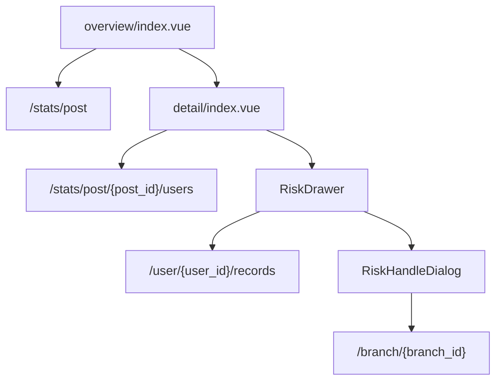

# 代码合规前端附录

代码合规前端位于 `web/apps/web-ele/src/views/compliance/`，采用“岗位概览 -> 用户详情 -> 风险抽屉 -> 分支处理对话框”四层展开。

## 页面结构

- `overview/index.vue`
  岗位维度概览页
- `detail/index.vue`
  岗位下钻到用户维度
- `components/RiskDrawer.vue`
  用户风险明细抽屉
- `components/RiskHandleDialog.vue`
  分支整改对话框

## API 入口

- `src/api/compliance/index.ts`

主要消费：

- `getPostStats`
- `getPostUsersStats`
- `getUserRecords`
- `updateBranchStatus`
- `uploadComplianceData`

## 前端数据流

## 实现特点

- 概览页与详情页都用统计卡 + 表格组合
- 风险处理粒度在分支级，不在记录级
- 模板下载与导入动作直接挂在概览页

## 对应主线文档

- [代码合规](/modules/code-compliance)
