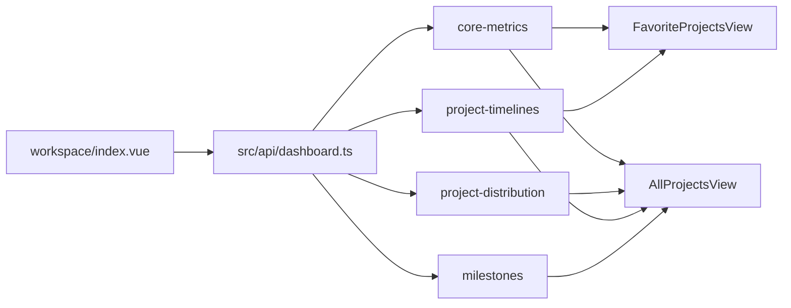

# 仪表盘前端附录

仪表盘页面位于 `web/apps/web-ele/src/views/dashboard/workspace/`，它不是单一页面吃一个大接口，而是由多个聚合 API 和多个展示组件共同装配而成。

## 页面入口

- `views/dashboard/workspace/index.vue`
  工作台主入口，负责页签、scope 和接口并发加载
- `views/dashboard/workspace/components/FavoriteProjectsView.vue`
  收藏视角
- `views/dashboard/workspace/components/AllProjectsView.vue`
  全量视角

## API 入口

- `src/api/dashboard.ts`

主要消费：

- `getCoreMetrics`
- `getProjectDistribution`
- `getProjectTimelines`
- `getUpcomingMilestones`

## 关键组件

- `QGRiskCard`
  里程碑风险卡片
- `RequirementWorkspacePanel`
  需求工作台摘要
- `ProjectPie / ProjectBar`
  分布图
- `MilestoneTimeline / MilestoneTable`
  项目时间轴和预警列表

## 数据流

## 实现重点

- 通过页签切换 `scope=all|favorites`
- 首屏数据分接口并行加载，而不是串行大请求
- 风险卡片和需求工作台是嵌套聚合面板，不属于 Dashboard API 本体

## 对应主线文档

- [工作台 / 仪表盘](/modules/dashboard)
