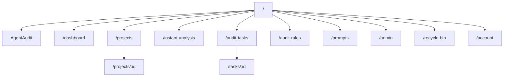

# DeepAudit 前端应用附录

DeepAudit 前端不是 `web-ele` 下的一组页面，而是独立应用 `web/apps/web-deepaudit`。它通过 Focus 的认证态与权限码接入主平台，但自身拥有独立的路由、页面、API 封装和流式事件处理。

## 应用入口与基础约束

应用目录：

```text
web/apps/web-deepaudit/
├── src/app/                    # 应用入口与路由
├── src/pages/                  # 页面层
├── src/shared/api/             # API 与 SSE 客户端
├── src/shared/focus/           # 与 Focus 主平台的鉴权集成
├── src/components/agent/       # Agent 审计专用组件
├── src/components/layout/      # DeepAudit 布局组件
└── src/shared/utils/           # 工具函数与拦截器
```

部署约束：

- Vite `base` 运行在 `/deepaudit-app/`
- 默认 API 基址来自 `VITE_API_BASE_URL`
- 默认值是 `/basic-api/api`

也就是说前端天然假设自己挂在：

- 页面入口：`/deepaudit-app/`
- API 入口：`/basic-api/api/*`

## 路由结构

路由定义位于 `web/apps/web-deepaudit/src/app/routes.tsx`。



每个路由都绑定了 `DEEPAUDIT_PAGE_CODES` 权限码，因此 DeepAudit 是按页面级访问码进行控制的，而不是仅靠菜单可见性控制。

## 页面分层说明

### 1. Agent 审计

页面：

- `pages/AgentAudit.tsx`

职责：

- 创建 Agent 审计任务
- 订阅流式事件
- 展示 thinking、tool call、finding、phase、summary

这是 DeepAudit 最核心的页面，也是对部署最敏感的页面，因为它高度依赖 SSE。

### 2. 项目管理

页面：

- `pages/Projects.tsx`
- `pages/ProjectDetail.tsx`
- `pages/RecycleBin.tsx`

职责：

- 管理项目列表、回收站
- 查看项目详情、最近任务、聚合问题
- 上传 ZIP、触发任务、查看语言与仓库配置

### 3. 传统扫描与即时分析

页面：

- `pages/AuditTasks.tsx`
- `pages/TaskDetail.tsx`
- `pages/InstantAnalysis.tsx`

职责：

- 展示传统扫描任务及其问题
- 展示即时分析历史
- 管理 Issue 状态更新

### 4. 策略与配置

页面：

- `pages/AuditRules.tsx`
- `pages/PromptManager.tsx`
- `pages/AdminDashboard.tsx`
- `pages/Account.tsx`

职责：

- 管理规则集和规则
- 管理提示词模板
- 查看系统层配置
- 维护账号与用户配置

## API 分层

前端 API 客户端集中在 `src/shared/api/`：

- `agentTasks.ts`
  Agent 任务、Finding、事件、摘要、检查点
- `agentStream.ts`
  SSE 客户端与重连机制
- `rules.ts`
  审计规则
- `prompts.ts`
  提示词模板
- `rag.ts`
  RAG 查询与索引
- `database.ts`
  Dashboard / 数据工具 / 系统数据
- `sshKeys.ts`
  SSH 凭据
- `serverClient.ts`
  通用请求客户端
- `focusAdapter.ts`
  与 Focus 主平台 token / baseURL / 权限码集成

## SSE 与实时渲染

DeepAudit 前端实时主链位于：

- `src/shared/api/agentStream.ts`

关键机制包括：

- 使用 `fetch + ReadableStream` 解析 SSE
- 兼容 `EventSource` 场景的设计思路
- 支持断线重连
- 支持 `after_sequence` 续传
- 把事件按 `thinking / tool_call / progress / task_end` 分类回调

这意味着前端不是“拿到整段字符串再渲染”，而是按事件流持续更新 UI。

## 认证与 Focus 主平台集成

DeepAudit 并不自己发 token，而是从 Focus 侧读现有认证态。关键文件：

- `shared/api/focusAdapter.ts`
- `shared/focus/focusAuth.ts`
- `shared/focus/focusPermission.ts`

关键逻辑：

- 从 localStorage / sessionStorage 中解析 `core-access`
- 读取 `accessToken`
- 读取 `accessCodes`
- 解析 `VITE_API_BASE_URL`
- 解析应用 `BASE_URL`

如果生产环境下 DeepAudit 打开后能进页面，但接口 401、SSE 建不起来，通常先看这里是否真的读到了 Focus 主平台 token。

## 部署与常见问题

前端最常见的生产问题集中在三类：

### 1. `/deepaudit-app/` 刷新 404

原因：

- Nginx 没有给 `/deepaudit-app/` 配 `try_files`
- 或者 `/deepaudit-app` 没有 301 到 `/deepaudit-app/`

### 2. 基础接口正常，但 DeepAudit API 404

原因：

- `web-deepaudit` 默认请求 `/basic-api/api/*`
- Nginx 只代理了 `/api/` 或 `/basic-api/` 但没有正确 rewrite

### 3. 页面正常，任务实时日志不刷新

原因：

- `/basic-api/api/deepaudit/agent-tasks/{id}/stream` 被 Nginx 缓冲
- 后端没有跑 ASGI
- Redis Channels 不可用

## 对应主线与部署文档

- [DeepAudit 智能审计主线页](/modules/deepaudit)
- [DeepAudit 后端实现附录](/backend/apps/deepaudit)
- [Nginx 部署文档](/dev-guide/deploy/nginx)
