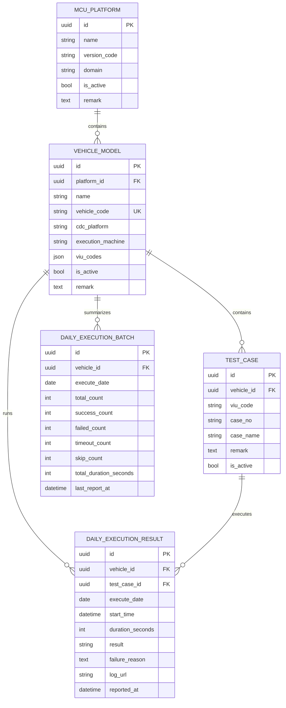
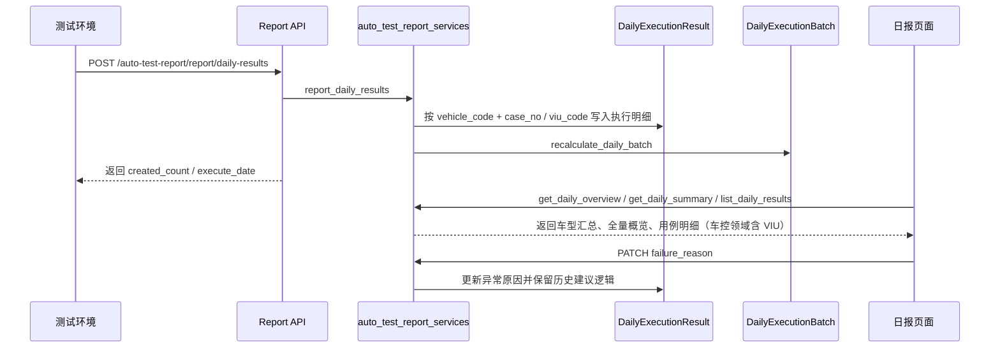

<FocusModuleHero :module="moduleMeta" />

<FocusModuleSection
  kicker="Module Purpose"
  title="模块定位"
  summary="自动化测试报告模块把平台、车型、测试用例和每日执行结果连接成一条持续积累的验证数据链。它不是一次性报表页面，而是一套长期沉淀自动化执行数据的结构化系统。"
>

它重点解决四类问题：

- 用什么平台、什么车型在执行
- 哪些用例属于该车型
- 某一天这些用例跑出了什么结果
- 如何从明细回溯到历史趋势和异常原因

现在这套主链又被扩展成双领域结构：

- 座舱领域沿用 `MCU 平台 -> 车型 -> 用例 -> 日报`
- 车控领域补入 `VIU 平台 -> 车型 -> VIU 编号 -> 用例 -> 日报`

因此这是一个“主数据 + 日执行明细 + 日汇总视图”组合模块，同时也承担领域切换和结构适配的职责。

</FocusModuleSection>

<FocusModuleSection
  kicker="Data Model"
  title="表结构与关系设计"
  summary="模块结构是一条很清晰的层级链：平台 -> 车型 -> 用例 -> 每日结果 / 每日批次。"
>

## 关键字段说明

### `McuPlatform`

平台主数据层，区分座舱 / 车控两个领域，关键字段包括：

- `name`
- `version_code`
- `domain`
- `is_active`
- `remark`

### `VehicleModel`

车型层对象，关键字段包括：

- `platform`
  所属平台
- `vehicle_code`
  外部上报识别码
- `cdc_platform`
  座舱平台信息
- `execution_machine`
  执行机器
- `viu_codes`
  车控车型可用的 VIU 编号子集，固定取值为 `viu0` ~ `viu4`

这里同时有两个唯一性约束：

- `vehicle_code` 全局唯一
- `platform + name` 组合唯一

### `TestCase`

测试用例对象，关键字段包括：

- `vehicle`
  归属车型
- `viu_code`
  车控领域下与 `case_no` 共同唯一；座舱领域保持空值
- `case_no`
  用例编号
- `case_name`
  用例名称
- `remark`
  测试说明或补充信息
- `is_active`
  是否启用

同一车型下 `vehicle + viu_code + case_no` 唯一；座舱领域因为 `viu_code` 为空，行为与旧模型一致。

### `DailyExecutionResult` 与 `DailyExecutionBatch`

这两个对象共同构成“明细 + 汇总”双层视图：

- `DailyExecutionResult`
  保存单条执行结果
- `DailyExecutionBatch`
  保存同车型同日期的汇总结果

`DailyExecutionBatch` 通过 `vehicle + execute_date` 唯一，保证每日每车型只有一条汇总记录。

</FocusModuleSection>

<FocusModuleSection
  kicker="Implementation"
  title="关键实现原理"
  summary="自动化测试报告模块最重要的设计，不是页面多少，而是明细如何沉淀、汇总如何重算、异常原因如何复用。"
>

### 结果上报：`report_daily_results`

在 `backend-django/apps/auto_test_report/auto_test_report_services.py` 中，上报流程会：

1. 根据 `vehicle_code` 找到有效车型
2. 逐条校验上报结果中的 `case_no`、`result`、`viu_code`
3. 为校验通过的结果创建 `DailyExecutionResult`
4. 收集失败行到 `errors[]`，其余结果继续落库
5. 调用 `recalculate_daily_batch`

这说明系统不是直接覆盖结果，而是按上报事件追加结果，再重新计算当前视图。

### 汇总重算：`recalculate_daily_batch`

汇总逻辑会：

1. 查询某天该车型每个用例的最新执行结果
2. 统计 `success / failed / timeout / skip`
3. 用“实际落库的最新结果数”作为 `total_count`
4. 用显式 `skip` 结果统计 `skip_count`
5. 更新 `DailyExecutionBatch`

这意味着：

- `skip` 必须由上报端显式传入，未上传的注册用例不再自动算跳过
- 汇总表是派生视图，而不是独立业务来源

### 历史原因建议：`get_suggested_failure_reason`

如果当前失败或超时结果没有填写异常原因，系统会回看同车型同用例最近一次非空 `failure_reason`，作为前端建议值。  
这是一种很实用的知识复用机制，可以减少重复录入。

### 每日明细视图：`list_daily_results`

明细页直接查某天存在的最新结果，不再补齐未执行的注册用例：

1. 查询某天每个用例的最新结果
2. 只返回真实落库的结果行
3. `skip` 只代表显式上报的跳过结果

所以日报页展示的是“真实执行结果列表”，而不是“全量用例补齐视图”。

</FocusModuleSection>

<FocusModuleSection
  kicker="Frontend Entry"
  title="前端入口与页面结构"
  summary="前端按主数据管理和日报分析两条主线拆分，和后端模型层级保持一致。"
>

前端主入口包括：

- `web/apps/web-ele/src/views/auto-test-report/vehicle-config/index.vue`
  平台与车型配置页
- `web/apps/web-ele/src/views/auto-test-report/test-cases/index.vue`
  用例管理页，支持导入、导出、批量删除
- `web/apps/web-ele/src/views/auto-test-report/daily-results/index.vue`
  每日执行概览、明细、异常原因编辑
- `web/apps/web-ele/src/views/auto-test-report/components/test-case-history-drawer.vue`
  查看单用例历史执行记录
- `web/apps/web-ele/src/views/auto-test-report/components/domain-switcher.vue`
  统一领域切换器

对应 API 位于 `web/apps/web-ele/src/api/auto-test-report/index.ts`。

其中：

- 车型配置页可以跳转到日报页
- 页面内提供全局领域切换器，座舱 / 车控三页共用同一状态，并通过 `sessionStorage` 维持同标签页联动
- 车控视图下，车型配置页会维护 VIU 编号子集，用例页和日报页会展示 `viu_code`
- 日报页仍按车型汇总，明细和历史抽屉只在车控领域补充 VIU 维度
- 失败/超时结果允许在前端补录 `failure_reason`

</FocusModuleSection>

<FocusModuleSection
  kicker="Sequence"
  title="时序图：一次执行结果如何沉淀为日报"
  summary="自动化测试报告的主链是‘外部上报 -> 明细落库 -> 汇总重算 -> 页面回查’。"
>

</FocusModuleSection>

<FocusModuleSection
  kicker="Dependencies"
  title="相关依赖与上下游"
  summary="自动化测试报告以车型与用例主数据为上游，以日报分析和问题回溯为下游。"
>

- 上游输入
  测试环境上报的 `vehicle_code + results[]`，车控领域结果额外携带 `viu_code`
- 上游依赖
  平台、车型、测试用例主数据，以及车型级 VIU 子集配置
- 下游消费
  每日执行概览、车型明细、异常原因补录、历史回溯
- 结构特征
  明细与汇总双表并存，汇总由明细重算而来，日报仍按车型聚合

</FocusModuleSection>

<FocusModuleSection kicker="Core APIs" title="核心 API 清单" summary="以下接口覆盖主数据管理、结果上报、日报汇总与异常原因处理。">

<FocusApiTable :items="apis" />

</FocusModuleSection>

<FocusModuleSection kicker="Related Docs" title="相关文档" summary="继续下钻实现附录可参考这些页面。">

- [后端技术参考](/backend/apps/auto-test-report)
- [前端页面参考](/frontend/views/auto-test-report)
- [项目管理](/modules/project-manager)

</FocusModuleSection>
