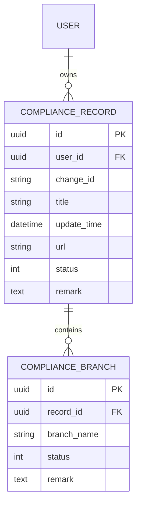
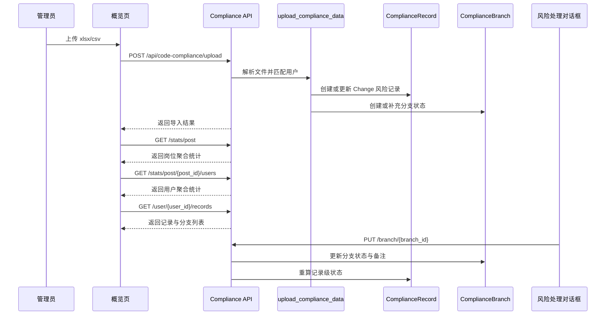

<FocusModuleHero :module="moduleMeta" />

<FocusModuleSection
  kicker="Module Purpose"
  title="模块定位"
  summary="代码合规模块把原本零散的 Change 风险整理成一套可聚合、可追踪、可整改的治理台账。它关注的不是“扫出了多少问题”，而是谁的哪些分支还没有处理完。"
>

这个模块偏治理而不是分析，核心业务问题是：

- 哪些岗位、哪些人存在合规风险
- 同一条风险在不同分支上是否已经处理
- 风险状态在组织维度和个人维度如何统计

因此它的设计重点不是复杂模型数量，而是“记录级状态”和“分支级状态”的层次拆分。

</FocusModuleSection>

<FocusModuleSection
  kicker="Foundation V1"
  title="一期基础数据升级"
  summary="新一期在保留旧 Excel 风险台账的前提下，新增组织、代码库、分支和代码库-分支绑定主数据。"
>

一期新增的基础数据不参与漏合风险检测，只为后续联动公司代码库系统做准备。

新增模型包括：

- `ComplianceOrganization`
  公司代码库系统组织，使用外部 `group_id` 作为业务唯一标识
- `ComplianceRepository`
  公司代码库系统代码库，使用外部 `project_id` 作为业务唯一标识
- `ComplianceManagedBranch`
  分支主数据，为避免影响旧风险台账，未复用旧 `ComplianceBranch`
- `ComplianceRepositoryBranch`
  代码库和分支的绑定表，支持软删除恢复

新增页面包括：

- `代码库管理`
  左侧组织树，右侧当前组织直接挂载的代码库列表，组织用 Dialog 编辑，代码库用 Drawer 编辑
- `分支管理`
  分支基础信息列表、CRUD、Excel 导入和批量绑定代码库

详细一期说明见后端文档：`backend-django/docs/code-compliance-foundation-v1.md`。

</FocusModuleSection>

<FocusModuleSection
  kicker="Data Model"
  title="表结构与关系设计"
  summary="代码合规模块只有两个核心表，但语义层次非常明确：记录表示 Change 风险主对象，分支表示治理粒度。"
>

## 关键对象说明

### `ComplianceRecord`

记录级对象，对应一次 Change 风险，关键字段包括：

- `user`
  风险归属人，后续岗位和用户统计都依赖它
- `change_id`
  风险记录的业务主键语义
- `title`、`url`
  用于回溯源码或代码评审上下文
- `update_time`
  支持时间区间查询
- `status`
  记录级汇总状态，不是最细粒度状态
- `remark`
  记录整体说明，或承接历史导入备注

### `ComplianceBranch`

分支级对象，表示这条风险在某一分支上的处理状态，关键字段包括：

- `record`
  所属风险记录
- `branch_name`
  分支名称
- `status`
  0 待处理、1 无风险、2 已修复
- `remark`
  分支级整改日志与备注

设计上真正的治理粒度在 `ComplianceBranch`，因为同一 Change 可能在不同分支进度不同。

</FocusModuleSection>

<FocusModuleSection
  kicker="Aggregation Logic"
  title="统计结构与聚合口径"
  summary="代码合规模块的看板数据不是单独快照表，而是实时遍历记录与分支得到。"
>

在 `backend-django/apps/code_compliance/services.py` 中：

- `get_post_stats`
  把所有记录按岗位聚合，输出岗位级总风险数、待处理数、分支总数、待处理分支数
- `get_post_users_detail`
  在岗位维度下进一步按用户聚合，并支持 `start_date / end_date`
- `get_user_records`
  返回某个用户下的风险明细和分支列表

这里有两个很重要的统计口径：

1. `total_risks / unresolved_risks`
   统计的是记录数，也就是 Change 风险数
2. `total_branch_risks / unresolved_branch_risks`
   统计的是分支数，反映实际整改粒度

所以一个岗位可能 Change 数不高，但分支待处理量很高，这也是模块要保留双层统计的原因。

</FocusModuleSection>

<FocusModuleSection
  kicker="Implementation"
  title="关键实现原理"
  summary="代码合规的核心实现不是 CRUD，而是导入规范化、状态同步和备注日志叠加。"
>

### 导入逻辑：`upload_compliance_data`

导入接口位于 `backend-django/apps/code_compliance/api.py`，支持：

- `.xlsx`
- `.csv`

导入时会：

1. 解析 `ChangeId / Title / URL / User / Branches / Remark`
2. 先按用户名，再按邮箱尝试匹配用户
3. 如果记录不存在则创建 `ComplianceRecord`
4. 如果记录已存在，则补充分支而不是简单覆盖

这说明导入不是“整表替换”，而是“以 Change 为锚点做增量补齐”。

### 分支状态同步：`update_branch_status`

当用户在前端更新某个分支状态时，服务层会：

1. 更新分支状态
2. 把备注按“时间 + 操作人 + 新状态 + 备注内容”追加进 `branch.remark`
3. 重新遍历父记录下所有分支，回写 `ComplianceRecord.status`

同步规则是：

- 只要存在一个待处理分支，记录级状态就是待处理
- 如果所有分支都是无风险，记录级状态就是无风险
- 其他情况归为已修复

这保证了前端统计可以只读记录表和分支表，而不需要另外维护汇总状态表。

### 未知岗位兜底

如果用户没有岗位，统计时会归入 `unknown / 未知岗位`。  
这避免了因为组织主数据不完整而导致风险记录在概览页丢失。

</FocusModuleSection>

<FocusModuleSection
  kicker="Frontend Entry"
  title="前端入口与页面结构"
  summary="前端采用‘概览 -> 详情 -> 抽屉整改’三级展开，而不是在一个页面里堆满所有数据。"
>

前端入口位于：

- `web/apps/web-ele/src/views/compliance/overview/index.vue`
  合规风险概览页，消费 `getPostStats`
- `web/apps/web-ele/src/views/compliance/detail/index.vue`
  岗位详情页，消费 `getPostUsersStats`
- `web/apps/web-ele/src/views/compliance/repository/index.vue`
  代码库管理页，消费 `/api/code-compliance/base/organizations` 与 `/repositories`
- `web/apps/web-ele/src/views/compliance/branch/index.vue`
  分支管理页，消费 `/api/code-compliance/base/branches`
- `web/apps/web-ele/src/views/compliance/components/RiskDrawer.vue`
  用户风险抽屉，消费 `getUserRecords`
- `web/apps/web-ele/src/views/compliance/components/RiskHandleDialog.vue`
  分支整改对话框，消费 `updateBranchStatus`

对应 API 类型定义位于 `web/apps/web-ele/src/api/compliance/index.ts`。
基础数据 API 类型定义位于 `web/apps/web-ele/src/api/compliance/base.ts`。

这套页面结构与数据结构是一一对应的：

- 概览页看岗位聚合
- 详情页看用户聚合
- 抽屉看记录明细
- 对话框改分支状态

</FocusModuleSection>

<FocusModuleSection
  kicker="Sequence"
  title="时序图：一次合规风险导入后如何进入整改"
  summary="代码合规模块真正完成的是‘导入台账 -> 组织聚合 -> 分支整改 -> 状态回写’这一整条链。"
>

</FocusModuleSection>

<FocusModuleSection
  kicker="Dependencies"
  title="相关依赖与上下游"
  summary="代码合规高度依赖组织主数据和用户主数据，但治理状态本身完全由本模块维护。"
>

- 上游依赖
  `core.user` 与 `core.post`，用于归属用户和岗位
- 上游输入
  外部 Excel / CSV 风险清单
- 下游消费
  合规概览页、岗位详情页、用户风险整改抽屉
- 关联模块
  与代码扫描类似都属于治理类模块，但代码合规更偏 Change / 分支整改视角

</FocusModuleSection>

<FocusModuleSection kicker="Core APIs" title="核心 API 清单" summary="以下接口覆盖导入、统计和整改动作。">

<FocusApiTable :items="apis" />

</FocusModuleSection>

<FocusModuleSection kicker="Related Docs" title="相关文档" summary="继续下钻实现附录可参考这些页面。">

- [后端技术参考](/backend/apps/code-compliance)
- [前端页面参考](/frontend/views/code-compliance)
- [代码扫描](/modules/code-scan)

</FocusModuleSection>
