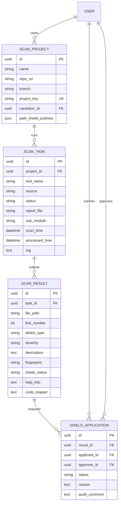
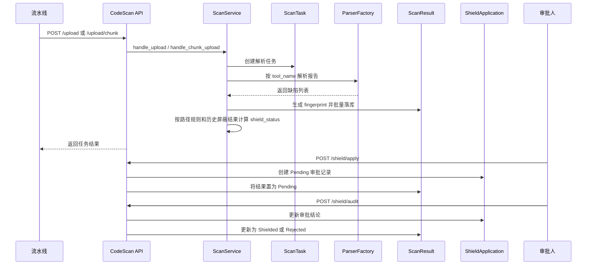

<FocusModuleHero :module="moduleMeta" />

<FocusModuleSection
  kicker="Module Purpose"
  title="模块定位"
  summary="代码扫描模块是 Focus 中承接静态扫描与动态内存检查结果的治理平台。它既负责管理扫描项目和任务，也负责把扫描结果纳入持续治理流程。"
>

这个模块回答的是一整条扫描链路问题：

- 扫描对象是谁：项目、仓库、分支、子模块
- 扫描结果从哪里来：流水线文件上传、分片上传
- 缺陷如何归并与继承：指纹、路径屏蔽、最新任务视图
- 误报如何治理：屏蔽申请、审批、审计记录

它本质上是“结果治理平台”，而不只是“报告查看器”。

</FocusModuleSection>

<FocusModuleSection
  kicker="Data Model"
  title="表结构与关系设计"
  summary="代码扫描围绕项目、任务、结果、屏蔽申请四层对象展开，形成一条从原始报告到治理状态的完整链路。"
>

## 关键对象说明

### `ScanProject`

扫描项目是扫描治理的聚合根，关键字段包括：

- `repo_url`、`branch`
  定义代码来源
- `project_key`
  供流水线上传时做匿名认证
- `caretaker`
  指定数据看护责任人
- `path_shield_prefixes`
  基于路径前缀的自动屏蔽规则

### `ScanTask`

表示一次报告接收与解析任务，关键字段包括：

- `tool_name`
  决定解析器选择与结果分组
- `source`
  `pipeline` 或 `manual`
- `status`
  `pending / processing / success / failed`
- `sub_module`
  对 `valgrind / tsan` 这类需要按子模块拆分的工具非常重要
- `report_file`、`log`
  用于回溯原始报告与解析过程

### `ScanResult`

缺陷结果对象的关键不是常规字段，而是两个治理字段：

- `fingerprint`
  由 `file_path + defect_type + description` 生成，用于跨任务归并
- `shield_status`
  `Normal / Pending / Shielded / Rejected`

这让系统可以把“当前任务的缺陷”关联到“历史治理结论”。

### `ShieldApplication`

审批链对象，记录：

- 谁申请屏蔽
- 谁审批
- 审批结论与备注

这保证误报治理具备审计轨迹，而不是直接把结果状态手工改掉。

</FocusModuleSection>

<FocusModuleSection
  kicker="Implementation"
  title="关键实现原理"
  summary="代码扫描模块的难点不在列表展示，而在‘上传解析、缺陷指纹、最新任务筛选、屏蔽继承’四件事如何拼起来。"
>

### 报告解析：`handle_upload`

在 `backend-django/apps/code_scan/services.py` 中，`ScanService.handle_upload` 会：

1. 根据 `project_key` 找到 `ScanProject`
2. 创建 `ScanTask`
3. 根据 `tool_name` 从 `ParserFactory` 选择 parser
4. 解析报告得到 defects
5. 为每条 defect 生成 `fingerprint`
6. 批量写入 `ScanResult`

已支持的解析器包含：

- `valgrind`
- `tsan`
- `cppcheck`
- `clang-tidy`
- `weggli`
- `cooddy`
- `binexplorer`

这说明模块的扩展方式是“统一任务模型 + 多 parser 工厂”。

### 路径屏蔽与历史继承

结果写入前，服务层会同时检查：

- 当前项目是否已有相同 `fingerprint` 的结果被 `Shielded`
- 当前 `file_path` 是否命中项目级 `path_shield_prefixes`

如果命中任一条件，新的结果会直接标记为 `Shielded`。  
所以 `shield_status` 不是单次扫描即时算出来的，它会继承项目历史治理状态。

### 最新结果视图：`projects/overview` 与 `latest-results`

仪表盘和结果页并不是简单读取全部成功任务，而是通过 `_select_latest_task_rows` 做“按工具或按子模块选最新任务”的裁剪：

- 普通工具只取最新一次成功任务
- `valgrind / tsan` 这类子模块级工具，会按 `sub_module` 选每个子模块的最新任务

这就是为什么结果页展示的是“最新治理视图”，而不是全历史缺陷表。

### 审批流：`apply_shield` / `audit_shield`

屏蔽治理采用两步式：

1. 申请时把结果状态从 `Normal` 改成 `Pending`，并创建 `ShieldApplication`
2. 审批通过后把结果状态改成 `Shielded`，否则改成 `Rejected`

这条链条保证了误报治理具备责任边界与审计记录。

</FocusModuleSection>

<FocusModuleSection
  kicker="Frontend Entry"
  title="前端入口与页面结构"
  summary="前端不是一个页面包打天下，而是拆成项目配置、扫描结果、审批流和任务日志四个视角。"
>

前端主入口包括：

- `web/apps/web-ele/src/views/code_scan/project/index.vue`
  项目管理页，维护扫描项目并跳转结果页、任务日志页
- `web/apps/web-ele/src/views/code_scan/result/index.vue`
  查看项目最新结果、申请屏蔽、查看屏蔽记录
- `web/apps/web-ele/src/views/code_scan/audit/index.vue`
  审批屏蔽申请
- `web/apps/web-ele/src/views/code_scan/task-log/index.vue`
  查看历史任务日志

对应 API 类型定义位于 `web/apps/web-ele/src/api/code_scan/index.ts`。

需要特别说明的是：

- 前端 API 中保留了 `runScanTaskApi`
- 但当前后端主实现更明确暴露的是 `upload` / `upload/chunk`

因此文档以仓库里可确认的后端主链为准，把代码扫描定义为“报告驱动的任务解析链”。

</FocusModuleSection>

<FocusModuleSection
  kicker="Sequence"
  title="时序图：一次扫描结果如何进入治理流程"
  summary="代码扫描的价值不只在解析报告，而在于扫描结果如何被持续继承、审批和屏蔽。"
>

</FocusModuleSection>

<FocusModuleSection
  kicker="Dependencies"
  title="相关依赖与上下游"
  summary="代码扫描是一个典型的中台治理模块，上游来自流水线与代码仓，下游服务于质量治理和集成报告。"
>

- 上游输入
  流水线扫描报告、分片上传内容、项目仓库配置
- 上游依赖
  `core.user` 用于责任人与审批人
- 下游消费
  代码扫描结果页、屏蔽审批页、任务日志页
- 关联模块
  `integration-report` 会读取 `code_scan_project_key` 与 `valgrind_sub_modules` 聚合每日指标
- 关联模块
  `deepaudit` 与代码扫描都属于代码治理类能力，但定位不同：前者偏智能审计，后者偏结构化扫描结果治理

</FocusModuleSection>

<FocusModuleSection kicker="Core APIs" title="核心 API 清单" summary="以下接口覆盖配置、上传解析、结果治理和审批。">

<FocusApiTable :items="apis" />

</FocusModuleSection>

<FocusModuleSection kicker="Related Docs" title="相关文档" summary="继续查看实现附录可参考这些入口。">

- [后端技术参考](/backend/apps/code-scan)
- [前端页面参考](/frontend/views/code-scan)
- [集成报告](/modules/integration-report)

</FocusModuleSection>
