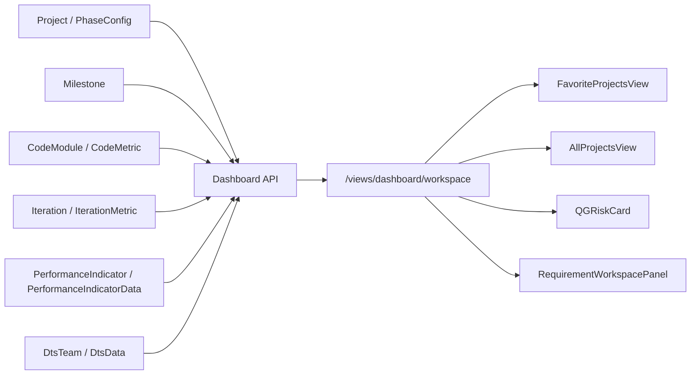
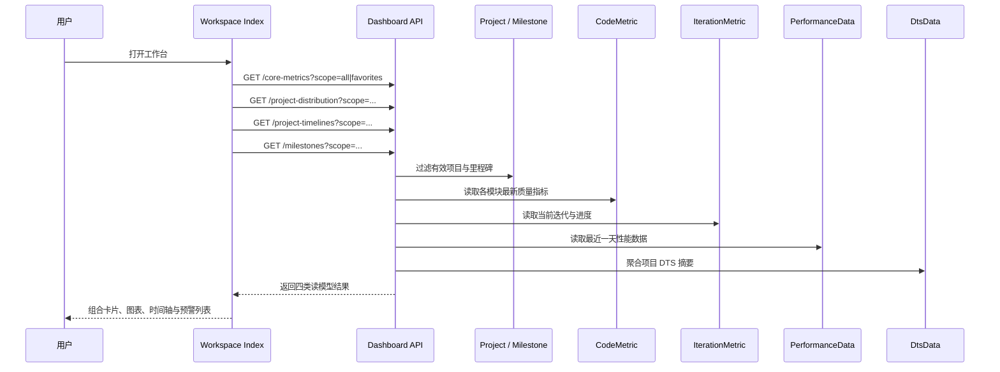

<FocusModuleHero :module="moduleMeta" />

<FocusModuleSection
  kicker="Module Purpose"
  title="模块定位"
  summary="工作台 / 仪表盘不是一个独立业务域，而是 Focus 的读模型聚合层。它把项目管理、质量、性能监控、DTS、需求工作台等多个模块的摘要压缩成首页可消费的数据视图。"
>

这个模块本身几乎不沉淀事务数据，它真正负责的是三件事：

- 统一 scope：区分 `all` 与 `favorites` 两种用户视角
- 统一摘要口径：把不同子域的最新统计压成固定契约
- 统一前端装配：为工作台首屏、趋势卡片、项目时间轴和里程碑提醒提供稳定数据结构

因此它的架构重点不在表设计，而在聚合函数、口径一致性和跨模块依赖控制。

</FocusModuleSection>

<FocusModuleSection
  kicker="Read Model"
  title="聚合结构设计"
  summary="仪表盘围绕 4 个聚合出口设计：核心指标、项目分布、项目时间轴、里程碑提醒。"
>

## 聚合来源

## 读模型契约

后端在 `backend-django/apps/dashboard/api.py` 和 `backend-django/apps/dashboard/schemas.py` 中把聚合结果固定成以下结构：

- `CoreMetricsSchema`
  包含 `code_quality`、`iteration`、`performance`、`dts` 四个一级摘要块
- `ProjectDistribution`
  包含 `by_domain`、`by_type`、`vehicle_by_platform`、`cockpit_by_cdc_platform`、`cockpit_by_smart_screen_version`
- `FavoriteProjectDetail`
  把项目基础信息、LOC、健康分、当前迭代、迭代进度、QG 时间轴打平成一张卡片
- `UpcomingMilestone`
  只保留工作台预警需要的 `project_name / project_manager / qg_name / qg_date / days_left`

这意味着仪表盘不是暴露原始 ORM 结构，而是暴露一套稳定的聚合 DTO。

</FocusModuleSection>

<FocusModuleSection
  kicker="Design Contract"
  title="关键字段与口径设计"
  summary="由于仪表盘没有独立表，真正需要解释的是‘这些字段怎么算出来’。"
>

## `scope`

`get_projects_by_scope` 是整个工作台聚合的入口过滤器：

- `all`：读取所有未删除、未结项项目
- `favorites`：在此基础上进一步过滤用户收藏项目

这个过滤器决定了后续质量、迭代、里程碑等摘要是面向全局，还是面向当前用户偏好的项目集合。

## `code_quality`

由已启用 `enable_quality` 的项目驱动，读取每个 `CodeModule` 最新一条 `CodeMetric`：

- `total_projects`：启用质量能力的项目数
- `total_modules`：纳入统计的模块数
- `total_loc`：各模块最新 LOC 之和
- `total_issues`：各模块最新 `dangerous_func_count` 之和
- `avg_duplication_rate`：各模块最新重复率的平均值
- `health_score`：当前代码中为固定摘要分，用于首屏展示

## `iteration`

由已启用 `enable_iteration` 的项目驱动，只看 `is_current=True` 的当前迭代：

- `active_iterations`：当前进行中的迭代数
- `delayed_iterations`：结束日期早于今天的迭代数
- `total_req_count`：使用最新 `IterationMetric` 中 `sr_num + dr_num + ar_num`
- `completion_rate`：按 AR/DR 的完成与验收状态动态计算百分比

## `performance`

性能监控摘要当前是系统级聚合，而不是严格按项目过滤：

- `total_indicators`：全部性能指标数
- `abnormal_count`：最近一天中波动值超过阈值的指标数
- `coverage_rate`：当前实现里为固定展示值

这里需要如实说明：当前仪表盘对性能监控的接入是全局视图，不是收藏项目维度的严格切片。

## `dts`

按目标项目集合的 DTS 团队数据聚合：

- `total_issues`
- `critical_issues`
- `avg_solve_time`
- `solve_rate`

其中 `solve_rate` 会从字符串百分比中解析为数值平均值，属于摘要口径转换而不是直接字段映射。

</FocusModuleSection>

<FocusModuleSection
  kicker="Implementation"
  title="关键实现原理"
  summary="工作台的难点不在前端布局，而在后端如何用尽量少的聚合函数产出稳定首页数据。"
>

### `get_core_metrics`

这是仪表盘最核心的聚合函数，负责把四个域的最新摘要拼成统一结构。它的典型实现策略是：

1. 先按 `scope` 得到目标项目集合
2. 再按子域开关拆出质量项目、迭代项目、DTS 项目
3. 对每个子域只取“最新一条有效指标”
4. 最终拼接为固定 schema 返回给前端

这种做法的优点是首页响应结构稳定，缺点是有些值仍带有“展示口径”性质，比如固定覆盖率与健康分。

### `get_project_distribution`

这个函数并不读取统计快照表，而是直接使用项目主数据和阶段配置：

- `domain` / `type` 直接来自 `Project`
- `vehicle_by_platform` 来自车控项目的 `idvp_platform`
- `cockpit_by_cdc_platform` / `cockpit_by_smart_screen_version` 来自 `phase_configs`

这说明仪表盘的分布图是“主数据衍生视图”，不是独立数据仓。

### `get_project_timelines`

这个函数把多个域的数据压成单卡片对象：

- 基础信息来自 `Project`
- LOC 与健康分来自各模块最新 `CodeMetric`
- 当前迭代与进度来自 `Iteration / IterationMetric`
- QG 时间轴来自 `Milestone`

这里的“健康分”并不是质量域原生字段，而是工作台内联计算出来的展示分。

### `get_upcoming_milestones`

它会遍历 `qg1_date` 到 `qg8_date`，只保留未来 30 天内的节点，并计算 `days_left`。  
这也是为什么工作台里程碑提醒本质上是一层“日期扫描器”，而不是独立预警表。

</FocusModuleSection>

<FocusModuleSection
  kicker="Frontend Entry"
  title="前端入口与页面装配"
  summary="工作台前端不是单页面直接吃一个大接口，而是把多个聚合接口拆开加载。"
>

前端主入口位于 `web/apps/web-ele/src/views/dashboard/workspace/index.vue`，核心消费链如下：

- `web/apps/web-ele/src/api/dashboard.ts`
  负责 `getCoreMetrics / getProjectDistribution / getProjectTimelines / getUpcomingMilestones`
- `web/apps/web-ele/src/views/dashboard/workspace/index.vue`
  根据当前页签决定 `scope=all|favorites`
- `web/apps/web-ele/src/views/dashboard/workspace/components/FavoriteProjectsView.vue`
  负责收藏视角的摘要卡片、时间轴、风险卡片和需求工作台
- `web/apps/web-ele/src/views/dashboard/workspace/components/AllProjectsView.vue`
  负责全量视角的摘要卡片、分布图和里程碑提醒

此外工作台页面还会复用：

- `QGRiskCard`
- `RequirementWorkspacePanel`
- `ProjectPie / ProjectBar`
- `MilestoneTimeline / MilestoneTable`

也就是说，仪表盘不是单一组件，而是一组聚合 API 驱动的首页装配层。

</FocusModuleSection>

<FocusModuleSection
  kicker="Sequence"
  title="时序图：工作台如何聚合多个模块摘要"
  summary="从用户打开页面到首屏完成渲染，核心在于多个聚合接口并行请求和子视图装配。"
>

</FocusModuleSection>

<FocusModuleSection
  kicker="Dependencies"
  title="相关依赖与上下游"
  summary="仪表盘本身几乎不拥有主数据，所以它的稳定性取决于上下游模块的数据质量。"
>

- 上游输入
  `project-manager` 提供项目、里程碑、迭代、质量、DTS 等基础数据
- 上游输入
  `performance` 提供最近一天的性能指标与波动阈值
- 下游消费
  工作台首屏、收藏项目视图、近期里程碑提醒、分布图等首页组件

从架构角色看，仪表盘更接近“应用层聚合服务”，而不是独立领域模型。

</FocusModuleSection>

<FocusModuleSection kicker="Core APIs" title="核心 API 清单" summary="以下接口覆盖仪表盘主要聚合能力。">

<FocusApiTable :items="apis" />

</FocusModuleSection>

<FocusModuleSection kicker="Related Docs" title="相关文档" summary="继续下钻具体子域实现可以查看这些页面。">

- [项目管理](/modules/project-manager)
- [性能监控](/modules/performance)
- [前端工作台附录](/frontend/views/dashboard)

</FocusModuleSection>
