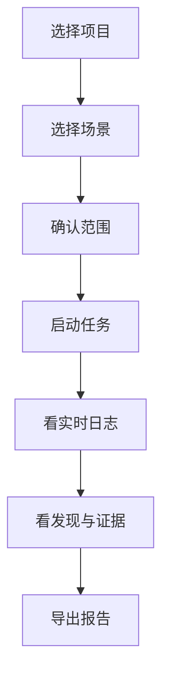
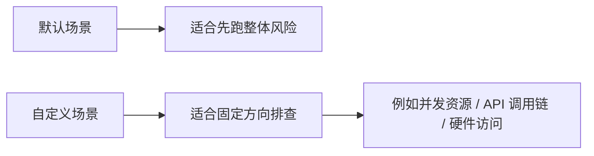
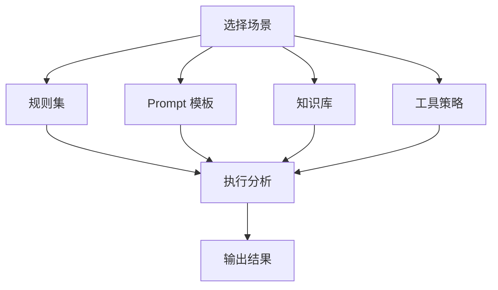

# DeepAudit 快速指南

这是一版给日常使用者看的短说明，目标只有一个：**让你快速知道怎么开始、怎么看结果、什么时候该用哪个场景。**

如果你想看更完整的说明，请继续阅读 [DeepAudit 使用指南（完整版）](/modules/deepaudit-user-guide)。

## DeepAudit 是什么

DeepAudit 是 Focus 里的智能审计工作台。它既能帮你做安全审计，也能帮你做代码梳理、调用链定位、资源访问排查和结果交付。

你可以把它理解成一个“先分析、再解释、最后出报告”的助手。

### 适合谁用

- 安全工程师：关注漏洞、风险点和证据
- 研发同学：想快速定位相关代码和调用链
- 项目负责人：想看一份能直接汇报的结果
- 团队维护者：想把常见排查思路固化成场景

## 最快怎么用

### 你只需要做 3 件事

1. 选项目
2. 选场景
3. 确认范围后启动

剩下的事情交给 DeepAudit：

- 自动载入分析策略
- 自动处理代码上下文
- 自动输出实时日志和发现
- 自动生成报告

## 最常用的功能

| 功能 | 你会用来做什么 |
| --- | --- |
| 发起审计 | 对一个项目或目录做完整分析 |
| 查看实时日志 | 观察任务跑到哪一步，是否已经在看目标文件 |
| 阅读发现 | 看问题位置、代码证据、修复建议 |
| 导出报告 | 输出 HTML、Markdown 或 JSON 结果 |
| 管理场景 | 把常见排查方式固定下来，后面直接复用 |

## 场景怎么选

### 什么时候选默认场景

如果你还不确定项目里具体有什么问题，先选默认场景。

### 什么时候选自定义场景

如果你已经知道要查什么，建议选更聚焦的场景，例如：

- 并发资源访问排查
- 高危 API 调用链梳理
- 临界区与硬件访问检查
- 驱动初始化顺序排查

### 代码梳理模式也可以用

DeepAudit 不一定只用来找漏洞。你也可以把它当成“代码梳理助手”：

- 找相关代码在哪些文件里
- 找入口和出口
- 理清调用链
- 看资源边界和共享关系
- 先定位，再决定是否做漏洞判定

## 看结果时先看什么

1. **是否完成**
2. **问题数有多少**
3. **是否有已验证问题**
4. **证据是否清晰**
5. **修复建议是否具体**

### 一条好结果通常长什么样

- 有文件路径
- 有行号范围
- 有代码片段
- 有明确说明
- 有可执行建议

如果只有一句很泛的建议，通常说明场景还可以再收紧。

## 三种导出格式怎么选

| 格式 | 适合场景 |
| --- | --- |
| HTML | 直接看、发给开发团队、开会展示 |
| Markdown | 继续编辑、贴工单、写文档 |
| JSON | 接后续系统处理或做二次分析 |

## 场景、规则、Prompt、知识库的关系

你可以简单理解为：

- **场景**：总开关
- **规则集**：看什么
- **Prompt**：怎么想、怎么说
- **知识库**：补什么背景
- **工具策略**：先怎么查

## 常见问题

### Q1：我为什么看不到场景管理页？

通常是权限没有分配到对应菜单或操作码。

### Q2：为什么结果看起来太宽泛？

通常是场景太宽、范围太大，或者知识不够聚焦。

### Q3：DeepAudit 只能找漏洞吗？

不是，也很适合做代码梳理和路径排查。

## 想继续看更详细的内容

- [DeepAudit 使用指南（完整版）](/modules/deepaudit-user-guide)
- [DeepAudit 模块页](/modules/deepaudit)
- [DeepAudit 前端应用附录](/frontend/views/deepaudit)
- [DeepAudit 后端实现附录](/backend/apps/deepaudit)

