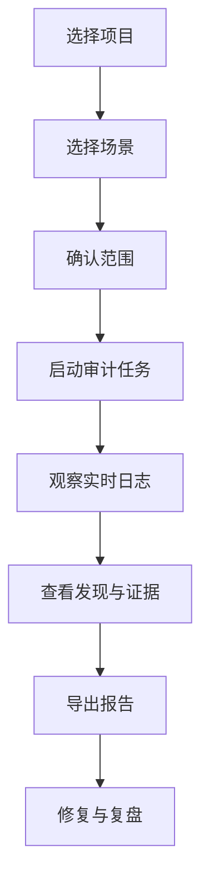
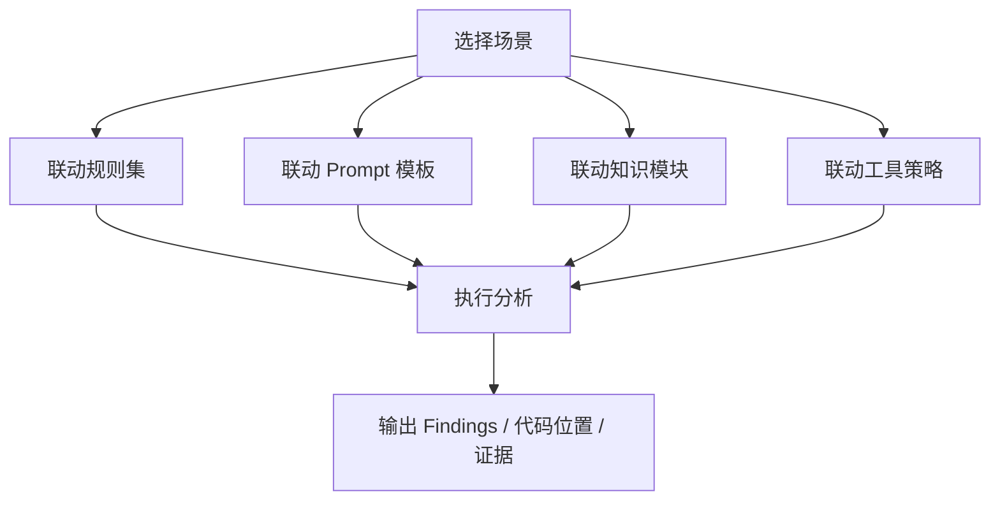
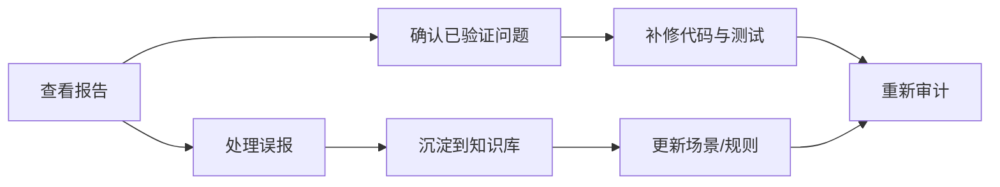

# DeepAudit 使用指南（完整版）

如果你想先看更短的版本，可以先阅读 [DeepAudit 快速指南](/modules/deepaudit-user-guide-quick)。

这份完整版更适合：

- 第一次给团队介绍 DeepAudit
- 想把场景、规则、知识库和报告阅读一次讲清楚
- 准备做团队内部培训或流程沉淀

本文重点回答三个问题：

1. DeepAudit 能帮你做什么
2. 你应该怎么发起一次审计
3. 结果出来以后应该怎么看、怎么复用

如果你第一次接触 DeepAudit，建议先按“快速上手”走一遍，再回来看场景、知识库和报告阅读部分。

## 一、DeepAudit 能做什么

DeepAudit 不只是“找漏洞”的工具，它更像是一个面向代码审计的工作台。你可以把它用在下面几类场景里：

| 使用目标 | 适合做什么 | 你会得到什么 |
| --- | --- | --- |
| 安全审计 | 查找输入验证、权限控制、越界访问、资源泄漏等问题 | Findings、证据片段、修复建议 |
| 代码梳理 | 梳理调用链、资源边界、并发相关代码、硬件访问路径 | 相关文件清单、调用关系、关键位置 |
| 团队复用 | 把常见排查思路固定下来 | 可重复使用的场景、规则、Prompt、知识库 |
| 结果交付 | 输出给开发、测试或管理者查看 | HTML / Markdown / JSON 报告 |

### 先记住一个最重要的概念

**场景是 DeepAudit 的总开关。**

你通常只需要选一个场景，系统会自动联动：

- 规则集：决定重点看什么
- Prompt 模板：决定模型怎么分析
- 知识库：补充领域知识和经验
- 工具策略：决定优先怎么搜索、怎么定位
- 输出目标：决定更偏“漏洞审计”还是“代码梳理”

也就是说，日常使用时你不需要每次都手工拼装一整套配置。

## 二、一次完整审计是怎么走的

### 1. 选择项目

在项目列表、项目详情页或 AgentAudit 入口中，先确定你要审计的项目。

常见检查点：

- 项目是不是当前要分析的代码仓
- 分支是不是正确
- 目录或文件范围是否选对
- 是否需要排除某些自动生成目录或第三方目录

### 2. 选择场景

场景决定了 DeepAudit 这次要怎么分析。

你可以这样理解：

- **默认场景**：适合通用审计，先跑一遍整体风险
- **定制场景**：适合固定类型的问题排查，比如并发资源梳理、硬件访问检查、API 调用链梳理

如果你只是想先看看这个项目里有没有明显问题，优先选默认场景。
如果你已经知道自己要查什么，建议直接选更聚焦的场景。

### 3. 启动任务

确认项目、场景和范围后，点击启动。

接下来系统会自动完成：

- 准备代码上下文
- 载入场景对应的规则、Prompt 和知识
- 调用分析工具
- 生成实时日志和阶段结果

### 4. 观察实时日志

任务运行中，你会看到：

- 当前阶段
- 工具调用情况
- 分析中的候选发现
- 进度更新

如果任务比较长，建议你不要只等最终结果，而是边看边确认是否已经在分析你关心的文件。

### 5. 查看发现与证据

任务完成后，重点看三件事：

1. **问题是不是落在你关注的文件上**
2. **证据是否清晰**
3. **建议是否足够具体**

如果一个问题只有模糊描述，没有代码位置和片段，通常说明这个问题还需要再补充上下文，或者场景选得还不够聚焦。

### 6. 导出报告

DeepAudit 通常会提供几种导出方式：

- **HTML**：最适合直接阅读和汇报
- **Markdown**：适合继续编辑、贴进文档或工单
- **JSON**：适合后续二次处理或系统集成

## 三、场景、规则、Prompt、知识库怎么配合

### 你可以把它们理解成这四层

| 组件 | 作用 | 你需要关注什么 |
| --- | --- | --- |
| 场景 | 一次审计的总开关 | 这是你最先选的东西 |
| 规则集 | 决定重点看什么风险 | 适合复用团队经验 |
| Prompt 模板 | 决定模型怎么思考和输出 | 影响结果的表达方式 |
| 知识库 | 提供领域背景和经验 | 适合汽车 C/C++、RTOS、驱动等场景 |

### 默认场景适合什么

默认场景适合下面这些情况：

- 你不知道项目具体问题在哪里
- 你想先跑一次整体风险扫描
- 你希望得到尽量完整的发现和证据

### 自定义场景适合什么

自定义场景更适合固定方向的排查，例如：

- 并发资源访问排查
- 高危 API 调用链梳理
- 临界区与硬件访问检查
- 某类驱动初始化流程梳理

这类场景的目标不一定是“找漏洞”，也可以是：

- 找到相关代码都在哪
- 搞清楚调用链怎么走
- 看清资源边界和依赖关系
- 先把代码脉络梳理清楚，再决定是否进一步安全审计

## 四、如果你想做的是“代码梳理”，不是“漏洞审计”

这是 DeepAudit 很适合的一类用法。

比如你要做的是：

- 某个项目里所有并发资源相关代码的梳理
- 某条硬件访问路径的排查
- 某类高危 API 调用链的定位

这时候你的目标不是立刻判断“有没有漏洞”，而是先回答下面这些问题：

- 相关代码在哪些文件里
- 入口和出口分别是什么
- 调用链中间经过了哪些函数
- 哪些资源是共享的、哪些是临界区
- 哪些位置值得后续再做安全审计

### 这类场景通常会输出什么

- 相关文件列表
- 关键函数和代码位置
- 调用链和路径说明
- 可能的风险边界
- 如果真的看到明显问题，也会附带提醒

## 五、怎么看审计结果

### 1. 先看整体结论

先看这些信息：

- 任务是否完成
- 安全评分或质量评分
- 问题总数
- 已验证问题数
- 误报数
- 主要风险集中在哪些文件

### 2. 再看每条 Finding

每条发现建议重点看这几个部分：

- **标题**：这条问题是什么
- **文件位置**：问题在哪个文件、哪几行
- **代码证据**：实际命中的代码片段
- **问题描述**：为什么会被认为有风险
- **修复建议**：应该怎么改
- **验证说明**：是不是已经验证过、如何验证的

### 3. 如何理解状态

| 状态 | 含义 | 建议动作 |
| --- | --- | --- |
| 已验证 | 系统或人工确认过这条发现值得重视 | 优先修复 |
| 待验证 | 还需要结合上下文确认 | 先复核再决定 |
| 误报 | 这条不成立或不适用 | 标记并沉淀经验 |

### 4. 报告导出后怎么看

如果你要给开发团队看，建议优先使用 HTML 报告，因为它更适合快速浏览：

- 左侧目录方便跳转
- 右侧正文适合阅读细节
- 发现卡片能直接看到证据和建议
- 适合会议、评审和邮件转发

如果你要继续整理成工单或知识库，Markdown 会更方便。

## 六、场景管理页适合谁

场景管理更适合团队维护者或审计负责人。

你可以在这里做这些事：

- 创建新的场景
- 复制已有场景作为模板
- 停用不再使用的场景
- 把场景绑定到常用的规则、Prompt 和知识模块

### 推荐的使用方式

如果你的团队经常查同一类问题，建议把它固化成场景，而不是每次重新配置。

举个例子：

- 汽车底层 C 项目经常要查并发资源访问
- 驱动项目经常要查初始化顺序和硬件访问
- 某些项目经常要查高危 API 的调用链

这些都很适合做成可重复使用的场景。

## 七、结果怎么复用

建议你每次审计结束后都做一次简单复盘：

1. 哪些问题是真问题
2. 哪些问题是误报
3. 哪些代码模式以后还会再出现
4. 哪些经验应该写进知识库
5. 哪些规则应该补进场景

这样 DeepAudit 跑得越多，后面的结果会越稳定。

## 八、常见问题

### Q1：为什么我看不到场景管理页？

通常是权限没有分配到对应菜单或操作码。请联系管理员检查你的 DeepAudit 页面权限。

### Q2：为什么任务结果比较泛，证据不够具体？

常见原因有三个：

- 场景选得太宽泛
- 代码范围太大
- 知识模块不够聚焦

建议先缩小场景，再把范围收紧到更具体的目录或文件。

### Q3：DeepAudit 只适合找漏洞吗？

不是。它也很适合做代码梳理、资源排查和调用链定位。

### Q4：我应该什么时候用默认场景？

当你还不确定要查什么、或者想先跑一次整体风险时，用默认场景最合适。

### Q5：我能不能把团队经验固定下来？

可以。建议用“场景 + 规则 + Prompt + 知识库”的方式沉淀，后续每次都能复用。

## 九、如果你想继续深入

- [DeepAudit 快速指南](/modules/deepaudit-user-guide-quick)
- [DeepAudit 模块页](/modules/deepaudit)
- [DeepAudit 前端应用附录](/frontend/views/deepaudit)
- [DeepAudit 后端实现附录](/backend/apps/deepaudit)
