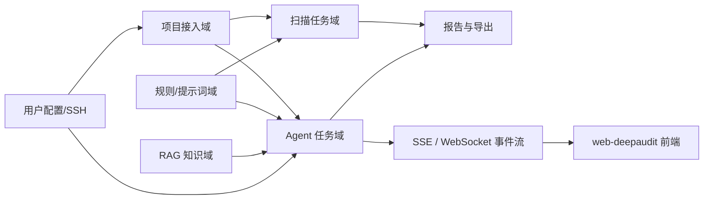
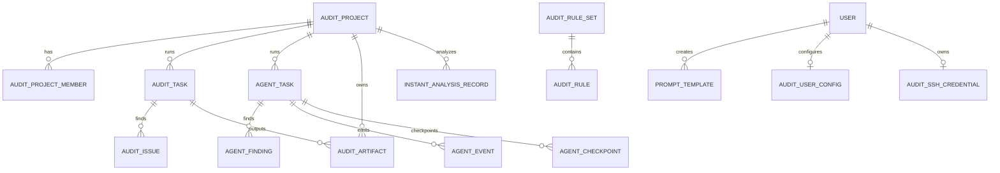
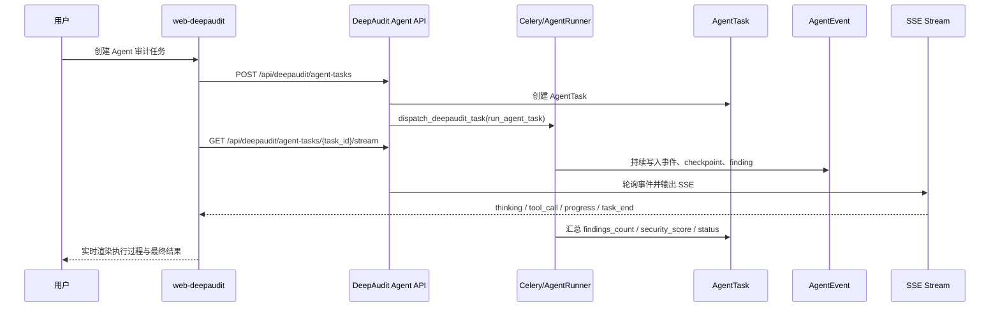

<FocusModuleHero :module="moduleMeta" />

<FocusModuleSection
  kicker="Module Purpose"
  title="模块定位"
  summary="DeepAudit 是 Focus 的智能审计平台，它把代码接入、规则与提示词、RAG 检索、多智能体推理、流式事件和报告输出组织成一套完整的安全分析系统。"
>

DeepAudit 解决的不是单一“扫描任务”问题，而是整条智能审计流水线问题：

- 代码上下文如何接入
- 审计策略如何定义
- 模型和知识如何协同
- 任务执行过程如何可观测
- 结果如何沉淀为可交付报告

因此它在 Focus 中不是普通业务模块，而是一个独立的智能审计子系统，同时又要和 Focus 主平台的认证、权限、导航、部署体系兼容。

</FocusModuleSection>

<FocusModuleSection
  kicker="Domain Map"
  title="领域结构设计"
  summary="DeepAudit 由 6 个核心子域协同组成：项目接入、传统扫描、Agent 审计、规则/提示词、RAG、报告与实时事件。"
>

子域分工如下：

- 项目接入域
  管项目、成员、仓库来源、ZIP 归档、分支和工作区准备
- 扫描任务域
  管传统仓库扫描、ZIP 扫描和即时分析
- Agent 任务域
  管多智能体执行、事件、Finding、检查点和恢复
- 规则 / 提示词域
  管审计规则集、系统模板与用户模板
- RAG 域
  管项目索引、分片、Embedding、检索与知识增强
- 报告与实时域
  管 PDF/JSON 导出、Dashboard 摘要、SSE / WebSocket 推送

</FocusModuleSection>

<FocusModuleSection
  kicker="Data Model"
  title="对象关系与表结构设计"
  summary="DeepAudit 的对象设计围绕项目上下文、传统任务、Agent 任务和策略配置展开，是一个典型的任务编排型系统。"
>

## 核心对象说明

### `AuditProject`

项目是 DeepAudit 的上下文根对象，关键字段包括：

- `source_type`
  `repository` 或 `zip`
- `repository_url` / `repository_type`
  仓库来源定义
- `default_branch`
  默认扫描分支
- `programming_languages`
  语言集合
- `owner`
  项目拥有者

### `AuditTask`

传统扫描任务对象，关键字段包括：

- `task_type`
  `repository / zip`
- `status`
  任务状态
- `branch_name`
  扫描分支
- `exclude_patterns`
  排除模式
- `scan_config`
  扫描参数
- `total_files / scanned_files / total_lines`
  扫描进度与规模
- `issues_count / quality_score`
  结果摘要

### `AgentTask`

多智能体任务对象，关键字段包括：

- `status` 与 `current_phase`
  反映执行阶段
- `audit_scope`
  审计范围
- `agent_config`
  Agent 执行配置
- `findings_count / security_score`
  任务结果摘要
- `timeout_seconds / max_iterations`
  执行约束

### `AgentFinding / AgentEvent / AgentCheckpoint`

这是 DeepAudit 与传统扫描最大的区别：

- `AgentFinding`
  最终可交付发现
- `AgentEvent`
  运行过程事件流，支撑 SSE 和任务回放
- `AgentCheckpoint`
  阶段快照，支撑恢复任务和调试

### `AuditRuleSet / AuditRule / PromptTemplate`

这一组对象定义了“如何审计”：

- 规则集决定策略内容
- 规则决定检测粒度
- 提示词模板决定模型交互方式

### `AuditUserConfig / AuditSshCredential`

这一组对象定义“用谁的模型、用什么凭据接代码仓”。

</FocusModuleSection>

<FocusModuleSection
  kicker="Execution"
  title="关键执行链路"
  summary="DeepAudit 的关键不是某个页面，而是多条执行链如何协同：项目接入、传统扫描、Agent 审计、RAG 建索引和实时事件推送。"
>

## 项目接入链

项目接入由 `project_services` 负责，典型动作包括：

1. 创建项目并绑定拥有者
2. 同步 owner 成员关系
3. 上传 ZIP 或拉取仓库分支
4. 根据 SSH 凭据和用户配置准备工作区

## 传统扫描链

扫描任务由 `scan_task_services` 负责：

1. 创建 `AuditTask`
2. 准备代码工作区
3. 扫描文件、行数和配置
4. 写入 `AuditIssue`
5. 归档 `AuditArtifact`
6. 导出 PDF / JSON 报告

## Agent 审计链

Agent 任务由 `agent_task_services` 与 `agent_runner` 负责：

1. 创建 `AgentTask`
2. 异步调度 `run_agent_task`
3. 在多阶段中持续写入 `AgentEvent`
4. 在关键阶段落 `AgentCheckpoint`
5. 产出 `AgentFinding`
6. 汇总为 `AgentSummary`

## RAG 链

RAG 域负责：

- 项目文件分片
- Embedding
- 向量索引落地
- 按项目上下文做检索增强

这条链通常不直接被用户看到，但直接影响 Agent 任务质量。

</FocusModuleSection>

<FocusModuleSection
  kicker="Realtime"
  title="实时通信设计：SSE 与 WebSocket"
  summary="DeepAudit 是当前仓库中对实时通信依赖最强的业务模块。Agent 审计页既依赖 SSE 流式事件，也具备 WebSocket 推送能力。"
>

## SSE 主链

前端 `web-deepaudit` 通过：

- `/api/deepaudit/agent-tasks/{task_id}/stream`

读取 `StreamingHttpResponse` 输出的 `text/event-stream` 事件流。  
后端会：

- 轮询新事件
- 过滤 thinking / tool_call 等事件类型
- 定时输出 heartbeat
- 在终态时输出 `task_end`
- 显式设置 `X-Accel-Buffering: no`

## WebSocket 辅链

后端还提供：

- `/ws/deepaudit/tasks/{task_id}/`

由 `DeepAuditTaskConsumer` 负责认证、项目权限校验、加入任务 group，并通过 `push_task_event` 广播事件。

## 为什么生产环境常见“基础接口正常，但 SSE / WS 全挂”

因为这两条链同时要求：

1. 后端必须跑 `application.asgi:application`
2. `CHANNEL_LAYERS` 与 Redis 可用
3. Nginx 对 `/basic-api/api/deepaudit/.../stream` 关闭缓冲
4. Nginx 对 `/ws/` 正确转发 Upgrade/Connection 头

任何一项缺失，都会出现“页面可打开、基础 API 正常、但流式能力失效”的现象。

</FocusModuleSection>

<FocusModuleSection
  kicker="Frontend Entry"
  title="前端入口与路由结构"
  summary="DeepAudit 不是复用 `web-ele` 的页面，而是独立前端应用 `web/apps/web-deepaudit`，通过 Focus 鉴权与权限体系集成。"
>

前端主路由定义在 `web/apps/web-deepaudit/src/app/routes.tsx`，核心页面包括：

- `/`
  Agent 审计主页
- `/dashboard`
  DeepAudit 仪表盘
- `/projects`
  项目管理
- `/projects/:id`
  项目详情
- `/instant-analysis`
  即时分析
- `/audit-tasks`
  传统扫描任务列表
- `/tasks/:id`
  扫描任务详情
- `/audit-rules`
  审计规则
- `/prompts`
  提示词管理
- `/admin`
  系统管理
- `/recycle-bin`
  回收站

关键 API 文件包括：

- `shared/api/agentTasks.ts`
- `shared/api/agentStream.ts`
- `shared/api/rules.ts`
- `shared/api/prompts.ts`
- `shared/api/rag.ts`
- `shared/api/database.ts`
- `shared/api/sshKeys.ts`

其中 `focusAdapter.ts` 很关键，因为它把前端 API 基址固定解析为：

- `VITE_API_BASE_URL`
- 默认值 `/basic-api/api`

这决定了生产环境 Nginx 路径必须兼容 `/basic-api/api/*`。

</FocusModuleSection>

<FocusModuleSection
  kicker="Sequence"
  title="时序图：一次 Agent 审计任务如何执行并流式回传"
  summary="这条链是 DeepAudit 最关键的业务闭环，也是部署时最容易出问题的链路。"
>

</FocusModuleSection>

<FocusModuleSection
  kicker="Dependencies"
  title="相关依赖与部署约束"
  summary="DeepAudit 是当前 Focus 中对部署约束最强的模块。它除了常规 HTTP 依赖外，还额外依赖异步执行、Redis 和流式代理配置。"
>

- 运行时依赖
  `application.asgi`、Channels、Redis `CHANNEL_LAYERS`
- 异步依赖
  Celery 默认 worker + DeepAudit 专用 worker
- 存储依赖
  工作区、知识库、报告、SSH 凭据目录
- 前端部署依赖
  `/deepaudit-app/` 静态入口与 `/basic-api/api` API 前缀
- 实时链路依赖
  SSE `/api/deepaudit/agent-tasks/{task_id}/stream` 与 WebSocket `/ws/deepaudit/tasks/{task_id}/`

</FocusModuleSection>

<FocusModuleSection
  kicker="Knowledge Base"
  title="知识库维护建议"
  summary="DeepAudit 的安全知识库建议分成共享基线知识和自定义知识两层维护，避免把个人经验直接写进内置规则。"
>

- 共享基线知识
  继续维护在 `backend-django/apps/deepaudit/agent_engine/knowledge/` 下的 `vulnerabilities/` 和 `frameworks/`，适合长期稳定、对所有项目通用、需要跟代码一起评审发布的知识。
- 个人 / 团队 / 项目知识
  默认维护成 `custom` 条目，通过系统配置页的知识库管理器或 `/api/deepaudit/rag/knowledge/*` 接口写入，底层会落到 `media/deepaudit/knowledge/*.json`。
- 模块 ID 规范
  建议显式填写并采用 `custom_*`、`team_*`、`proj_*` 前缀；避免使用内置保留前缀 `vuln_*`、`framework_*`。
- 推荐内容结构
  每条知识优先包含适用场景、风险模式、检测信号、误报边界、修复建议和最小示例，便于筛选、语义检索和 Agent 注入复用。
- 维护节奏
  审计任务结束后及时沉淀新模式和误报边界；定期清理过时条目、合并重复条目，并统一标签。

</FocusModuleSection>

<FocusModuleSection kicker="Core APIs" title="核心 API 清单" summary="以下接口覆盖项目接入、任务执行、策略配置、RAG、实时流和报告导出。">

<FocusApiTable :items="apis" />

</FocusModuleSection>

<FocusModuleSection kicker="Related Docs" title="相关文档" summary="继续查看更细的实现附录与部署文档。">

- [后端技术参考](/backend/apps/deepaudit)
- [前端页面参考](/frontend/views/deepaudit)
- [Nginx 部署](/dev-guide/deploy/nginx)

</FocusModuleSection>
