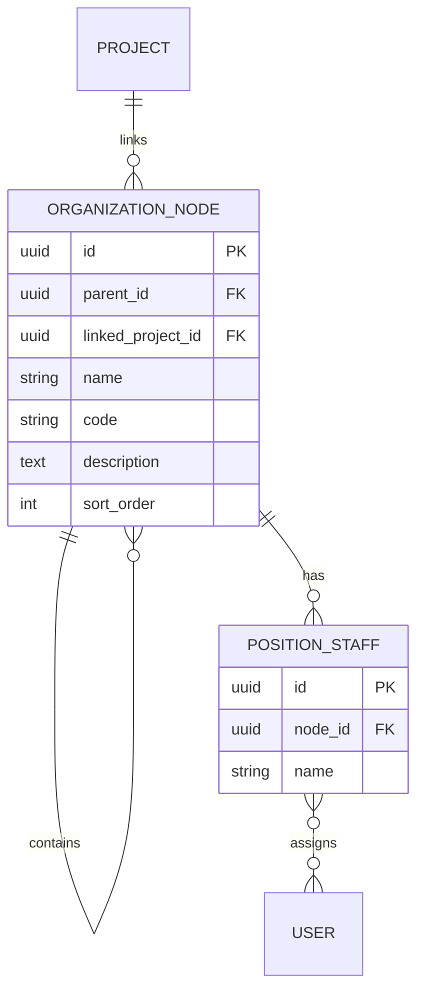
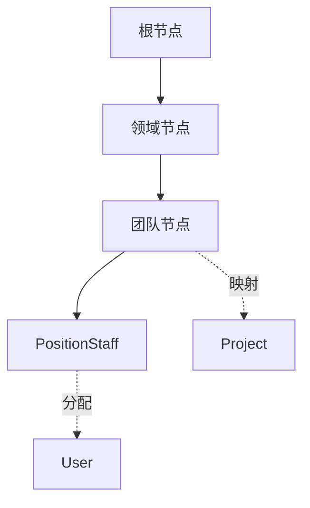
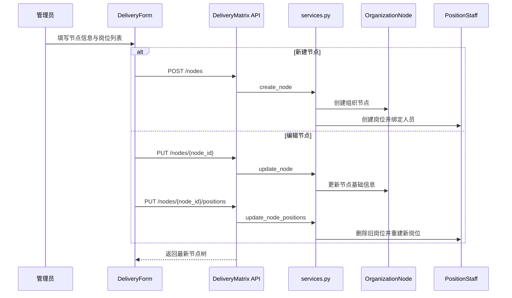

<FocusModuleHero :module="moduleMeta" />

<FocusModuleSection
  kicker="Module Purpose"
  title="模块定位"
  summary="交付矩阵模块把组织结构、岗位责任和项目映射组织成一张可维护的交付网络，用于回答‘谁负责哪个交付节点、节点映射到哪个项目’。"
>

它不是普通的组织架构树，核心价值在于三层关系被同时结构化：

- 组织节点的层级关系
- 节点与项目的映射关系
- 节点下岗位与人员的责任关系

因此它是一个典型的“树结构 + 责任分配”模块。

</FocusModuleSection>

<FocusModuleSection
  kicker="Data Model"
  title="表结构与关系设计"
  summary="交付矩阵的数据模型很简洁，但它把树形组织、项目映射和岗位责任拆成了三层明确对象。"
>

## 关键对象说明

### `OrganizationNode`

组织节点是矩阵的聚合根，关键字段包括：

- `parent`
  定义树结构
- `linked_project`
  把节点映射到项目主数据
- `name`、`code`
  节点显示与编码识别
- `description`
  补充业务说明
- `sort_order`
  控制节点展示顺序

### `PositionStaff`

岗位对象挂在节点之下，关键字段包括：

- `node`
  岗位归属节点
- `name`
  岗位名称
- `users`
  多对多绑定责任人员

模型中还定义了 `unique_together(node, name)`，保证同一节点下岗位名称唯一。

</FocusModuleSection>

<FocusModuleSection
  kicker="Tree Logic"
  title="树结构与关联关系设计"
  summary="交付矩阵真正复杂的不是建表，而是如何在内存里构建树、过滤合法父节点，并把岗位与项目关系装配回节点。"
>

在 `backend-django/apps/delivery_matrix/services.py` 中：

- `get_tree_data`
  会预取岗位、用户、关联项目与项目里程碑，再在内存中构建 `child_list`
- `get_valid_parent_tree`
  会排除当前节点及其整个子树，避免把节点挂到自己的后代下

对应的关系逻辑可以表示为：

这说明：

- 项目不是树节点本身，而是节点上的映射属性
- 岗位也不是树结构中的节点，而是节点的责任配置

</FocusModuleSection>

<FocusModuleSection
  kicker="Implementation"
  title="关键实现原理"
  summary="交付矩阵的关键实现不在复杂算法，而在于‘树节点 + 岗位列表’如何原子化维护。"
>

### 创建节点：`create_node`

创建节点时会在一个事务里完成：

1. 处理 `parent_id` 与 `linked_project_id` 的空值语义
2. 创建 `OrganizationNode`
3. 遍历 `positions`
4. 创建 `PositionStaff`
5. 为岗位绑定 `user_ids`

这意味着“新增节点”本质上是一个复合写操作，不是单表插入。

### 更新岗位：`update_node_positions`

岗位更新采用“先删除后重建”的整体替换策略：

- 先删除该节点已有岗位
- 再按新列表重新创建并绑定用户

这样做的含义是：岗位列表被视作节点的一份完整配置，而不是零散 patch。  
优点是实现简单、状态一致，代价是更新动作天然更偏覆盖式。

### 删除约束：`delete_node`

删除节点前会检查是否存在子节点。  
这说明树结构约束优先于便捷删除，避免组织树被删除成不完整状态。

</FocusModuleSection>

<FocusModuleSection
  kicker="Frontend Entry"
  title="前端入口与页面结构"
  summary="前端拆成‘管理端’与‘展示端’两个视角：管理端负责维护树和岗位，展示端负责查阅交付网络。"
>

前端主入口包括：

- `web/apps/web-ele/src/views/delivery-matrix/admin/index.vue`
  节点管理主页面
- `web/apps/web-ele/src/views/delivery-matrix/admin/modules/DeliveryTree.vue`
  左侧树组件，承载选择、展开、增删入口
- `web/apps/web-ele/src/views/delivery-matrix/admin/modules/DeliveryForm.vue`
  右侧表单，维护节点基础信息和岗位列表
- `web/apps/web-ele/src/views/delivery-matrix/dashboard/index.vue`
  展示型矩阵视图，可跳项目报告和矩阵管理页

对应 API 位于 `web/apps/web-ele/src/api/delivery-matrix/index.ts`。

</FocusModuleSection>

<FocusModuleSection
  kicker="Sequence"
  title="时序图：一次节点配置如何生效"
  summary="创建或编辑交付节点时，真正生效的是节点、岗位与用户关系的整体刷新。"
>

</FocusModuleSection>

<FocusModuleSection
  kicker="Dependencies"
  title="相关依赖与上下游"
  summary="交付矩阵并不生产项目数据，而是把组织结构和项目管理域绑定在一起。"
>

- 上游依赖
  `project-manager` 提供 `Project` 主数据
- 上游依赖
  `core.user` 提供岗位责任人
- 下游消费
  交付矩阵展示页、项目报告跳转、交付责任分工
- 结构特征
  组织树、项目映射、岗位人员三者解耦建模

</FocusModuleSection>

<FocusModuleSection kicker="Core APIs" title="核心 API 清单" summary="以下接口覆盖组织树维护与岗位配置主链。">

<FocusApiTable :items="apis" />

</FocusModuleSection>

<FocusModuleSection kicker="Related Docs" title="相关文档" summary="继续下钻实现附录可参考这些页面。">

- [后端技术参考](/backend/apps/delivery-matrix)
- [前端页面参考](/frontend/views/delivery-matrix)
- [项目管理](/modules/project-manager)

</FocusModuleSection>
