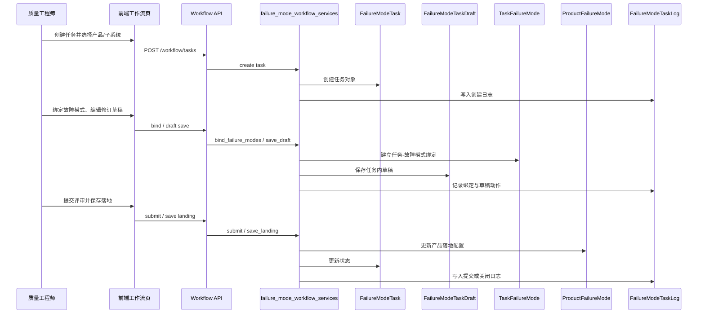

<FocusModuleHero :module="moduleMeta" />

<FocusModuleSection
  kicker="Module Purpose"
  title="模块定位"
  summary="故障模式模块负责把故障经验从零散知识转成结构化资产，同时把处理过程从临时沟通转成可追踪流程。"
>

故障模式模块的核心目标不是“记录问题”，而是建立一个可复用的问题治理系统：

- 一端沉淀故障模式、现象、措施、观测方式和诊断经验
- 一端承接任务分派、评审、落地与关闭动作

因此它天然是“知识库 + 流程平台”的组合体，而不是简单的缺陷表格。

</FocusModuleSection>

<FocusModuleSection
  kicker="Design Structure"
  title="设计结构"
  summary="模块由 4 层结构组成：知识条目层、关系洞察层、工作流层、统计与配置层。"
>

## 1. 知识条目层

沉淀故障模式本体，包括：

- 故障现象
- 根因
- 影响
- 处理措施
- 观测方式
- 华驼诊断信息
- 相关测试案例

## 2. 关系洞察层

模块支持从不同角度查看故障模式的关联关系，例如：

- 某条处理措施关联了哪些故障模式
- 某种观测方式覆盖了哪些产品
- 某个测试案例和哪些故障模式相连

## 3. 工作流层

故障治理不是看完条目就结束，还要进入任务处理：

- 创建任务
- 分派责任人
- 处理与提交
- 评审与关闭
- 落地配置

## 4. 统计与配置层

- 通过产品、子系统、状态等维度观察问题分布
- 通过产品线、角色、子系统配置支撑整个模块长期运转

</FocusModuleSection>

<FocusModuleSection
  kicker="Data Model"
  title="表结构与关系设计"
  summary="故障模式模块的最大特点是：不是一张大表，而是由故障条目、关系表、产品落地表、任务表共同组成。"
>

```mermaid
erDiagram
    FAILURE_MODE ||--o{ FAILURE_MODE_INTERCEPTION_REL : links
    FAILURE_MODE ||--o{ FAILURE_MODE_HANDLING_REL : links
    FAILURE_MODE ||--o{ FAILURE_MODE_OBSERVATION_REL : links
    FAILURE_MODE ||--o{ FAILURE_MODE_HUATUO_REL : links
    HANDLING_MEASURE ||--o{ HANDLING_MEASURE_TESTCASE_REL : validates
    TEST_CASE ||--o{ HANDLING_MEASURE_TESTCASE_REL : validates

    FAILURE_MODE_PRODUCT ||--o{ PRODUCT_FAILURE_MODE : maps
    FAILURE_MODE ||--o{ PRODUCT_FAILURE_MODE : maps
    PRODUCT_FAILURE_MODE ||--o{ PRODUCT_FM_INTERCEPTION_LANDING : configures
    PRODUCT_FAILURE_MODE ||--o{ PRODUCT_FM_HANDLING_LANDING : configures
    PRODUCT_FAILURE_MODE ||--o{ PRODUCT_FM_OBSERVATION_LANDING : configures
    PRODUCT_FAILURE_MODE ||--o{ PRODUCT_FM_HUATUO_LANDING : configures

    FAILURE_MODE_TASK ||--o{ TASK_FAILURE_MODE : binds
    FAILURE_MODE ||--o{ TASK_FAILURE_MODE : binds
    FAILURE_MODE_TASK ||--o{ FAILURE_MODE_TASK_DRAFT : drafts
    FAILURE_MODE_TASK ||--o{ FAILURE_MODE_TASK_LOG : logs
    FAILURE_MODE_PRODUCT ||--o{ FAILURE_MODE_ROLE_ASSIGNMENT : scopes
```

## 关键表设计说明

### `FailureMode`

这是知识主对象，关键字段包括：

- 语义描述：`brief`、`effect_html`、`root_cause_html`
- 分类属性：`subsystem`、`module_name`、`chips`
- 风险属性：`functional_safety_level`、`occurrence_frequency`、`detectability`、`severity`
- 来源属性：`source_type`、`source_task`
- 必配约束：`interception_required`、`huatuo_required`

### 关系表

四类关系表都采用独立表设计，而不是直接写进 JSON：

- `FailureModeInterceptionStrategyRel`
- `FailureModeHandlingMeasureRel`
- `FailureModeObservationMethodRel`
- `FailureModeHuatuoDiagnosisRel`

### 落地表

`ProductFailureMode` 以及四类 `Landing` 表表达的是“故障模式在具体产品里的落地状态”。  
这层设计使平台能区分知识定义和项目落地。

### 流程表

`FailureModeTask`、`TaskFailureMode`、`FailureModeTaskDraft`、`FailureModeTaskLog` 共同形成流程域。  
其中草稿对象用于让任务内修改先不直接污染正式知识对象。

</FocusModuleSection>

<FocusModuleSection
  kicker="Functional Areas"
  title="功能分层"
  summary="前端页面和 API 已经清晰对应到这 4 类功能层。"
>

### 故障模式库

- 维护条目本身及其多类关联资产
- 使用抽屉和关联洞察页处理复杂关系编辑

### 工作流

- 面向任务处理人、评审人和管理员
- 管理创建、处理、评审、关闭和交接动作

### 统计看板

- 查看产品维度和子系统维度的分布与趋势
- 聚焦高风险、重复出现和落地覆盖率问题

### 基础配置

- 管理产品、角色、子系统结构
- 解决“模块运行依赖哪些组织与配置前提”的问题

</FocusModuleSection>

<FocusModuleSection
  kicker="Implementation"
  title="前后端实现逻辑"
  summary="故障模式模块的复杂度主要来自数据关系多、编辑动作重、流程状态多。"
>

## 后端

- `failure_mode_api.py` 负责知识库、统计和配置相关接口
- `failure_mode_workflow_api.py` 负责任务流转相关接口
- `router.py` 将两块能力聚合到统一前缀下

后端职责分工：

- 知识对象的结构化存储与查询
- 关系洞察的聚合返回
- 工作流任务的状态管理
- 产品、角色、子系统等配置管理

### 关键方法原理

#### `failure_mode_services` 中的关系规范化

service 层做了大量归一化处理，例如：

- 文本列表规范化
- 可选字段规范化
- 布尔值与枚举值规范化

这是为了确保来自前端复杂表单的数据在落库前变成统一结构。

#### `failure_mode_workflow_services` 中的任务流转

工作流服务负责任务创建、绑定故障模式、保存修订草稿、提交评审、关闭 / 驳回 / 改派。  
这说明任务流不是前端拼接状态，而是服务层集中控制的正式流程。

## 前端

- 页面目录位于 `views/failure-mode/*`
- API 分为 `failure_mode.ts` 与 `failure_mode_workflow.ts`
- 使用大量抽屉、关系洞察页和统计视图承载复杂信息

</FocusModuleSection>

<FocusModuleSection
  kicker="Sequence"
  title="时序图：故障模式任务如何驱动知识落地"
  summary="模块的关键不是单纯改一条故障模式，而是通过任务把知识落进具体产品。"
>

</FocusModuleSection>

<FocusModuleSection
  kicker="Core APIs"
  title="核心 API 清单"
  summary="以下接口最能代表故障模式模块的知识与流程双主线。"
>

<FocusApiTable :items="apis" />

</FocusModuleSection>

<FocusModuleSection
  kicker="Frontend Entry"
  title="前端页面与职责"
  summary="当前页面划分已经能很好体现该模块的四层结构。"
>

| 页面 | 路由 | 页面职责 |
| --- | --- | --- |
| 故障模式库 | `/failure-mode` | 管理故障条目与关联知识资产 |
| 工作流 | `/failure-mode/workflow` | 推进任务处理、评审与关闭 |
| 统计看板 | `/failure-mode/statistics` | 观察故障分布和高风险聚集 |
| 配置 | `/failure-mode/config` | 管理产品、角色与子系统结构 |

</FocusModuleSection>

<FocusModuleSection
  kicker="Typical Scenarios"
  title="典型场景"
  summary="故障模式模块最有价值的，是让经验资产和处理动作形成闭环。"
>

### 场景一：沉淀一个新故障模式

1. 质量工程师创建故障模式条目
2. 录入故障现象、根因、处理措施与观测方式
3. 关联相关测试案例和产品线
4. 条目进入模块知识资产池

### 场景二：围绕某个故障发起处理流程

1. 从知识条目出发创建工作流任务
2. 指派责任人，进入处理状态
3. 评审结果、记录会议纪要并决定落地策略
4. 最终在产品或基线中完成落地

</FocusModuleSection>

<FocusModuleSection
  kicker="Related Docs"
  title="相关文档"
  summary="需要下钻实现细节时，可以继续阅读这些附录。"
>

- [后端技术参考](/backend/apps/failure-mode)
- [前端页面参考](/frontend/views/failure-mode)
- [项目管理](/modules/project-manager)
- [需求中心](/modules/requirement-center)

</FocusModuleSection>
