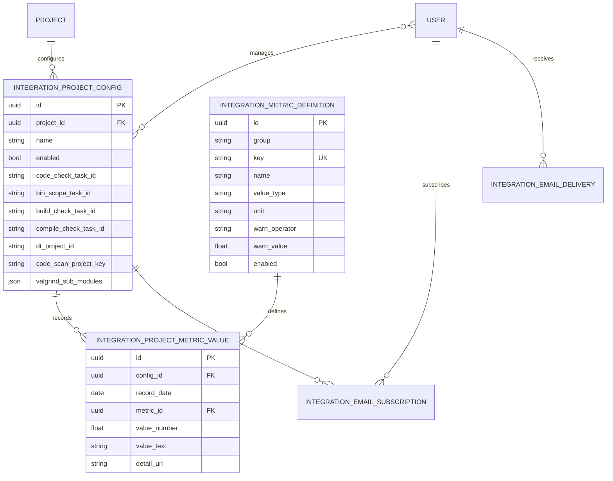
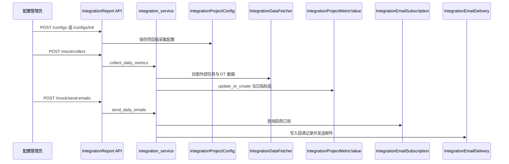

<FocusModuleHero :module="moduleMeta" />

<FocusModuleSection kicker="Module Purpose" title="模块定位" summary="集成报告模块负责把多个外部任务系统和扫描系统的数据统一拉取、归档、评估并按订阅发送给相关负责人。它是一个典型的‘配置驱动采集 + 指标驱动投递’模块。"

>

它关注的不是单次邮件发送，而是一整条日常经营链：

- 采集什么：项目级配置
- 如何评价：指标定义与预警阈值
- 采集结果存在哪里：每日指标值
- 谁来接收：订阅关系
- 投递是否成功：邮件投递日志

因此这是一个典型的“数据编排模块”，而不是普通 CRUD 页面。

</FocusModuleSection>

<FocusModuleSection kicker="Data Model" title="表结构与关系设计" summary="集成报告围绕配置、指标定义、每日指标值、订阅和投递日志五类对象展开。"

>

## 关键对象说明

### `IntegrationProjectConfig`

配置对象定义了一个项目应该从哪些外部系统采哪些数据，关键字段包括：

- `project` 对应项目管理主数据
- `managers` 项目负责人集合
- `enabled` 是否参与采集
- `code_check_task_id / bin_scope_task_id / build_check_task_id / compile_check_task_id` 各类代码或构建任务 ID
- `dt_project_id` DT 维度外部标识
- `code_scan_project_key` 关联代码扫描项目
- `valgrind_sub_modules` 指定需要纳入统计的子模块

### `IntegrationMetricDefinition`

指标字典定义“采回来之后如何解释”，关键字段包括：

- `group` `code` 或 `dt`
- `key` 指标唯一标识
- `value_type` `number / string / percent`
- `warn_operator / warn_value` 预警判断规则

### `IntegrationProjectMetricValue`

这是日报归档表，用于保存“某配置、某天、某指标”的采集结果。  
它通过 `unique_together(config, record_date, metric)` 保证每天每指标只有一条结果。

### `IntegrationEmailSubscription` / `IntegrationEmailDelivery`

一个负责“谁订阅了谁”，一个负责“当天发给谁、是否成功”。

</FocusModuleSection>

<FocusModuleSection kicker="Implementation" title="关键实现原理" summary="集成报告模块的核心在于默认指标字典初始化、配置驱动采集、指标分级和订阅驱动投递。"

>

### 默认指标定义：`ensure_default_metric_definitions`

在 `backend-django/apps/integration_report/integration_service.py` 中，系统会在采集或查询前确保默认指标存在，例如：

- `code_check_pass_rate`
- `build_check_pass_rate`
- `compile_check_pass_rate`
- `tscan_error_num`
- `valgrind_error_num`
- `dt_pass_rate`
- `dt_line_coverage`
- `dt_method_coverage`

这意味着指标体系不是散落在页面里的魔法字符串，而是一套可持久化的字典配置。

### 每日采集：`collect_daily_metrics`

采集时会：

1. 筛选启用的 `IntegrationProjectConfig`
2. 为每个配置实例化 `IntegrationDataFetcher`
3. 拉取代码与 DT 维度的外部数据
4. 叠加 `_fetch_code_scan_metrics` 输出的代码扫描数据
5. 对每个指标执行 `update_or_create`

这条链说明采集是“配置驱动 + 指标字典驱动”，而不是在接口层手写每个字段。

### 预警等级：`_eval_level`

历史页和订阅页看到的 `normal / warning / danger` 来自指标定义中的：

- `warn_operator`
- `warn_value`

也就是说，预警颜色不是前端硬编码规则，而是服务层根据指标字典动态计算的。

### 邮件投递：`send_daily_emails`

投递时会：

1. 按日期读取当天采集值
2. 按订阅关系分组用户
3. 生成邮件主题和正文
4. 写入 `IntegrationEmailDelivery`
5. 记录 `pending / sent / failed`

因此邮件日志页不是临时日志，而是一张正式的投递审计表。

</FocusModuleSection>

<FocusModuleSection kicker="Frontend Entry" title="前端入口与页面结构" summary="前端按配置、订阅、历史、投递日志四个视角拆分，和后端对象分层一一对应。"

>

前端主入口包括：

- `web/apps/web-ele/src/views/integration-report/config/index.vue` 配置维护页
- `web/apps/web-ele/src/views/integration-report/subscription/index.vue` 用户订阅页
- `web/apps/web-ele/src/views/integration-report/history/index.vue` 历史指标趋势页
- `web/apps/web-ele/src/views/integration-report/email-logs/index.vue` 邮件日志页

对应 API 类型定义位于 `web/apps/web-ele/src/api/integration-report/index.ts`。

其中：

- 配置页重点消费 `listIntegrationConfigsApi`
- 订阅页消费 `listIntegrationProjectsApi + toggleIntegrationSubscriptionApi`
- 历史页消费 `queryIntegrationHistoryApi`
- 日志页消费 `listEmailDeliveriesApi`

历史页关键词搜索支持配置/项目与数据看护人两组多关键词。新参数 `keywords`、`caretaker_keywords` 接收数组，旧参数 `keyword`、`caretaker_keyword` 保持兼容并会合并去重；`keyword_match_mode=all` 为默认交集模式，要求每个关键词都命中，`any` 为并集模式，命中任一关键词即可。普通 code / dt 历史和 DT_FUZZ 历史使用同一套过滤语义。

</FocusModuleSection>

<FocusModuleSection kicker="Sequence" title="时序图：一次日报采集与邮件投递" summary="集成报告模块的主链是‘配置 -> 采集 -> 指标归档 -> 订阅投递 -> 日志审计’。"

>

</FocusModuleSection>

<FocusModuleSection kicker="Dependencies" title="相关依赖与上下游" summary="集成报告是典型的编排中台：上游来自项目、代码扫描和外部任务系统，下游是订阅邮件和历史趋势查询。"

>

- 上游依赖 `project-manager` 提供项目主数据
- 上游依赖 `code-scan` 提供 `code_scan_project_key` 与子模块错误数
- 上游依赖外部代码检查、构建检查、DT 系统
- 下游消费订阅页、历史趋势页、邮件日志页、日报邮件

</FocusModuleSection>

<FocusModuleSection kicker="Core APIs" title="核心 API 清单" summary="以下接口覆盖配置、订阅、历史、采集与投递。">

<FocusApiTable :items="apis" />

</FocusModuleSection>

<FocusModuleSection kicker="Related Docs" title="相关文档" summary="继续下钻实现附录可参考这些页面。">

- [后端技术参考](/backend/apps/integration-report)
- [前端页面参考](/frontend/views/integration-report)
- [代码扫描](/modules/code-scan)

</FocusModuleSection>
