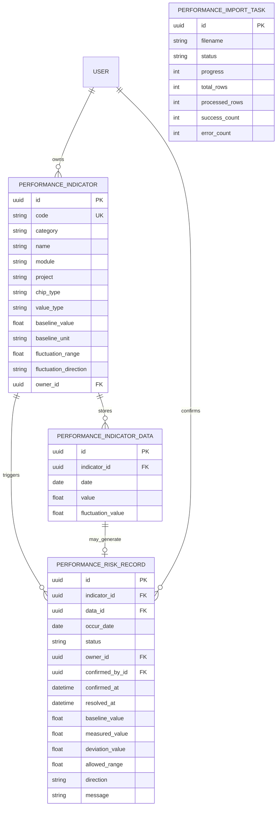
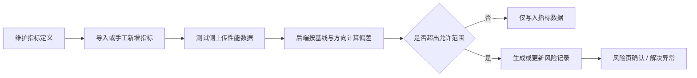
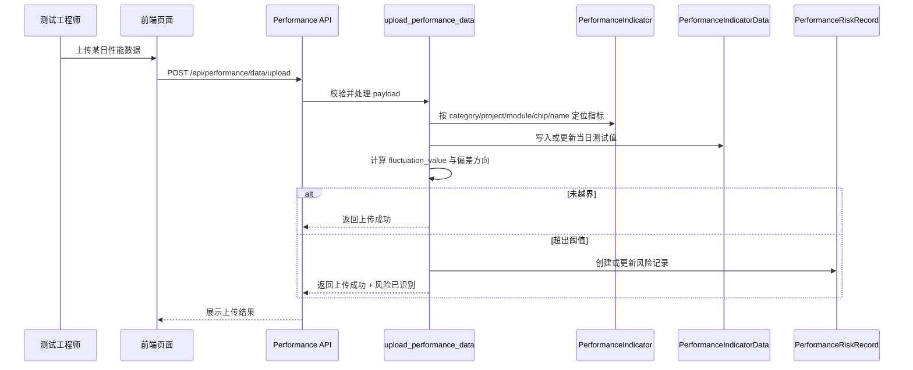

<FocusModuleHero :module="moduleMeta" />

<FocusModuleSection
  kicker="Module Purpose"
  title="模块定位"
  summary="性能监控模块负责把“性能是否稳定”从经验判断变成可配置、可观测、可追责的系统能力。这里的 performance 指性能，不是绩效。"
>

性能监控模块面向性能测试工程师、项目经理和平台负责人。它的目标不是简单展示若干曲线，而是建立一条完整闭环：

- 先定义指标与基线，明确什么叫“正常”
- 再按项目 / 模块 / 芯片维度持续采集数据
- 最后把异常识别为风险对象，进入确认与解决流程

这意味着该模块的设计重点不在“图表炫不炫”，而在于三个结构是否稳定：

1. 指标定义结构是否稳定
2. 数据归档结构是否稳定
3. 风险处置结构是否稳定

</FocusModuleSection>

<FocusModuleSection
  kicker="Design Structure"
  title="设计结构"
  summary="模块设计围绕 4 个核心对象展开：指标定义、指标数据、风险记录、导入任务。"
>

## 核心对象

| 对象 | 作用 | 为什么单独建模 |
| --- | --- | --- |
| `PerformanceIndicator` | 描述指标定义、基线和责任边界 | 指标是整个模块的聚合根，所有趋势和风险都围绕它展开 |
| `PerformanceIndicatorData` | 记录某个日期下的具体测试值 | 用时间序列形式沉淀测试数据，支撑趋势与异常分析 |
| `PerformanceRiskRecord` | 记录一次超阈值异常 | 把异常从“某个数字异常”升级为“可跟踪的问题对象” |
| `PerformanceIndicatorImportTask` | 记录导入任务执行状态 | 解决指标批量导入的耗时与可追踪性问题 |

## 关系结构

## 设计意图

- 指标定义和测试数据分开建模，避免“修改指标配置”污染历史数据
- 风险记录独立建模，避免异常只停留在趋势页而没有后续动作
- 导入任务异步化，避免大型 Excel/CSV 导入阻塞接口请求

</FocusModuleSection>

<FocusModuleSection
  kicker="Functional Areas"
  title="功能分层"
  summary="当前前后端实现已经自然形成了配置层、观测层、处置层三段式结构。"
>

### 1. 配置层

- 维护指标编码、分类、项目、模块、芯片类型和值类型
- 定义基线值、单位、允许浮动范围、浮动方向
- 绑定责任人，明确异常归属
- 支持批量更新和文件导入，适合一次性导入大量指标

### 2. 观测层

- 按日期上传性能数据
- 在趋势看板中展示当前值、基线值和偏差值
- 支持按项目、模块、芯片类型做横向切片

### 3. 处置层

- 系统在数据上传时识别超阈值风险
- 风险进入 `open / ack / resolved` 状态流转
- 风险记录保留确认人、确认时间、解决时间与说明

</FocusModuleSection>

<FocusModuleSection
  kicker="Data Flow"
  title="关键数据流"
  summary="模块最重要的不是页面数量，而是从定义到异常处置的流转是否完整。"
>

## 数据上报闭环

## 关键判断逻辑

- 指标先按 `category + project + module + chip_type + name` 定位
- 根据 `fluctuation_direction` 判断“偏大是异常”还是“偏小是异常”
- 根据 `fluctuation_range` 与 `baseline_value` 计算是否越界
- 越界后创建或更新风险对象，而不是只给前端一个临时红点

## 时序图：一次性能数据上传如何变成风险记录

</FocusModuleSection>

<FocusModuleSection
  kicker="Implementation"
  title="前后端实现逻辑"
  summary="前端和后端都已经围绕这条闭环做了清晰拆分。"
>

## 后端实现

- 路由位于 `backend-django/apps/performance/api.py`
- 数据模型位于 `backend-django/apps/performance/models.py`
- 上传与导入逻辑由 `services.py` 承接
- 指标导入通过任务对象和后台线程异步执行

当前后端重点职责：

- 维护指标树与芯片筛选
- 提供指标 CRUD 与批量处理能力
- 承担数据上传、趋势查询和风险查询
- 在服务层沉淀风险识别逻辑

### 关键方法原理

#### `upload_performance_data`

这是模块里最关键的方法之一，它承担了“数据接入 -> 计算偏差 -> 风险生成”这条主链路。

实现原理可以概括为：

1. 先从请求体中提取项目、模块、芯片类型、日期与批量数据
2. 根据维度组合定位对应指标
3. 对每条数据计算 `fluctuation_value`
4. 再结合 `fluctuation_direction` 和 `fluctuation_range` 判断是否越界
5. 若越界，则创建或更新对应 `PerformanceRiskRecord`

这意味着风险识别不是定时批处理，而是内嵌在数据上传事务里的实时判断逻辑。

#### `run_indicator_import_task`

导入逻辑被拆成单独任务对象和后台线程，主要是为了：

- 避免大文件导入阻塞请求线程
- 让前端能轮询查看导入进度
- 记录失败行和错误摘要，便于重复修正

因此导入任务不是“上传完立刻一次性完成”，而是一个可追踪的后台处理过程。

## 前端实现

- API 封装位于 `web/apps/web-ele/src/api/core/performance.ts`
- 页面分为：
  - `/performance/config`
  - `/performance/dashboard`
  - `/performance/risk`

当前前端重点职责：

- 配置页负责结构化管理指标定义
- 趋势页负责读取并解释当前性能状态
- 风险页负责将异常转化为“可处理对象”

</FocusModuleSection>

<FocusModuleSection
  kicker="Core APIs"
  title="核心 API 清单"
  summary="只保留高频、关键、当前真实存在的接口。"
>

<FocusApiTable :items="apis" />

</FocusModuleSection>

<FocusModuleSection
  kicker="Frontend Entry"
  title="前端页面与职责"
  summary="页面结构与模块设计一一对应，不再把所有能力挤在同一页。"
>

| 页面 | 路由 | 页面职责 |
| --- | --- | --- |
| 指标配置 | `/performance/config` | 管理指标定义、导入任务、批量编辑与筛选树 |
| 趋势看板 | `/performance/dashboard` | 解释当前性能状态，展示波动和覆盖情况 |
| 风险管理 | `/performance/risk` | 确认、跟踪和解决性能异常 |

</FocusModuleSection>

<FocusModuleSection
  kicker="Typical Scenarios"
  title="典型场景"
  summary="下面两个场景最能体现性能监控模块存在的价值。"
>

### 场景一：新项目上线一批指标

1. 负责人在配置页批量导入项目性能指标
2. 为每个指标配置基线值、波动方向和责任人
3. 测试侧开始每日或每轮构建后上传测试数据

### 场景二：某项指标持续异常

1. 上传数据后系统发现指标超出允许范围
2. 风险对象出现在风险页
3. 责任人确认问题是否有效
4. 问题修复后更新风险状态并沉淀说明

</FocusModuleSection>

<FocusModuleSection
  kicker="Related Docs"
  title="相关文档"
  summary="如果需要继续查看实现附录，可以从这里下钻。"
>

- [后端技术参考](/backend/apps/performance)
- [前端页面参考](/frontend/views/performance)
- [工作台 / 仪表盘](/modules/dashboard)

</FocusModuleSection>
