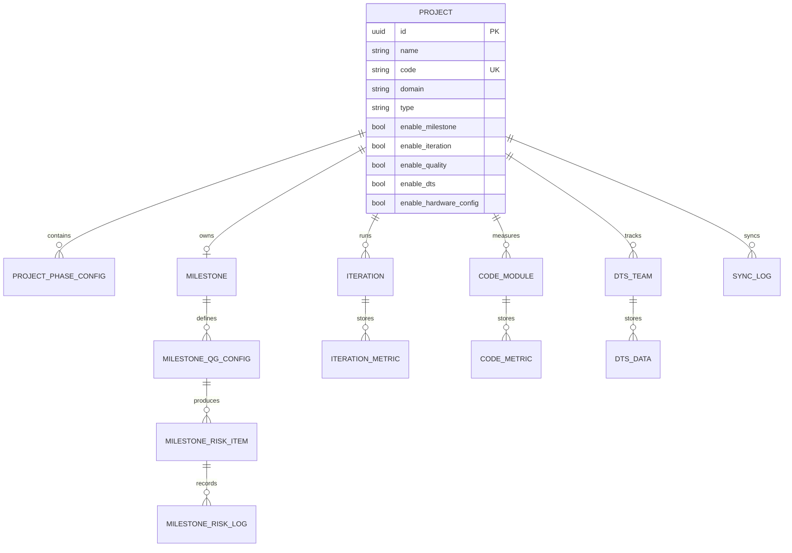
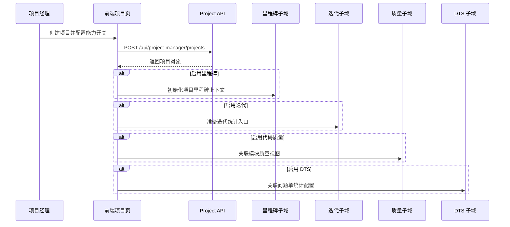

<script setup lang="ts">
import { getFocusModule } from '../data/modules';

const moduleMeta = getFocusModule('project-manager');

const apis = [
  {
    consumer: '项目主列表与详情页',
    method: 'GET',
    params: 'page, pageSize, keyword, domain 等',
    path: '/api/project-manager/projects',
    purpose: '分页获取项目主数据列表',
    returns: 'PaginatedResponse<ProjectOut>',
  },
  {
    consumer: '项目创建 / 编辑',
    method: 'POST',
    params: '基础信息、项目经理、功能开关等',
    path: '/api/project-manager/projects',
    purpose: '创建项目聚合根',
    returns: 'ProjectOut',
  },
  {
    consumer: '里程碑看板',
    method: 'GET',
    params: 'project_id',
    path: '/api/project-manager/milestones/board',
    purpose: '读取项目里程碑、QG 节点和风险信息',
    returns: 'MilestoneBoardItem[]',
  },
  {
    consumer: '迭代概览页',
    method: 'GET',
    params: 'project_id',
    path: '/api/project-manager/iterations/overview',
    purpose: '读取迭代执行、延期与需求完成情况',
    returns: 'IterationDashboardItem[]',
  },
  {
    consumer: '代码质量页',
    method: 'GET',
    params: 'project_id, date',
    path: '/api/project-manager/code_quality/overview',
    purpose: '返回项目质量摘要和模块质量指标',
    returns: 'ProjectQualitySummary[]',
  },
  {
    consumer: 'DTS 统计页',
    method: 'POST',
    params: '筛选条件、字段集、分页参数',
    path: '/api/project-manager/dts-statistics/list',
    purpose: '分页查询 DTS 统计明细',
    returns: 'DtsListResponse',
  },
];
</script>

<FocusModuleHero :module="moduleMeta" />

<FocusModuleSection
  kicker="Module Purpose"
  title="模块定位"
  summary="项目管理是 Focus 的核心业务域，用一个项目聚合根把交付推进、风险跟踪、质量观测和需求协作串起来。"
>

项目管理模块不是单纯的项目台账，而是 Focus 中最重要的业务主线。它回答的是：

- 当前有哪些项目在跑
- 每个项目处于什么交付阶段
- 里程碑、迭代、代码质量、DTS、需求看板之间如何共享同一套项目上下文

因此它的价值不在“多一个项目列表页”，而在于成为其他模块引用的上游主数据中心。

</FocusModuleSection>

<FocusModuleSection
  kicker="Design Structure"
  title="设计结构"
  summary="项目管理模块采用“项目聚合根 + 多子域协同”的设计，不同子模块共享同一套项目上下文。"
>

## 聚合根

`Project` 是整个模块的聚合根，负责承载：

- 项目基础信息：名称、编码、领域、类型
- 管理边界：项目经理、是否结项
- 子域开关：是否启用里程碑、迭代、质量、DTS 等能力

## 子域结构



## 设计意图

- 用单一 `Project` 主数据做所有子域的上下文锚点
- 用子域开关避免所有项目都被迫启用所有能力
- 让不同角色在同一项目上下文里协作，而不是跨系统手工对齐

</FocusModuleSection>

<FocusModuleSection
  kicker="Functional Areas"
  title="功能分层"
  summary="当前实现已经形成了 4 类清晰的项目管理能力。"
>

### 1. 项目主数据层

- 创建、编辑和筛选项目
- 管理项目经理、领域和交付类型
- 通过开关决定该项目启用哪些子能力

### 2. 交付推进层

- 里程碑视图管理 QG 节点、风险项和日志
- 迭代视图管理需求进展、延期和刷新动作
- 项目报告用于输出阶段性项目状态

### 3. 质量观测层

- 代码质量子域沉淀模块质量数据
- DTS 与 DTS Statistics 子域提供缺陷统计和导出能力
- 硬件配置子域为交付和测试类页面提供环境信息

### 4. 协同补充层

- Requirement Board 用项目上下文承接需求推进
- Requirement Workspace 为工作台和项目空间提供聚合信息
- Sync Log 用于跟踪外部同步动作

</FocusModuleSection>

<FocusModuleSection
  kicker="Domain Logic"
  title="关键对象与字段设计"
  summary="项目管理模块最重要的设计，不是页面数量，而是不同子域如何共享项目主数据。"
>

## `Project`

项目是所有子域的聚合根，关键字段包括：

- 基础识别：`name`、`code`、`domain`、`type`
- 责任边界：`managers`
- 状态与注释：`is_closed`、`repo_url`、`remark`
- 能力开关：`enable_milestone`、`enable_iteration`、`enable_quality`、`enable_dts`、`enable_hardware_config`

设计意义：

- 项目对象既是业务实体，也是“子域能力开关中心”
- 不同项目可以只开启自己真正需要的能力，避免所有子域强耦合

## `ProjectPhaseConfig`

项目阶段典配对象用于描述“不同阶段需要什么典配环境”，关键字段包括：

- `stage_name`、`stage_start`、`stage_end`
- `scenario`
- `vehicle_hardware`
- `cdc_platform`
- `smart_screen_versions`

它将交付阶段和环境配置绑定起来，服务于项目推进与验证配套。

## `Milestone` / `MilestoneQGConfig` / `MilestoneRiskItem`

这是一条独立的里程碑风险链：

- `Milestone` 保存项目节点日期
- `MilestoneQGConfig` 定义每个 QG 的规则和配置
- `MilestoneRiskItem` 保存每日/阶段性风险记录
- `MilestoneRiskLog` 保存操作日志

这条链的设计价值在于：风险不是写在备注里，而是被结构化地沉淀和跟踪。

</FocusModuleSection>

<FocusModuleSection
  kicker="Key Flows"
  title="关键流程"
  summary="项目管理模块最大的价值在于把多个原本分散的流程压进同一条项目主线。"
>

## 项目初始化流程

```text
创建项目
  ↓
配置项目经理与基础属性
  ↓
开启里程碑 / 迭代 / 质量 / DTS 等子能力
  ↓
项目进入各子域协同状态
```

## 项目推进流程

```text
里程碑设定节点
  ↓
迭代推进需求与任务
  ↓
代码质量 / DTS / 风险数据持续汇入
  ↓
报告、工作台、交付矩阵读取摘要
```

## 泳道图：项目立项后多个子域如何进入协同



</FocusModuleSection>

<FocusModuleSection
  kicker="Implementation"
  title="前后端实现逻辑"
  summary="当前项目管理模块已经形成按子域拆分、但共享主项目上下文的成熟结构。"
>

## 后端

- 总路由位于 `backend-django/apps/project_manager/router.py`
- 子路由包含：
  - `projects`
  - `milestones`
  - `iterations`
  - `code_quality`
  - `dts`
  - `hardware`
  - `report`
  - `requirement-board`
  - `requirement-workspace`
  - `dts-statistics`

后端实现重点：

- 每个子域独立演进，但都挂在同一项目上下文下
- 通过服务层处理刷新、聚合和统计逻辑
- 保持 API 命名与业务子域基本一致

### 关键方法原理

#### `project_service` 中的项目创建 / 更新逻辑

项目服务层的关键职责不只是保存项目字段，而是同步维护：

- 项目经理关系
- 项目阶段典配
- 子域开关与相关配置项

这意味着“项目保存”本质上是一个配置入口，不是简单 CRUD。

#### `milestone_service.check_qg_risks_daily`

这个方法体现了里程碑子域的核心实现原理：

1. 遍历启用的 QG 配置
2. 判断当前日期是否进入检查窗口
3. 调用单节点检查逻辑
4. 生成或更新风险项

它把“QG 风险识别”从人工判断转成了结构化的日常检查任务。

## 前端

- 页面位于 `web/apps/web-ele/src/views/project-manager/*`
- API 位于 `web/apps/web-ele/src/api/project-manager/*`
- 前后端都按子域拆分，降低认知复杂度

前端实现重点：

- 项目页负责主数据和能力开关
- 里程碑、迭代、质量和 DTS 页面各自服务不同角色
- 需求看板与工作区页面作为项目协作的衍生入口

</FocusModuleSection>

<FocusModuleSection
  kicker="Core APIs"
  title="核心 API 清单"
  summary="只保留最能代表模块主能力的接口。"
>

<FocusApiTable :items="apis" />

</FocusModuleSection>

<FocusModuleSection
  kicker="Frontend Entry"
  title="前端页面与职责"
  summary="当前页面结构本身就体现了项目管理的设计边界。"
>

| 页面 | 路由 | 页面职责 |
| --- | --- | --- |
| 项目列表 | `/project-manager/project` | 管理项目基础信息和功能开关 |
| 里程碑 | `/project-manager/milestone` | 管理 QG 节点、风险项和时间线 |
| 迭代 | `/project-manager/iteration` | 跟踪迭代执行和需求状态 |
| 代码质量 | `/project-manager/code-quality` | 查看项目代码质量和模块指标 |
| DTS / DTS Statistics | `/project-manager/dts` / `/project-manager/dts-statistics` | 查看问题统计、导出和分析结果 |
| 需求看板 | `/project-manager/requirement-board` | 在项目上下文中协调需求推进 |

</FocusModuleSection>

<FocusModuleSection
  kicker="Typical Scenarios"
  title="典型场景"
  summary="下面两个场景最能体现项目管理为什么是 Focus 的核心主线。"
>

### 场景一：新项目立项

1. 创建项目主数据
2. 配置项目经理和交付类型
3. 开启里程碑、迭代、代码质量和 DTS 等功能
4. 团队开始在各子域持续协作

### 场景二：项目进入交付压力期

1. 里程碑节点临近
2. 迭代页显示延期和需求压力
3. 代码质量、DTS 与工作台同步暴露风险信号
4. 管理者通过报告和交付矩阵统一观测

</FocusModuleSection>

<FocusModuleSection
  kicker="Related Docs"
  title="相关文档"
  summary="需要查看更细的技术附录时，可以从下面继续下钻。"
>

- [后端技术参考](/backend/apps/project-manager)
- [前端页面参考](/frontend/views/project-manager)
- [交付矩阵](/modules/delivery-matrix)

</FocusModuleSection>
